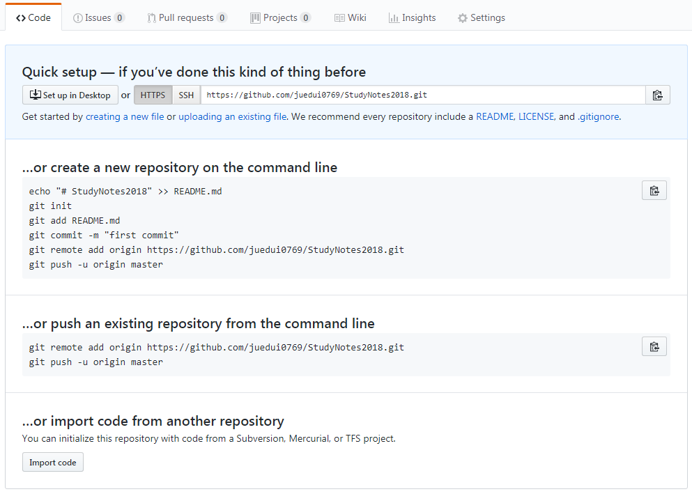

# github-开始



在`github`上，新建一个`repository`后，可以做的操作如上图。

```shell
echo "# StudyNotes2018" >> README.md
git init
git add README.md
git commit -m "first commit"
git remote add origin https://github.com/juedui0769/StudyNotes2018.git
git push -u origin master
```

我是完全按照上面的步骤操作的，将我在`F:\Docs\101_Me`的文件夹添加到`github`上了。

但是，图片不显示，我仔细看了下，原来在我本地，图片地址是绝对地址。


# End