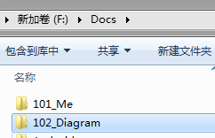

# 百度网盘-自动备份

- 自动备份是 VIP 的功能，以后，我还是手动备份吧（目前的我完全可以做到手动备份的境界：其实也就几个重要的文件而已）。
- 2018年12月12日02:04:58，我已经将“自动备份”移除了！
- 
- 主要就是备份上面的目录下的两个文件。
- **重要问题**
  - 图片还是自己备份啊！
  - 看来，得研究一下“文件系统”了。弄一个服务器作文件系统，是最好的选择啊！
  - 或者，使用“七牛云存储”：这得自己写一个程序！
    - 这个比较靠谱！
    - 之前在“慕课网-瓦力老师的ElasticSearch”课程中用到了，七牛云的。https://portal.qiniu.com/bucket/wali/index ，抽时间写一段程序来定期扫描自己的文件夹，然后自动备份到七牛云上（对比更改时间，只上传更新的文件，先将老文件删除，然后再将新文件上传）。
- 我是真的傻
  - 这样的，“图片” + “*.md” 类型的笔记最适合放在`github`上的。

## 简述

“百度网盘” -> 设置 -> 基本 -> 自动备份：管理自动备份的文件夹，旁边有一个按钮“管理”，

点击之后，可以“手动添加文件夹”

不知道可不可以不启动网盘客户端也能够自动备份？

- 如果可以那就爽了，
- 否则，就要每天手动开启一下客户端，让它备份。
  - 每隔一段时间，它会扫描文件夹的改变，然后触发上传。
  - 每天晚上，我开启客户端，让它备份一下，就可以了！（实在等不及，就把某个文件单独上传到网盘或QQ，或gitee，等位置也行！）

## 设置

- 我是把**“F:\Docs\101_Me”**备份到“我的网盘/MarkDown_网盘备份/101_Me”下了。

- 但是，可以直接对任意文件，右键上传到百度云。所以，根目录下也有一个“101_Me”的文件夹，后期删除就没有了。
- 把**“F:\Docs\102_Diagram”**也备份到“我的网盘/MarkDown_网盘备份/”目录下了。
  - 这个目录下是我用“draw.io”绘制的图表。“draw.io”的介绍，在“101_Me”目录下有一个文件“110_mxGraph_draw.io_你值得拥有”作了简单的介绍。使用起来很简单，对我来说，比较容易上手！

