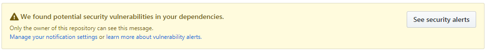
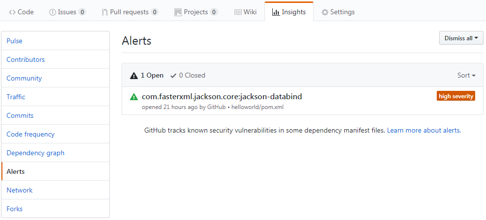
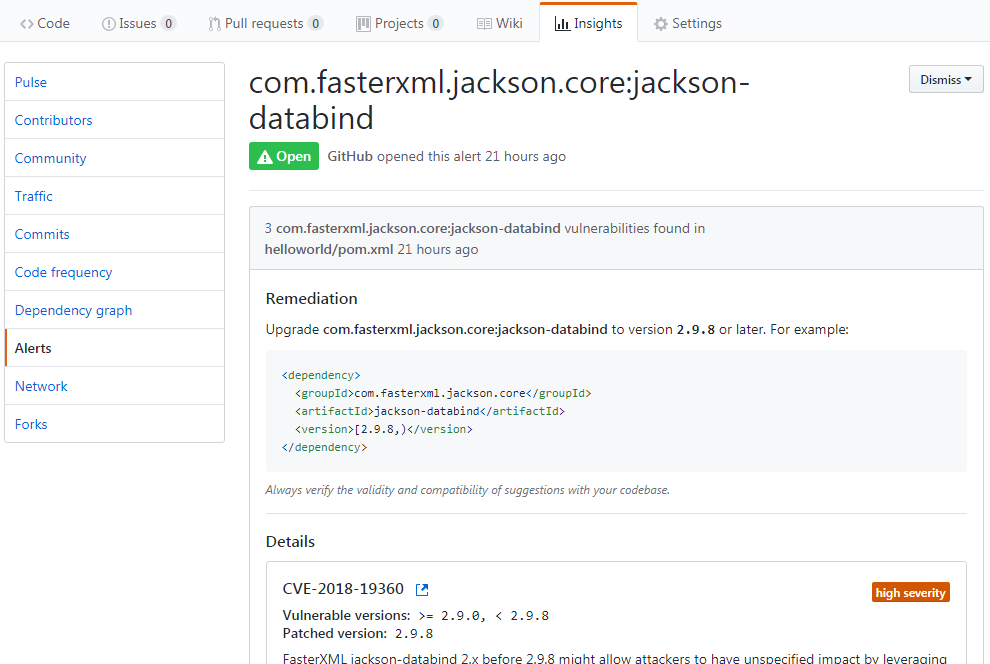

# Github

## github_security_alerts

> ##### We found potential security vulnerabilities in your dependencies.
>
> Only the owner of this repository can see this message. 
> [Manage your notification settings](https://github.com/settings/notifications) or [learn more about vulnerability alerts.](https://help.github.com/articles/about-security-alerts-for-vulnerable-dependencies)

# End