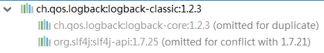
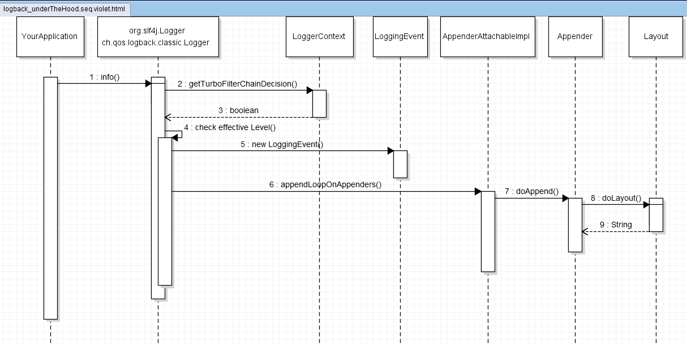

# 软件资源收集

## ~~01 PDMan-数据库建模~~

数据库建模工具

https://www.oschina.net/p/PDMan

https://gitee.com/robergroup/pdman

2018年12月30日14:19:18， 今天使用了一下，感觉很粗糙……

## 02 Jmockdata-随机模拟java数据

https://www.oschina.net/p/jmockdata

## 03 O2OA-办公软件

https://www.oschina.net/news/103085/o2oa-4-12-26


## 04 java orm

### 01 jooq 

https://blog.csdn.net/xianzhixianzhixian/article/details/78894256， 参考这篇博文，要使用"jooq"的话，需要学习一套操作的API，目前我是不想再学习一条操作sql的API了，所以，果断放弃`jooq`。 jooq的官网百度就能搜到，就不贴出来了。

### 02  OrmLite

http://ormlite.com/， 官网。

### 03 mybatis

http://www.mybatis.org/mybatis-3/zh/index.html ， 现在有“简体中文”的支持了，棒！

### 04 MyBatis Generator

http://www.mybatis.org/generator/

https://github.com/mybatis/generator

### 05 jSqlBox

https://gitee.com/drinkjava2/jSqlBox

文档： https://gitee.com/drinkjava2/jSqlBox/wikis/pages

在 https://github.com/juedui0769/BitCode2018 有代码记录！

## 05 druid

https://github.com/alibaba/druid

https://github.com/alibaba/druid/wiki/%E5%B8%B8%E8%A7%81%E9%97%AE%E9%A2%98 ， 这个“常见问题”页面，强烈建议阅读！

16 ： `maxIdle`是Druid为了方便"DBCP"用户迁移而增加的，`maxIdle`是一个混乱的概念。连接池只应该有`maxPoolSize`和`minPoolSize`，druid只保留了`maxActive`和`minIdle`，分别相当于`maxPoolSize`和`minPoolSize`。


## 06 HikariCP

https://www.oschina.net/search?scope=project&q=HikariCP

http://brettwooldridge.github.io/HikariCP/

initialization examples，https://github.com/brettwooldridge/HikariCP#initialization

## 07 SLF4J

https://www.slf4j.org/

https://www.oschina.net/translate/why-use-sl4j-over-log4j-for-logging， 为什么使用 SLF4J 而不是 Log4J 来做 Java 日志

SLF4J user manual :  https://www.slf4j.org/manual.html

## 08 LOGBack

https://logback.qos.ch/

文档 ： https://logback.qos.ch/manual/index.html

### 01 Introduction

https://logback.qos.ch/manual/introduction.html，`logback`简介，文档第一篇……

```xml
<dependency>
	<groupId>ch.qos.logback</groupId>
	<artifactId>logback-classic</artifactId>
	<version>1.2.3</version>
</dependency>
```



> Note that the above example does not reference any logback classes. In most cases, as far as logging is concerned, your classes will only need to import SLF4J classes. Thus, the vast majority, if not all, of your classes will use the SLF4J API and will be oblivious to the existence of logback.
>
> 注意，上面的示例没有引用任何logback类。在大多数情况下，就日志记录而言，类只需要导入slf4j类。因此，绝大多数类（如果不是全部）都将使用slf4j api，并且将忽略logback的存在。

> Appenders exist for many different destinations including the console, files, Syslog, TCP Sockets, JMS and many more. 
>
> Users can also easily create their own Appenders as appropriate for their specific situation.

### 02 Architecture

https://logback.qos.ch/manual/architecture.html ，文档第二篇

> Logback is built upon three main classes: `Logger`, `Appender` and `Layout`. 

>Named Hierarchy
>
>A logger is said to be an ancestor of another logger if its name followed by a dot is a prefix of the descendant logger name. A logger is said to be a parent of a child logger if there are no ancestors between itself and the descendant logger.
>
>如果一个记录器的名称后跟一个点是其后代记录器名称的前缀，则该记录器被称为另一个记录器的祖先。如果记录器本身和后代记录器之间没有祖先，则称记录器为子记录器的父级。
>
>For example, the logger named `"com.foo"` is a parent of the logger named `"com.foo.Bar"`. Similarly, `"java"` is a parent of `"java.util"` and an ancestor of `"java.util.Vector"`.

The root logger resides at the top of the logger hierarchy. It is exceptional in that it is part of every hierarchy at its inception. Like every logger, it can be retrieved by its name, as follows:

根记录器位于记录器层次结构的顶部。这是一个例外，因为它是每一个层次的一部分，在它的开始。与每个日志记录程序一样，它也可以通过其名称进行检索，如下所示：

```java
Logger rootLogger = LoggerFactory.getLogger(org.slf4j.Logger.ROOT_LOGGER_NAME);
```

It assumes that levels are ordered as follows: `TRACE < DEBUG < INFO <  WARN < ERROR`.

> Nevertheless, naming loggers after the class where they are located seems to be the best general strategy known so far.
>
> 然而，以日志记录者所在的类命名日志记录者似乎是目前已知的最好的一般策略。

> In logback speak, an output destination is called an appender.
>
> Currently, appenders exist for the console, files, remote socket servers, to MySQL, PostgreSQL, Oracle and other databases, JMS, and remote UNIX Syslog daemons.

> Loggers have their additivity flag set to true by default.
>
> 默认情况下，记录器的additivity标志设置为true。

> The following two lines will yield the exact same output. However, in case of a *disabled* logging statement, the second variant will outperform the first variant by a factor of at least 30.
>
> 以下两行将产生完全相同的输出。但是，在禁用日志记录语句的情况下，第二个变量的性能将比第一个变量高至少30倍。
>
> ```java
> logger.debug("The new entry is "+entry+".");
> logger.debug("The new entry is {}.", entry);
> ```
>
> A two argument variant is also available. For example, you can write:
>
> ```java
> logger.debug("The new entry is {}. It replaces {}.", entry, oldEntry);
> ```
>
> If three or more arguments need to be passed, an `Object[]` variant is also available. For example, you can write:
>
> ```sh
> Object[] paramArray = {newVal, below, above};
> logger.debug("Value {} was inserted between {} and {}.", paramArray);
> ```
>

官网原图


violet-重绘



反对日志记录的一个经常被引用的论点是它的计算成本。这是一个合理的问题，因为即使是中等大小的应用程序也可以生成数千个日志请求。我们的大部分开发工作都花在了测量和调整logback的性能上。除了这些努力之外，用户还应该意识到以下性能问题。

> The cost of parameter construction can be quite high and depends on the size of the parameters involved. To avoid the cost of parameter construction you can take advantage of SLF4J's parameterized logging:
>
> 参数构建的成本可能相当高，并且取决于所涉及的参数的大小。为了避免参数构建的成本，您可以利用SLF4J的参数化日志记录：
>
> ```java
> x.debug("Entry number: {} is {}", i, entry[i]);
> ```
>
> 此变量不会产生参数构造的成本。与上一次调用debug（）方法相比，它的速度要快得多。只有将日志记录请求发送到附加的附加程序时，才会格式化消息。此外，格式化消息的组件也得到了高度优化。

> Although feature-rich, one of the foremost design goals of logback was speed of execution, a requirement which is second only to reliability. Some logback components have been rewritten several times to improve performance.
>
> 尽管功能丰富，但logback的首要设计目标之一是执行速度，这是仅次于可靠性的要求。为了提高性能，已多次重写了一些日志组件。

### 03 Configuration

https://logback.qos.ch/manual/configuration.html

> Inserting log requests into the application code requires a fair amount of planning and effort. Observation shows that approximately four percent of code is dedicated to logging. Consequently, even a moderately sized application will contain thousands of logging statements embedded within its code. Given their number, we need tools to manage these log statements.
>
> 在应用程序代码中插入日志请求需要大量的计划和工作。观察表明，大约4%的代码专用于日志记录。因此，即使是一个中等大小的应用程序，其代码中也会嵌入数千条日志语句。考虑到它们的数量，我们需要工具来管理这些日志语句。

> Logback can be configured either programmatically or with a configuration script expressed in XML or Groovy format. By the way, existing log4j users can convert their *log4j.properties* files to *logback.xml* using our [PropertiesTranslator](http://logback.qos.ch/translator/) web-application.
>
> 日志可以通过编程方式配置，也可以使用XML或groovy格式表示的配置脚本配置。另外，现有的log4j用户可以使用我们的propertiesTranslator Web应用程序将log4j.properties文件转换为logback.xml。

如果在`classpath`下找不到`logback-test.xml` , `logback.groovy`, `logback.xml` 文件，logback将使用`ch.qos.logback.classic.spi.Configurator`接口的实现 `ch.qos.logback.classic.BasicConfigurator`的配置。

F:\wxg111_openapi\logback-1.2.3


### 11 Joran

https://logback.qos.ch/manual/onJoran.html

> As mentioned above, Joran is built on top of the SAX API. As an XML document is parsed, each element generates events corresponding to the start, body and end of each element. When a Joran configurator receives these events, it will attempt to find in its rule store an action corresponding to the *current pattern*. For example, the current pattern for the start, body or end event of element *B* nested within a top-level *A* element is "A/B". The current pattern is a data structure maintained automatically by Joran as it receives and processes SAX events.
>
> 如上所述，Joran构建在SAX API之上。当XML文档被解析时，每个元素生成对应于每个元素的开始、主体和结束的事件。当Joran配置程序接收到这些事件时，它将尝试在其规则存储中找到与当前模式对应的操作。例如，嵌套在顶级A元素中的元素B的开始、主体或结束事件的当前模式为“A/B”。当前模式是Joran在接收和处理SAX事件时自动维护的数据结构。


# End