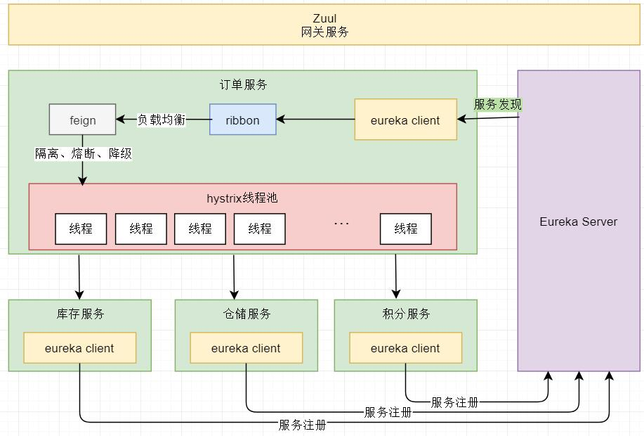

# Spring Cloud

## （1）官网

- https://spring.io/projects/spring-cloud

## （2）中文资源

- https://springcloud.cc/
- ✓ https://springcloud.cc/spring-cloud-dalston.html
  - Dalston -> 对应boot version 1.5.x

## （3）网文

### <1> Spring Cloud底层原理——石杉的架构笔记

- <https://mp.weixin.qq.com/s?__biz=MzU0OTk3ODQ3Ng==&mid=2247483712&idx=1&sn=4cd88761830428a2e485ac4c2cf120f9&chksm=fba6e943ccd16055344222ce9c794358e1a4a84fdf4263eaa7c91e9756597bd06e49f9b390cb&mpshare=1&scene=23&srcid=1208WZwpV5Ax9lVtdp1pTCc0#rd>

这篇文章比较标题党，作为入门还可以。

业务场景到时可以拿来作为例子：

- 假设开发一个电商网站，实现用户下单到发货的流程：
  - 用户创建订单，并支付
  - 扣减相应的商品库存
  - 通知仓储中心，发货
  - 给用户的这次购物增加相应的积分



如上图：

- 如果前端、移动端要调用后端系统，统一从Zuul网关进入，由Zuul网关转发请求给对应的服务。
- 订单服务、库存服务、仓储服务、积分服务，都有一个“eureka client”可以把自己注册到“eureka server”，在本例中，订单服务要调用其他的服务。
- ribbon，做负载均衡，feign，做代理。

### <2>


- https://www.cnblogs.com/chry/category/1045074.html
- https://www.cnblogs.com/lexiaofei/tag/SpringCloud/
- https://www.cnblogs.com/ityouknow/p/7508306.html （纯洁的微笑）
  - https://github.com/ityouknow/spring-cloud-examples （github）
- https://www.zhihu.com/question/61403505


## 踩坑记录

### （1）package

```java
@ComponentScan(basePackages = {"com.wxg.controller"})
```

看上面的代码就明白了这个“坑”的意思了。


# End