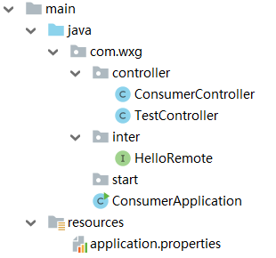

# Spring Cloud

## （1）官网

- https://spring.io/projects/spring-cloud

## （2）中文资源

- https://springcloud.cc/
- ✓ https://springcloud.cc/spring-cloud-dalston.html
  - Dalston -> 对应boot version 1.5.x

## （3）网文

### <1> Spring Cloud底层原理——石杉的架构笔记

- <https://mp.weixin.qq.com/s?__biz=MzU0OTk3ODQ3Ng==&mid=2247483712&idx=1&sn=4cd88761830428a2e485ac4c2cf120f9&chksm=fba6e943ccd16055344222ce9c794358e1a4a84fdf4263eaa7c91e9756597bd06e49f9b390cb&mpshare=1&scene=23&srcid=1208WZwpV5Ax9lVtdp1pTCc0#rd>

这篇文章比较标题党，作为入门还可以。

业务场景到时可以拿来作为例子：

- 假设开发一个电商网站，实现用户下单到发货的流程：
  - 用户创建订单，并支付
  - 扣减相应的商品库存
  - 通知仓储中心，发货
  - 给用户的这次购物增加相应的积分


如上图：

- 如果前端、移动端要调用后端系统，统一从Zuul网关进入，由Zuul网关转发请求给对应的服务。
- 订单服务、库存服务、仓储服务、积分服务，都有一个“eureka client”可以把自己注册到“eureka server”，在本例中，订单服务要调用其他的服务。
- ribbon，做负载均衡，feign，做代理。

### <2>


- https://www.cnblogs.com/chry/category/1045074.html
- https://www.cnblogs.com/lexiaofei/tag/SpringCloud/
- https://www.cnblogs.com/ityouknow/p/7508306.html （纯洁的微笑）
  - https://github.com/ityouknow/spring-cloud-examples （github）
- https://www.zhihu.com/question/61403505


## 知识点

### （1）maven

- F:\wxg115_springboot2\cloud-parent ， Maven聚合
- `dependencyManagement` ， `plugin`  可以放在 parent 中，子module都可以继承， 如下：

```xml
<?xml version="1.0" encoding="UTF-8"?>
<project xmlns="http://maven.apache.org/POM/4.0.0"
         xmlns:xsi="http://www.w3.org/2001/XMLSchema-instance"
         xsi:schemaLocation="http://maven.apache.org/POM/4.0.0 http://maven.apache.org/xsd/maven-4.0.0.xsd">
    <modelVersion>4.0.0</modelVersion>

    <groupId>com.wxg.cloud</groupId>
    <artifactId>cloud-parent</artifactId>
    <packaging>pom</packaging>
    <version>1.0-SNAPSHOT</version>
    <modules>
        <module>eureka-server</module>
        <module>hello-provider</module>
        <module>hello-consumer</module>
    </modules>

    <parent>
        <groupId>org.springframework.boot</groupId>
        <artifactId>spring-boot-starter-parent</artifactId>
        <version>1.5.3.RELEASE</version>
        <relativePath/> <!-- lookup parent from repository -->
    </parent>

    <properties>
        <project.build.sourceEncoding>UTF-8</project.build.sourceEncoding>
        <project.reporting.outputEncoding>UTF-8</project.reporting.outputEncoding>
        <java.version>1.8</java.version>
        <maven.compiler.source>1.8</maven.compiler.source>
        <maven.compiler.target>1.8</maven.compiler.target>

        <spring-cloud.version>Dalston.RELEASE</spring-cloud.version>
    </properties>

    <dependencyManagement>
        <dependencies>
            <dependency>
                <groupId>org.springframework.cloud</groupId>
                <artifactId>spring-cloud-dependencies</artifactId>
                <version>${spring-cloud.version}</version>
                <type>pom</type>
                <scope>import</scope>
            </dependency>
        </dependencies>
    </dependencyManagement>

    <build>
        <plugins>
            <plugin>
                <groupId>org.springframework.boot</groupId>
                <artifactId>spring-boot-maven-plugin</artifactId>
            </plugin>
        </plugins>
    </build>

</project>
```

### （2）spring.profiles.active

```
src/main/resources
|- application-peer1.yml
|- application-peer2.yml
```

```yml
spring:
  application:
    name: spring-cloud-producer
  profiles: peer1
server:
  port: 9000
eureka:
  instance:
    hostname: localhost
  client:
    serviceUrl:
      defaultZone: http://localhost:8000/eureka/

variable:
  a: producer 1
```

```yml
spring:
  application:
    name: spring-cloud-producer
  profiles: peer2
server:
  port: 9003
eureka:
  instance:
    hostname: localhost
  client:
    serviceUrl:
      defaultZone: http://localhost:8000/eureka/

variable:
  a: producer 2
```

- 上面是两个配置文件的内容，
- `variable` 可以在代码中直接引用到，如下：

```java
@Configuration
@RestController
public class HelloController {

    @Value("${variable.a}")
    private String a;

    @RequestMapping("/hello")
    public String hello(@RequestParam String name) {
        return "hello "+name+"，"+ a +", send first messge";
    }
}
```

- `a` 变量会因不同的配置文件，而不同，在启动时指定配置，如下：

```sh
java -jar hello-provider-1.0-SNAPSHOT.jar --spring.profiles.active=peer1
java -jar hello-provider-1.0-SNAPSHOT.jar --spring.profiles.active=peer2
```

- https://blog.csdn.net/u010606397/article/details/80713968  ，这篇博文介绍的比较详细，可以参考。


## 踩坑记录

### （1）package

```java
@ComponentScan(basePackages = {"com.wxg.controller"})
```

看上面的代码就明白这个“坑”的意思了。

- 不在同一个包下，需要使用 `@ComponentScan(basePackages = {"com.wxg.controller"})` 
- 这里要注意一下，出现问题时， 用这个调试一下代码，观察下结果！

### （2）@RequestMapping

```java
@RequestMapping("/hello")
public String hello(@RequestParam String name) {
	return "hello "+name+
```

```java
@RequestMapping("/hello/{name}")
public String index(@PathVariable("name") String name) {
	return ...
```

看上面的两段代码，也是坑点

- 第一段： `.../hello?name=xxx`
- 第二段： `.../hello/xxx`

我在这里被坑了很久，我从网上下载的代码，测试时，一直出现 404 ，

- 我一直用 `.../hello?name=xxx` ，没注意到第二处要使用 `.../hello/xxx`
- 再出现 `404` 时，要首先检查 `@RequestMapping(` ，不要怀疑错了！
- 不要怀疑错了！
- 不要怀疑错了！！
- 不要怀疑错了！！！

### （3）扫描类的位置

- 

- 如上图，`ConsumerApplication` 一开始是放在 `start` 包下面的，但是，启动报错，无奈，提出来放到 `start` 的上级包下面。
- 这应该形成一个规范吧！（网上，有找到一些资料，但，解决办法对我不适用，也许是版本的问题）


# End