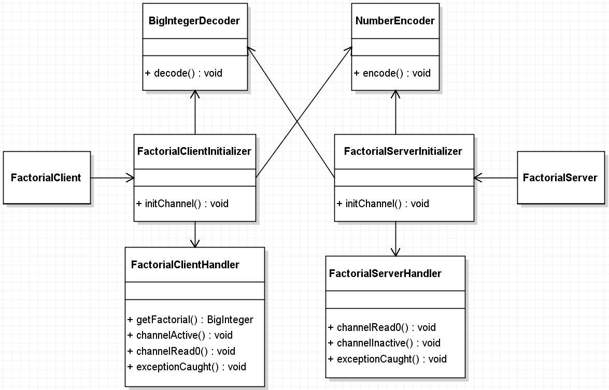
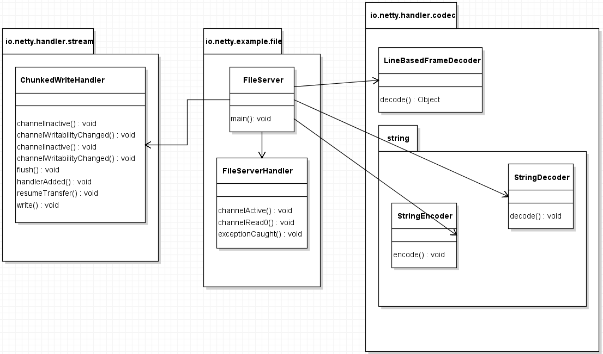
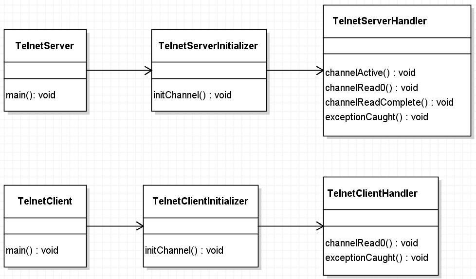

# 官方example


## 02 factorial-阶乘

没想到这个例子，我看了一下午，加入了一些打印输出，才稍微理解了一点代码。总共`8`个类：

- `FactorialClient`, `FactorialServer` 是两个启动类，一个代表客户端，一个代表服务端。服务端会一直运行，客户端需要一个输入`-Dcount=10`，如果不提供参数默认是`1000`。
- `NumberEncoder`, `BigIntegerDecoder` 是共用的，处理编解码的两个类。
- `FactorialClientHandler`, `FactorialServerHandler` 分别是客户端和服务端的handler。
- `FactorialClientInitializer`,`FactorialServerInitializer` 上面的编解码处理器及handler分别在这两个类中被引入，另在这两个类中还处理`SSL`，及压缩`ZlibCodecFactory`。类图如下：



计算时，先将`FactorialServer` 服务端启动，然后启动`FactorialClient`客户端，输入要计算的值，比如`10`就在`VM options`中输入`-Dcount=10`，再点击启动。

客户端会先发送`1`，再`2`...直到`10`，每次发送都有返回，但是客户端把`10`之前的值都丢弃了，只将累乘到`10`的结果保存在局部变量`BlockingQueue<BigInteger> answer`中，客户端会阻塞在`answer.take()`方法上，当`BlockingQueue`有值后，就输出到控制台，然后客户端程序结束。

亮点：

### （1）编解码： 

在`NumberEncoder`类上有一段注释，描述编码的规则。

```
Encodes a Number into the binary representation prepended with a magic number ('F' or 0x46) and a 32-bit length prefix. For example, 42 will be encoded to { 'F', 0, 0, 0, 1, 42 }
```

传递一段以`F`开头的字节码，然后再传递一个`4`字节的int值代表数据的长度，最后传递数据。

- 我在这里的理解有两个误区，一是数据的长度，二是数据的大小。
- 数据的长度，是：指数据的字节数，转换为字节后，占多少字节。
- 数据的大小，受长度限制，最多可以容纳`Integer.MAX_VALUE`个字节：`Integer.MAX_VALUE * 8`位。

以下是求解`10!`的阶乘server端的输出：

```
data: [1], dataLength: 1
data: [2], dataLength: 1
data: [6], dataLength: 1
data: [24], dataLength: 1
data: [120], dataLength: 1
data: [2, -48], dataLength: 2
data: [19, -80], dataLength: 2
data: [0, -99, -128], dataLength: 3
data: [5, -119, -128], dataLength: 3
data: [55, 95, 0], dataLength: 3
Factorial of 10 is: 3,628,800
```

从上面可以看出`3,628,800`是占`3`个长度的。

### （2）对于长度：

我比较迷！有必要多解释一下。

```
For example, 42 will be encoded to { 'F', 0, 0, 0, 1, 42 }
```

`Integer.MAX_VALUE`也只是表示为：`{ 'F', 0, 0, 0, 4, 2147483647 }`可以用下面这段代码来验证：

```java
Integer maxValue = Integer.MAX_VALUE;
System.out.println(maxValue);
BigInteger bigInteger = BigInteger.valueOf(maxValue);
byte[] bytes = bigInteger.toByteArray();
System.out.println(Arrays.toString(bytes));
System.out.println(bytes.length);
```

所以，这个编码方式是可以传输一个非常巨大的数字的。这也是为了表示出阶乘的结果。阶乘的结果递增非常快，一个小的数字结果会非常巨大。

### （3）BlockingQueue.take()

> Retrieves and removes the head of this queue, waiting if necessary until an element becomes available

这是`take()`方法的解释，调用它是会阻塞直到有数据，才可用。但是，在代码中我看到：

```java
public BigInteger getFactorial() {
	boolean interrupted = false;
	try {
		for (;;) {
			try {
				return answer.take();
			} catch (InterruptedException ignore) {
				interrupted = true;
			}
		}
	} finally {
		if (interrupted) {
			Thread.currentThread().interrupt();
		}
	}
}
```

`return answer.take();`是放在一个循环中的，这是为什么呢？`take()`不是会阻塞的吗，为何还要放在`for`循环中呢？

~~仔细阅读这段代码之后，我才意识到这是为了处理`InterruptedException`的，这样的写法，我现在还不会，我要慢慢去体会！~~

在网上咨询了`北京-liufor(442902149)`，他说，以上代码放到死循环中的目的是： 防止虚假唤醒（spurious wakeup）。

- `notifyAll`, `notify`, `signal`, `signalAll` 执行后，并不会马上唤醒被唤醒线程，须等到lock释放后，才会被唤醒。
- http://errorprone.info/bugpattern/WaitNotInLoop 这里描述的是各种正确的用法。

暂时，先记下这种写法，有时间再好好研究一下。

### （4）阶乘是如何计算的？

````java
@Override
public void channelRead0(ChannelHandlerContext ctx, final BigInteger msg) {
	receivedMessages ++;

//System.out.println(msg);

	if (receivedMessages == FactorialClient.COUNT) {
		// Offer the answer after closing the connection.
		ctx.channel().close().addListener(new ChannelFutureListener() {
			@Override
			public void operationComplete(ChannelFuture future) {
				boolean offered = answer.offer(msg);
				assert offered;
			}
		});
	}
}
````

上面这段代码解释了，阶乘是如何计算的。`//System.out.println(msg);`是我添加的打印输出，如果你要计算`3`的阶乘，程序是先发出`1`的，Server端返回`1`的阶乘，但是客户端不保留。`FactorialClient.COUNT == 3`： 只有当`receivedMessages`累加到`3`程序才会把结果放入到`BlockingQueue`中，即`answer.offer(msg)`。

### （5）分段发送？

```java
private void sendNumbers() {
	// Do not send more than 4096 numbers.
	ChannelFuture future = null;
	for (int i = 0; i < 4096 && next <= FactorialClient.COUNT; i++) {
		future = ctx.write(Integer.valueOf(next));
		next++;
	}
	if (next <= FactorialClient.COUNT) {
		assert future != null;
		future.addListener(numberSender);
	}
	ctx.flush();
}
```

请看上面的代码，当你要计算`5000`的阶乘时，程序是分两段`flush()`的： `0~4095`, `4096~5000`

在`sendNumbers`方法中，`i`是不会大于`4096`的，但是`next`才是会真正的抵达`5000`的变量。

## 03 file

这个样例没有看懂，先把类图放在这里吧。



在`io.netty.example.file`包中只有两个类，`FileServer`和`FileServerHandler`。但是，`FileServer`中引用了很多netty内部组件：`StringEncoder`, `StringDecoder`, `LineBaseFrameDecoder`, `ChunkedWriteHandler`。

`StringEncoder` 和 `StringDecoder` 相对比较好理解，是负责`ByteBuf`与`String`之间的编解码的。`LineBaseFrameDecoder`的用途，我就没怎么看懂，这也是一个解码器。

`ChunkedWriteHandler`是一个处理器，类的注释上说明了，传输大块数据时，需要用到这个处理器。内部有点复杂，没看明白。

## 04 telnet

和“阶乘”一样的，`Initializer`, `Handler`模式。6个类，如下：



```java
private static final StringDecoder DECODER = new StringDecoder();
private static final StringEncoder ENCODER = new StringEncoder();
pipeline.addLast(new DelimiterBasedFrameDecoder(8192, Delimiters.lineDelimiter()));
```

`StringDecoder`, `StringEncoder`, `DelimiterBasedFrameDecoder`, `Delimiters.lineDelimiter()` 这几个是政协常委，字符型的程序交互，用上就对了。`TelnetServer`和`TelnetClient`都用到上面的几个类了。

`TelnetClient`的代码和"阶乘"有些不同，它要处理控制台的输入`System.in`，如下：

```java
Bootstrap b = new Bootstrap();
b.group(group)
 .channel(NioSocketChannel.class)
 .handler(new TelnetClientInitializer(sslCtx));

// Start the connection attempt.
Channel ch = b.connect(HOST, PORT).sync().channel();

// Read commands from the stdin.
ChannelFuture lastWriteFuture = null;
BufferedReader in = new BufferedReader(new InputStreamReader(System.in));
for (;;) {
	String line = in.readLine();
	if (line == null) {
		break;
	}

	// Sends the received line to the server.
	lastWriteFuture = ch.writeAndFlush(line + "\r\n");

	// If user typed the 'bye' command, wait until the server closes
	// the connection.
	if ("bye".equals(line.toLowerCase())) {
		ch.closeFuture().sync();
		break;
	}
}

// Wait until all messages are flushed before closing the channel.
if (lastWriteFuture != null) {
	lastWriteFuture.sync();
}
```

以下几个地方对照上面的完整代码，仔细揣摩一下！

```java
Channel ch = b.connect(HOST, PORT).sync().channel();

lastWriteFuture = ch.writeAndFlush(line + "\r\n");

ch.closeFuture().sync();

lastWriteFuture.sync();
```

分别启动`TelnetServer`, `TelnetClient`，输入内容，看看实际情况是否和自己想的一样。

- 和我想的不一样。
- `TelnetServer`是没什么输出的。所有的输出都是展示在`TelnetClient`一端的，不过，你在控制台输入的内容，输送到server端后，被它添加了一些内容后输送回来。这表明client端和server端是有交互的。
- 直接回车，也是可以的。看看上面的代码，`line == null`的判断，虽然`break`但并没有退出程序（关闭channel）。
- 只有输入`bye`被server端接受到后，server端会关闭当前连接；client端也会关闭当前channel，不过，netty对channel的关闭，有些特别，我得好好体会一下（如果自己写，未必能写的正确！）。


# 05 根据telnet改写的echo

## EchoClientHandler.java

```java
@Sharable
public class EchoClientHandler extends SimpleChannelInboundHandler<String> {
    @Override
    protected void channelRead0(ChannelHandlerContext ctx, String msg) throws Exception {
        System.err.println(msg);
    }

    @Override
    public void exceptionCaught(ChannelHandlerContext ctx, Throwable cause) throws Exception {
        cause.printStackTrace();
        ctx.close();
    }
}
```

## EchoClientInitializer.java

```java
public class EchoClientInitializer extends ChannelInitializer<SocketChannel> {

    private static final StringDecoder DECODER = new StringDecoder();
    private static final StringEncoder ENCODER = new StringEncoder();

    @Override
    protected void initChannel(SocketChannel ch) throws Exception {
        ChannelPipeline pipeline = ch.pipeline();

        pipeline.addLast(new DelimiterBasedFrameDecoder(8192, Delimiters.lineDelimiter()));
        pipeline.addLast(DECODER);
        pipeline.addLast(ENCODER);
        pipeline.addLast(new EchoClientHandler());
    }
}
```

## EchoClient.java

```java
public final class EchoClient {
    static final String HOST = "127.0.0.1";
    static final int PORT = 8007;

    public static void main(String[] args) throws InterruptedException, IOException {
        EventLoopGroup group = new NioEventLoopGroup();

        try {
            Bootstrap b = new Bootstrap();
            b.group(group)
                    .channel(NioSocketChannel.class)
                    .option(ChannelOption.TCP_NODELAY, true)
                    .handler(new EchoClientInitializer());

            // Start the connection attempt.
            Channel ch = b.connect(HOST, PORT).sync().channel();

            ChannelFuture lastWriteFuture = null;

            BufferedReader in = new BufferedReader(new InputStreamReader(System.in));

            for (;;) {
                String line = in.readLine();
                if (line == null) {
                    break;
                }

                // Sends the received line to the server.
                lastWriteFuture = ch.writeAndFlush(line + "\r\n");

                // If user typed the 'bye' command, wait until the server closes
                // the connection.
                if ("bye".equals(line.toLowerCase())) {
                    ch.closeFuture().sync();
                    break;
                }
            }

            // Wait until all messages are flushed before closing the channel.
            if (lastWriteFuture != null) {
                lastWriteFuture.sync();
            }


//            // Start the client.
//            ChannelFuture f = b.connect(HOST, PORT).sync();
//
//            // Wait until the connection is closed.
//            f.channel().closeFuture().sync();
        } finally {
            group.shutdownGracefully();
        }
    }
}
```

## EchoServerHandler.java

```java
@Sharable
public class EchoServerHandler extends SimpleChannelInboundHandler<String> {

    @Override
    public void channelActive(ChannelHandlerContext ctx) throws Exception {
        Channel channel = ctx.channel();
        System.err.println(channel.id());
    }

    @Override
    protected void channelRead0(ChannelHandlerContext ctx, String msg) throws Exception {
        String response;
        boolean close = false;
        if (msg.isEmpty()) {
            response = "Please type something.\r\n";
        } else if ("bye".equals(msg.toLowerCase())) {
            response = "Have a good day!\r\n";
            close = true;
        } else {
            response = "<< " + msg + "\r\n";
        }

        ChannelFuture future = ctx.write(response);
        if (close) {
            future.addListener(ChannelFutureListener.CLOSE);
        }
    }

    @Override
    public void channelReadComplete(ChannelHandlerContext ctx) throws Exception {
        ctx.flush();
    }

    @Override
    public void exceptionCaught(ChannelHandlerContext ctx, Throwable cause) throws Exception {
        cause.printStackTrace();
        ctx.close();
    }
}
```

## EchoServerInitializer.java

```java
public class EchoServerInitializer extends ChannelInitializer<SocketChannel> {

    private static final StringDecoder DECODER = new StringDecoder();
    private static final StringEncoder ENCODER = new StringEncoder();

    @Override
    protected void initChannel(SocketChannel ch) throws Exception {
        ChannelPipeline pipeline = ch.pipeline();

        pipeline.addLast(new DelimiterBasedFrameDecoder(8192, Delimiters.lineDelimiter()));
        pipeline.addLast(DECODER);
        pipeline.addLast(ENCODER);

        pipeline.addLast(new EchoServerHandler());
    }
}
```

## EchoServer.java

```java
public final class EchoServer {
    static final int PORT = 8007;

    public static void main(String[] args) throws InterruptedException {
        // Configure the server.
        EventLoopGroup bossGroup = new NioEventLoopGroup(1);
        EventLoopGroup workerGroup = new NioEventLoopGroup();

        try {
            ServerBootstrap b = new ServerBootstrap();
            b.group(bossGroup, workerGroup)
                    .channel(NioServerSocketChannel.class)
                    .option(ChannelOption.SO_BACKLOG, 100)
                    .handler(new LoggingHandler(LogLevel.INFO))
                    .childHandler(new EchoServerInitializer());

            // Start the server.
            ChannelFuture f = b.bind(PORT).sync();

            // Wait until the server socket is closed.
            f.channel().closeFuture().sync();
        } finally {
            bossGroup.shutdownGracefully();
            workerGroup.shutdownGracefully();
        }

    }
}
```


# End