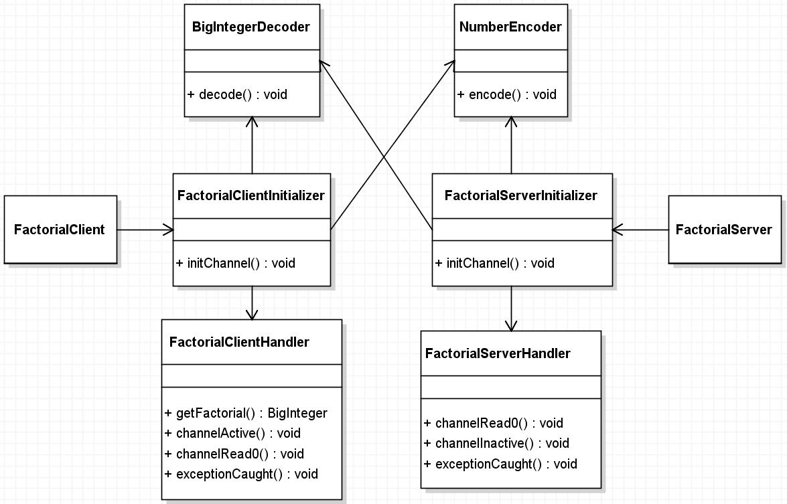
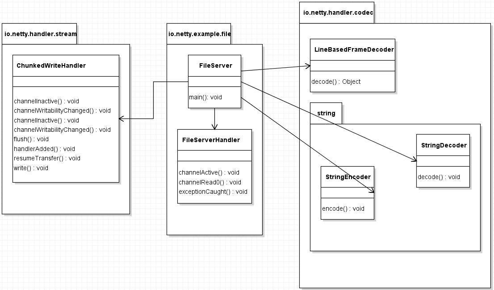
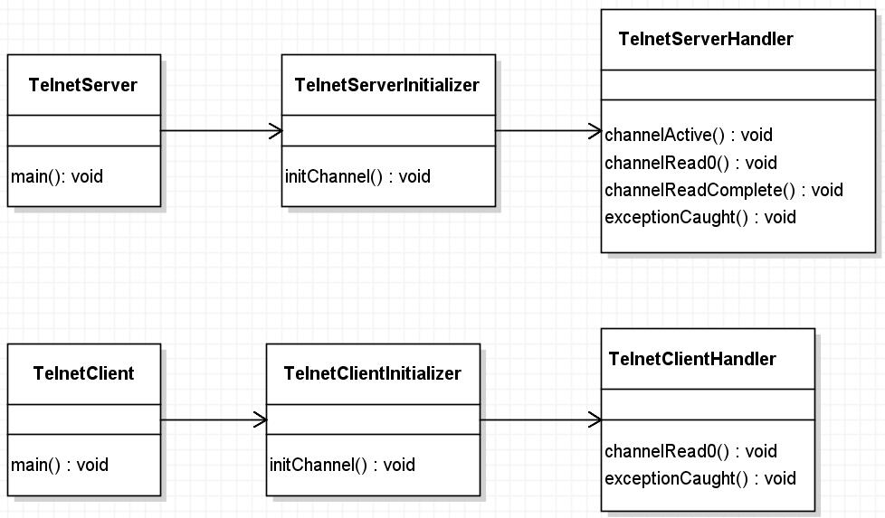
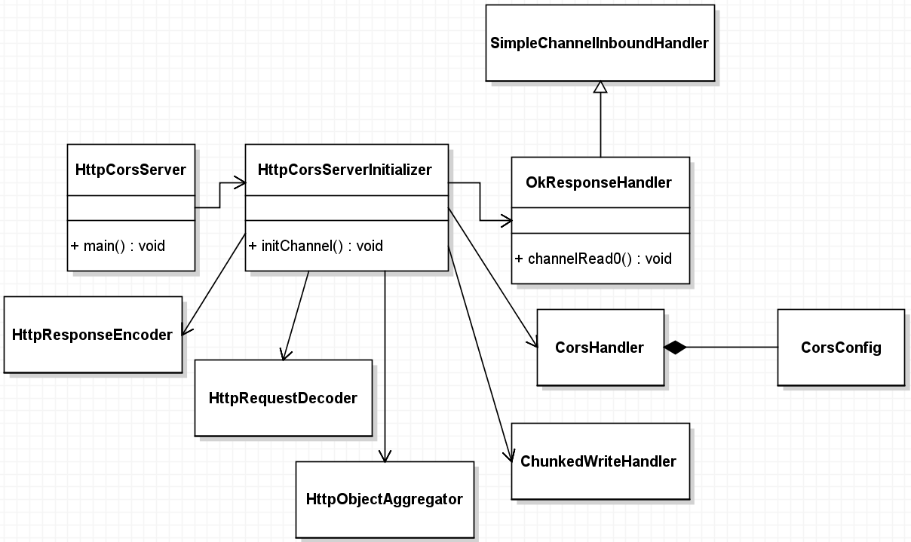

# 官方example

- "F:\wxg107\netty\example"

## 01 echo

### 官方example代码

#### EchoServer.java

```java
public final class EchoServer {

    static final boolean SSL = System.getProperty("ssl") != null;
    static final int PORT = Integer.parseInt(System.getProperty("port", "8007"));

    public static void main(String[] args) throws Exception {
        // Configure SSL.
        final SslContext sslCtx;
        if (SSL) {
            SelfSignedCertificate ssc = new SelfSignedCertificate();
            sslCtx = SslContextBuilder.forServer(ssc.certificate(), ssc.privateKey()).build();
        } else {
            sslCtx = null;
        }

        // Configure the server.
        EventLoopGroup bossGroup = new NioEventLoopGroup(1);
        EventLoopGroup workerGroup = new NioEventLoopGroup();
        try {
            ServerBootstrap b = new ServerBootstrap();
            b.group(bossGroup, workerGroup)
             .channel(NioServerSocketChannel.class)
             .option(ChannelOption.SO_BACKLOG, 100)
             .handler(new LoggingHandler(LogLevel.INFO))
             .childHandler(new ChannelInitializer<SocketChannel>() {
                 @Override
                 public void initChannel(SocketChannel ch) throws Exception {
                     ChannelPipeline p = ch.pipeline();
                     if (sslCtx != null) {
                         p.addLast(sslCtx.newHandler(ch.alloc()));
                     }
                     //p.addLast(new LoggingHandler(LogLevel.INFO));
                     p.addLast(new EchoServerHandler());
                 }
             });

            // Start the server.
            ChannelFuture f = b.bind(PORT).sync();

            // Wait until the server socket is closed.
            f.channel().closeFuture().sync();
        } finally {
            // Shut down all event loops to terminate all threads.
            bossGroup.shutdownGracefully();
            workerGroup.shutdownGracefully();
        }
    }
}
```

#### EchoClient.java

```java
public final class EchoClient {

    static final boolean SSL = System.getProperty("ssl") != null;
    static final String HOST = System.getProperty("host", "127.0.0.1");
    static final int PORT = Integer.parseInt(System.getProperty("port", "8007"));
    static final int SIZE = Integer.parseInt(System.getProperty("size", "256"));

    public static void main(String[] args) throws Exception {
        // Configure SSL.git
        final SslContext sslCtx;
        if (SSL) {
            sslCtx = SslContextBuilder.forClient()
                .trustManager(InsecureTrustManagerFactory.INSTANCE).build();
        } else {
            sslCtx = null;
        }

        // Configure the client.
        EventLoopGroup group = new NioEventLoopGroup();
        try {
            Bootstrap b = new Bootstrap();
            b.group(group)
             .channel(NioSocketChannel.class)
             .option(ChannelOption.TCP_NODELAY, true)
             .handler(new ChannelInitializer<SocketChannel>() {
                 @Override
                 public void initChannel(SocketChannel ch) throws Exception {
                     ChannelPipeline p = ch.pipeline();
                     if (sslCtx != null) {
                         p.addLast(sslCtx.newHandler(ch.alloc(), HOST, PORT));
                     }
                     //p.addLast(new LoggingHandler(LogLevel.INFO));
                     p.addLast(new EchoClientHandler());
                 }
             });

            // Start the client.
            ChannelFuture f = b.connect(HOST, PORT).sync();

            // Wait until the connection is closed.
            f.channel().closeFuture().sync();
        } finally {
            // Shut down the event loop to terminate all threads.
            group.shutdownGracefully();
        }
    }
}
```

#### EchoServerHandler.java

```java
@Sharable
public class EchoServerHandler extends ChannelInboundHandlerAdapter {

    @Override
    public void channelRead(ChannelHandlerContext ctx, Object msg) {
        ctx.write(msg);
    }

    @Override
    public void channelReadComplete(ChannelHandlerContext ctx) {
        ctx.flush();
    }

    @Override
    public void exceptionCaught(ChannelHandlerContext ctx, Throwable cause) {
        // Close the connection when an exception is raised.
        cause.printStackTrace();
        ctx.close();
    }
}
```

#### EchoClientHandler.java

```java
/**
 * Handler implementation for the echo client.  It initiates the ping-pong
 * traffic between the echo client and server by sending the first message to
 * the server.
 */
public class EchoClientHandler extends ChannelInboundHandlerAdapter {

    private final ByteBuf firstMessage;

    /**
     * Creates a client-side handler.
     */
    public EchoClientHandler() {
        firstMessage = Unpooled.buffer(EchoClient.SIZE);
        for (int i = 0; i < firstMessage.capacity(); i ++) {
            firstMessage.writeByte((byte) i);
        }
    }

    @Override
    public void channelActive(ChannelHandlerContext ctx) {
        ctx.writeAndFlush(firstMessage);
    }

    @Override
    public void channelRead(ChannelHandlerContext ctx, Object msg) {
        ctx.write(msg);
    }

    @Override
    public void channelReadComplete(ChannelHandlerContext ctx) {
       ctx.flush();
    }

    @Override
    public void exceptionCaught(ChannelHandlerContext ctx, Throwable cause) {
        // Close the connection when an exception is raised.
        cause.printStackTrace();
        ctx.close();
    }
}
```

### [Me]根据telnet改写的echo

#### EchoClientHandler.java

```java
@Sharable
public class EchoClientHandler extends SimpleChannelInboundHandler<String> {
    @Override
    protected void channelRead0(ChannelHandlerContext ctx, String msg) throws Exception {
        System.err.println(msg);
    }

    @Override
    public void exceptionCaught(ChannelHandlerContext ctx, Throwable cause) throws Exception {
        cause.printStackTrace();
        ctx.close();
    }
}
```

#### EchoClientInitializer.java

```java
public class EchoClientInitializer extends ChannelInitializer<SocketChannel> {

    private static final StringDecoder DECODER = new StringDecoder();
    private static final StringEncoder ENCODER = new StringEncoder();

    @Override
    protected void initChannel(SocketChannel ch) throws Exception {
        ChannelPipeline pipeline = ch.pipeline();

        pipeline.addLast(new DelimiterBasedFrameDecoder(8192, Delimiters.lineDelimiter()));
        pipeline.addLast(DECODER);
        pipeline.addLast(ENCODER);
        pipeline.addLast(new EchoClientHandler());
    }
}
```

#### EchoClient.java

```java
public final class EchoClient {
    static final String HOST = "127.0.0.1";
    static final int PORT = 8007;

    public static void main(String[] args) throws InterruptedException, IOException {
        EventLoopGroup group = new NioEventLoopGroup();

        try {
            Bootstrap b = new Bootstrap();
            b.group(group)
                    .channel(NioSocketChannel.class)
                    .option(ChannelOption.TCP_NODELAY, true)
                    .handler(new EchoClientInitializer());

            // Start the connection attempt.
            Channel ch = b.connect(HOST, PORT).sync().channel();

            ChannelFuture lastWriteFuture = null;

            BufferedReader in = new BufferedReader(new InputStreamReader(System.in));

            for (;;) {
                String line = in.readLine();
                if (line == null) {
                    break;
                }

                // Sends the received line to the server.
                lastWriteFuture = ch.writeAndFlush(line + "\r\n");

                // If user typed the 'bye' command, wait until the server closes
                // the connection.
                if ("bye".equals(line.toLowerCase())) {
                    ch.closeFuture().sync();
                    break;
                }
            }

            // Wait until all messages are flushed before closing the channel.
            if (lastWriteFuture != null) {
                lastWriteFuture.sync();
            }


//            // Start the client.
//            ChannelFuture f = b.connect(HOST, PORT).sync();
//
//            // Wait until the connection is closed.
//            f.channel().closeFuture().sync();
        } finally {
            group.shutdownGracefully();
        }
    }
}
```

#### EchoServerHandler.java

```java
@Sharable
public class EchoServerHandler extends SimpleChannelInboundHandler<String> {

    @Override
    public void channelActive(ChannelHandlerContext ctx) throws Exception {
        Channel channel = ctx.channel();
        System.err.println(channel.id());
    }

    @Override
    protected void channelRead0(ChannelHandlerContext ctx, String msg) throws Exception {
        String response;
        boolean close = false;
        if (msg.isEmpty()) {
            response = "Please type something.\r\n";
        } else if ("bye".equals(msg.toLowerCase())) {
            response = "Have a good day!\r\n";
            close = true;
        } else {
            response = "<< " + msg + "\r\n";
        }

        ChannelFuture future = ctx.write(response);
        if (close) {
            future.addListener(ChannelFutureListener.CLOSE);
        }
    }

    @Override
    public void channelReadComplete(ChannelHandlerContext ctx) throws Exception {
        ctx.flush();
    }

    @Override
    public void exceptionCaught(ChannelHandlerContext ctx, Throwable cause) throws Exception {
        cause.printStackTrace();
        ctx.close();
    }
}
```

#### EchoServerInitializer.java

```java
public class EchoServerInitializer extends ChannelInitializer<SocketChannel> {

    private static final StringDecoder DECODER = new StringDecoder();
    private static final StringEncoder ENCODER = new StringEncoder();

    @Override
    protected void initChannel(SocketChannel ch) throws Exception {
        ChannelPipeline pipeline = ch.pipeline();

        pipeline.addLast(new DelimiterBasedFrameDecoder(8192, Delimiters.lineDelimiter()));
        pipeline.addLast(DECODER);
        pipeline.addLast(ENCODER);

        pipeline.addLast(new EchoServerHandler());
    }
}
```

#### EchoServer.java

```java
public final class EchoServer {
    static final int PORT = 8007;

    public static void main(String[] args) throws InterruptedException {
        // Configure the server.
        EventLoopGroup bossGroup = new NioEventLoopGroup(1);
        EventLoopGroup workerGroup = new NioEventLoopGroup();

        try {
            ServerBootstrap b = new ServerBootstrap();
            b.group(bossGroup, workerGroup)
                    .channel(NioServerSocketChannel.class)
                    .option(ChannelOption.SO_BACKLOG, 100)
                    .handler(new LoggingHandler(LogLevel.INFO))
                    .childHandler(new EchoServerInitializer());

            // Start the server.
            ChannelFuture f = b.bind(PORT).sync();

            // Wait until the server socket is closed.
            f.channel().closeFuture().sync();
        } finally {
            bossGroup.shutdownGracefully();
            workerGroup.shutdownGracefully();
        }

    }
}
```

## 02 factorial-阶乘

没想到这个例子，我看了一下午，加入了一些打印输出，才稍微理解了一点代码。总共`8`个类：

- `FactorialClient`, `FactorialServer` 是两个启动类，一个代表客户端，一个代表服务端。服务端会一直运行，客户端需要一个输入`-Dcount=10`，如果不提供参数默认是`1000`。
- `NumberEncoder`, `BigIntegerDecoder` 是共用的，处理编解码的两个类。
- `FactorialClientHandler`, `FactorialServerHandler` 分别是客户端和服务端的handler。
- `FactorialClientInitializer`,`FactorialServerInitializer` 上面的编解码处理器及handler分别在这两个类中被引入，另在这两个类中还处理`SSL`，及压缩`ZlibCodecFactory`。类图如下：



计算时，先将`FactorialServer` 服务端启动，然后启动`FactorialClient`客户端，输入要计算的值，比如`10`就在`VM options`中输入`-Dcount=10`，再点击启动。

客户端会先发送`1`，再`2`...直到`10`，每次发送都有返回，但是客户端把`10`之前的值都丢弃了，只将累乘到`10`的结果保存在局部变量`BlockingQueue<BigInteger> answer`中，客户端会阻塞在`answer.take()`方法上，当`BlockingQueue`有值后，就输出到控制台，然后客户端程序结束。

亮点：

### （1）编解码： 

在`NumberEncoder`类上有一段注释，描述编码的规则。

```
Encodes a Number into the binary representation prepended with a magic number ('F' or 0x46) and a 32-bit length prefix. For example, 42 will be encoded to { 'F', 0, 0, 0, 1, 42 }
```

传递一段以`F`开头的字节码，然后再传递一个`4`字节的int值代表数据的长度，最后传递数据。

- 我在这里的理解有两个误区，一是数据的长度，二是数据的大小。
- 数据的长度，是：指数据的字节数，转换为字节后，占多少字节。
- 数据的大小，受长度限制，最多可以容纳`Integer.MAX_VALUE`个字节：`Integer.MAX_VALUE * 8`位。

以下是求解`10!`的阶乘server端的输出：

```
data: [1], dataLength: 1
data: [2], dataLength: 1
data: [6], dataLength: 1
data: [24], dataLength: 1
data: [120], dataLength: 1
data: [2, -48], dataLength: 2
data: [19, -80], dataLength: 2
data: [0, -99, -128], dataLength: 3
data: [5, -119, -128], dataLength: 3
data: [55, 95, 0], dataLength: 3
Factorial of 10 is: 3,628,800
```

从上面可以看出`3,628,800`是占`3`个长度的。

### （2）对于长度：

我比较迷！有必要多解释一下。

```
For example, 42 will be encoded to { 'F', 0, 0, 0, 1, 42 }
```

`Integer.MAX_VALUE`也只是表示为：`{ 'F', 0, 0, 0, 4, 2147483647 }`可以用下面这段代码来验证：

```java
Integer maxValue = Integer.MAX_VALUE;
System.out.println(maxValue);
BigInteger bigInteger = BigInteger.valueOf(maxValue);
byte[] bytes = bigInteger.toByteArray();
System.out.println(Arrays.toString(bytes));
System.out.println(bytes.length);
```

所以，这个编码方式是可以传输一个非常巨大的数字的。这也是为了表示出阶乘的结果。阶乘的结果递增非常快，一个小的数字结果会非常巨大。

### （3）BlockingQueue.take()

> Retrieves and removes the head of this queue, waiting if necessary until an element becomes available

这是`take()`方法的解释，调用它是会阻塞直到有数据，才可用。但是，在代码中我看到：

```java
public BigInteger getFactorial() {
	boolean interrupted = false;
	try {
		for (;;) {
			try {
				return answer.take();
			} catch (InterruptedException ignore) {
				interrupted = true;
			}
		}
	} finally {
		if (interrupted) {
			Thread.currentThread().interrupt();
		}
	}
}
```

`return answer.take();`是放在一个循环中的，这是为什么呢？`take()`不是会阻塞的吗，为何还要放在`for`循环中呢？

~~仔细阅读这段代码之后，我才意识到这是为了处理`InterruptedException`的，这样的写法，我现在还不会，我要慢慢去体会！~~

在网上咨询了`北京-liufor(442902149)`，他说，以上代码放到死循环中的目的是： 防止虚假唤醒（spurious wakeup）。

- `notifyAll`, `notify`, `signal`, `signalAll` 执行后，并不会马上唤醒被唤醒线程，须等到lock释放后，才会被唤醒。
- http://errorprone.info/bugpattern/WaitNotInLoop 这里描述的是各种正确的用法。

暂时，先记下这种写法，有时间再好好研究一下。

### （4）阶乘是如何计算的？

````java
@Override
public void channelRead0(ChannelHandlerContext ctx, final BigInteger msg) {
	receivedMessages ++;

//System.out.println(msg);

	if (receivedMessages == FactorialClient.COUNT) {
		// Offer the answer after closing the connection.
		ctx.channel().close().addListener(new ChannelFutureListener() {
			@Override
			public void operationComplete(ChannelFuture future) {
				boolean offered = answer.offer(msg);
				assert offered;
			}
		});
	}
}
````

上面这段代码解释了，阶乘是如何计算的。`//System.out.println(msg);`是我添加的打印输出，如果你要计算`3`的阶乘，程序是先发出`1`的，Server端返回`1`的阶乘，但是客户端不保留。`FactorialClient.COUNT == 3`： 只有当`receivedMessages`累加到`3`程序才会把结果放入到`BlockingQueue`中，即`answer.offer(msg)`。

### （5）分段发送？

```java
private void sendNumbers() {
	// Do not send more than 4096 numbers.
	ChannelFuture future = null;
	for (int i = 0; i < 4096 && next <= FactorialClient.COUNT; i++) {
		future = ctx.write(Integer.valueOf(next));
		next++;
	}
	if (next <= FactorialClient.COUNT) {
		assert future != null;
		future.addListener(numberSender);
	}
	ctx.flush();
}
```

请看上面的代码，当你要计算`5000`的阶乘时，程序是分两段`flush()`的： `0~4095`, `4096~5000`

在`sendNumbers`方法中，`i`是不会大于`4096`的，但是`next`才是会真正的抵达`5000`的变量。

## 03 file

这个样例没有看懂，先把类图放在这里吧。



在`io.netty.example.file`包中只有两个类，`FileServer`和`FileServerHandler`。但是，`FileServer`中引用了很多netty内部组件：`StringEncoder`, `StringDecoder`, `LineBaseFrameDecoder`, `ChunkedWriteHandler`。

`StringEncoder` 和 `StringDecoder` 相对比较好理解，是负责`ByteBuf`与`String`之间的编解码的。`LineBaseFrameDecoder`的用途，我就没怎么看懂，这也是一个解码器。

`ChunkedWriteHandler`是一个处理器，类的注释上说明了，传输大块数据时，需要用到这个处理器。内部有点复杂，没看明白。

## 04 telnet

### 解读

和“阶乘”一样的，`Initializer`, `Handler`模式。6个类，如下：



```java
private static final StringDecoder DECODER = new StringDecoder();
private static final StringEncoder ENCODER = new StringEncoder();
pipeline.addLast(new DelimiterBasedFrameDecoder(8192, Delimiters.lineDelimiter()));
```

`StringDecoder`, `StringEncoder`, `DelimiterBasedFrameDecoder`, `Delimiters.lineDelimiter()` 这几个是政协常委，字符型的程序交互，用上就对了。`TelnetServer`和`TelnetClient`都用到上面的几个类了。

`TelnetClient`的代码和"阶乘"有些不同，它要处理控制台的输入`System.in`，如下：

```java
Bootstrap b = new Bootstrap();
b.group(group)
 .channel(NioSocketChannel.class)
 .handler(new TelnetClientInitializer(sslCtx));

// Start the connection attempt.
Channel ch = b.connect(HOST, PORT).sync().channel();

// Read commands from the stdin.
ChannelFuture lastWriteFuture = null;
BufferedReader in = new BufferedReader(new InputStreamReader(System.in));
for (;;) {
	String line = in.readLine();
	if (line == null) {
		break;
	}

	// Sends the received line to the server.
	lastWriteFuture = ch.writeAndFlush(line + "\r\n");

	// If user typed the 'bye' command, wait until the server closes
	// the connection.
	if ("bye".equals(line.toLowerCase())) {
		ch.closeFuture().sync();
		break;
	}
}

// Wait until all messages are flushed before closing the channel.
if (lastWriteFuture != null) {
	lastWriteFuture.sync();
}
```

以下几个地方对照上面的完整代码，仔细揣摩一下！

```java
Channel ch = b.connect(HOST, PORT).sync().channel();

lastWriteFuture = ch.writeAndFlush(line + "\r\n");

ch.closeFuture().sync();

lastWriteFuture.sync();
```

分别启动`TelnetServer`, `TelnetClient`，输入内容，看看实际情况是否和自己想的一样。

- 和我想的不一样。
- `TelnetServer`是没什么输出的。所有的输出都是展示在`TelnetClient`一端的，不过，你在控制台输入的内容，输送到server端后，被它添加了一些内容后输送回来。这表明client端和server端是有交互的。
- 直接回车，也是可以的。看看上面的代码，`line == null`的判断，虽然`break`但并没有退出程序（关闭channel）。
- 只有输入`bye`被server端接受到后，server端会关闭当前连接；client端也会关闭当前channel，不过，netty对channel的关闭，有些特别，我得好好体会一下（如果自己写，未必能写的正确！）。

### 代码

#### TelnetClientHandler.java

```java
/**
 * Handles a client-side channel.
 */
@Sharable
public class TelnetClientHandler extends SimpleChannelInboundHandler<String> {

    @Override
    protected void channelRead0(ChannelHandlerContext ctx, String msg) throws Exception {
        System.err.println(msg);
    }

    @Override
    public void exceptionCaught(ChannelHandlerContext ctx, Throwable cause) {
        cause.printStackTrace();
        ctx.close();
    }
}
```

#### TelnetClientInitializer.java

```java
/**
 * Creates a newly configured {@link ChannelPipeline} for a new channel.
 */
public class TelnetClientInitializer extends ChannelInitializer<SocketChannel> {

    private static final StringDecoder DECODER = new StringDecoder();
    private static final StringEncoder ENCODER = new StringEncoder();

    private static final TelnetClientHandler CLIENT_HANDLER = new TelnetClientHandler();

    private final SslContext sslCtx;

    public TelnetClientInitializer(SslContext sslCtx) {
        this.sslCtx = sslCtx;
    }

    @Override
    public void initChannel(SocketChannel ch) {
        ChannelPipeline pipeline = ch.pipeline();

        if (sslCtx != null) {
            pipeline.addLast(sslCtx.newHandler(ch.alloc(), TelnetClient.HOST, TelnetClient.PORT));
        }

        // Add the text line codec combination first,
        pipeline.addLast(new DelimiterBasedFrameDecoder(8192, Delimiters.lineDelimiter()));
        pipeline.addLast(DECODER);
        pipeline.addLast(ENCODER);

        // and then business logic.
        pipeline.addLast(CLIENT_HANDLER);
    }
}
```

#### TelnetClient.java

```java
/**
 * Simplistic telnet client.
 */
public final class TelnetClient {

    static final boolean SSL = System.getProperty("ssl") != null;
    static final String HOST = System.getProperty("host", "127.0.0.1");
    static final int PORT = Integer.parseInt(System.getProperty("port", SSL? "8992" : "8023"));

    public static void main(String[] args) throws Exception {
        // Configure SSL.
        final SslContext sslCtx;
        if (SSL) {
            sslCtx = SslContextBuilder.forClient()
                .trustManager(InsecureTrustManagerFactory.INSTANCE).build();
        } else {
            sslCtx = null;
        }

        EventLoopGroup group = new NioEventLoopGroup();
        try {
            Bootstrap b = new Bootstrap();
            b.group(group)
             .channel(NioSocketChannel.class)
             .handler(new TelnetClientInitializer(sslCtx));

            // Start the connection attempt.
            Channel ch = b.connect(HOST, PORT).sync().channel();

            // Read commands from the stdin.
            ChannelFuture lastWriteFuture = null;
            BufferedReader in = new BufferedReader(new InputStreamReader(System.in));
            for (;;) {
                String line = in.readLine();
                if (line == null) {
                    break;
                }

                // Sends the received line to the server.
                lastWriteFuture = ch.writeAndFlush(line + "\r\n");

                // If user typed the 'bye' command, wait until the server closes
                // the connection.
                if ("bye".equals(line.toLowerCase())) {
                    ch.closeFuture().sync();
                    break;
                }
            }

            // Wait until all messages are flushed before closing the channel.
            if (lastWriteFuture != null) {
                lastWriteFuture.sync();
            }
        } finally {
            group.shutdownGracefully();
        }
    }
}
```

#### TelnetServerHandler.java

```java
/**
 * Handles a server-side channel.
 */
@Sharable
public class TelnetServerHandler extends SimpleChannelInboundHandler<String> {

    @Override
    public void channelActive(ChannelHandlerContext ctx) throws Exception {
        // Send greeting for a new connection.
        ctx.write("Welcome to " + InetAddress.getLocalHost().getHostName() + "!\r\n");
        ctx.write("It is " + new Date() + " now.\r\n");
        ctx.flush();
    }

    @Override
    public void channelRead0(ChannelHandlerContext ctx, String request) throws Exception {
        // Generate and write a response.
        String response;
        boolean close = false;
        if (request.isEmpty()) {
            response = "Please type something.\r\n";
        } else if ("bye".equals(request.toLowerCase())) {
            response = "Have a good day!\r\n";
            close = true;
        } else {
            response = "Did you say '" + request + "'?\r\n";
        }

        // We do not need to write a ChannelBuffer here.
        // We know the encoder inserted at TelnetPipelineFactory will do the conversion.
        ChannelFuture future = ctx.write(response);

        // Close the connection after sending 'Have a good day!'
        // if the client has sent 'bye'.
        if (close) {
            future.addListener(ChannelFutureListener.CLOSE);
        }
    }

    @Override
    public void channelReadComplete(ChannelHandlerContext ctx) {
        ctx.flush();
    }

    @Override
    public void exceptionCaught(ChannelHandlerContext ctx, Throwable cause) {
        cause.printStackTrace();
        ctx.close();
    }
}
```

#### TelnetServerInitializer.java

```java
/**
 * Creates a newly configured {@link ChannelPipeline} for a new channel.
 */
public class TelnetServerInitializer extends ChannelInitializer<SocketChannel> {

    private static final StringDecoder DECODER = new StringDecoder();
    private static final StringEncoder ENCODER = new StringEncoder();

    private static final TelnetServerHandler SERVER_HANDLER = new TelnetServerHandler();

    private final SslContext sslCtx;

    public TelnetServerInitializer(SslContext sslCtx) {
        this.sslCtx = sslCtx;
    }

    @Override
    public void initChannel(SocketChannel ch) throws Exception {
        ChannelPipeline pipeline = ch.pipeline();

        if (sslCtx != null) {
            pipeline.addLast(sslCtx.newHandler(ch.alloc()));
        }

        // Add the text line codec combination first,
        pipeline.addLast(new DelimiterBasedFrameDecoder(8192, Delimiters.lineDelimiter()));
        // the encoder and decoder are static as these are sharable
        pipeline.addLast(DECODER);
        pipeline.addLast(ENCODER);

        // and then business logic.
        pipeline.addLast(SERVER_HANDLER);
    }
}
```

#### TelnetServer.java

```java
/**
 * Simplistic telnet server.
 */
public final class TelnetServer {

    static final boolean SSL = System.getProperty("ssl") != null;
    static final int PORT = Integer.parseInt(System.getProperty("port", SSL? "8992" : "8023"));

    public static void main(String[] args) throws Exception {
        // Configure SSL.
        final SslContext sslCtx;
        if (SSL) {
            SelfSignedCertificate ssc = new SelfSignedCertificate();
            sslCtx = SslContextBuilder.forServer(ssc.certificate(), ssc.privateKey()).build();
        } else {
            sslCtx = null;
        }

        EventLoopGroup bossGroup = new NioEventLoopGroup(1);
        EventLoopGroup workerGroup = new NioEventLoopGroup();
        try {
            ServerBootstrap b = new ServerBootstrap();
            b.group(bossGroup, workerGroup)
             .channel(NioServerSocketChannel.class)
             .handler(new LoggingHandler(LogLevel.INFO))
             .childHandler(new TelnetServerInitializer(sslCtx));

            b.bind(PORT).sync().channel().closeFuture().sync();
        } finally {
            bossGroup.shutdownGracefully();
            workerGroup.shutdownGracefully();
        }
    }
}
```

## 05 securechat

### SecureChatServer.java

```java
public final class SecureChatServer {

    static final int PORT = Integer.parseInt(System.getProperty("port", "8992"));

    public static void main(String[] args) throws Exception {
        SelfSignedCertificate ssc = new SelfSignedCertificate();
        SslContext sslCtx = SslContextBuilder.forServer(ssc.certificate(), ssc.privateKey())
            .build();

        EventLoopGroup bossGroup = new NioEventLoopGroup(1);
        EventLoopGroup workerGroup = new NioEventLoopGroup();
        try {
            ServerBootstrap b = new ServerBootstrap();
            b.group(bossGroup, workerGroup)
             .channel(NioServerSocketChannel.class)
             .handler(new LoggingHandler(LogLevel.INFO))
             .childHandler(new SecureChatServerInitializer(sslCtx));

            b.bind(PORT).sync().channel().closeFuture().sync();
        } finally {
            bossGroup.shutdownGracefully();
            workerGroup.shutdownGracefully();
        }
    }
}
```

### SecureChatClient.java

```java
public final class SecureChatClient {

    static final String HOST = System.getProperty("host", "127.0.0.1");
    static final int PORT = Integer.parseInt(System.getProperty("port", "8992"));

    public static void main(String[] args) throws Exception {
        // Configure SSL.
        final SslContext sslCtx = SslContextBuilder.forClient()
            .trustManager(InsecureTrustManagerFactory.INSTANCE).build();

        EventLoopGroup group = new NioEventLoopGroup();
        try {
            Bootstrap b = new Bootstrap();
            b.group(group)
             .channel(NioSocketChannel.class)
             .handler(new SecureChatClientInitializer(sslCtx));

            // Start the connection attempt.
            Channel ch = b.connect(HOST, PORT).sync().channel();

            // Read commands from the stdin.
            ChannelFuture lastWriteFuture = null;
            BufferedReader in = new BufferedReader(new InputStreamReader(System.in));
            for (;;) {
                String line = in.readLine();
                if (line == null) {
                    break;
                }

                // Sends the received line to the server.
                lastWriteFuture = ch.writeAndFlush(line + "\r\n");

                // If user typed the 'bye' command, wait until the server closes
                // the connection.
                if ("bye".equals(line.toLowerCase())) {
                    ch.closeFuture().sync();
                    break;
                }
            }

            // Wait until all messages are flushed before closing the channel.
            if (lastWriteFuture != null) {
                lastWriteFuture.sync();
            }
        } finally {
            // The connection is closed automatically on shutdown.
            group.shutdownGracefully();
        }
    }
}
```

### SecureChatServerInitializer.java

```java
public class SecureChatServerInitializer extends ChannelInitializer<SocketChannel> {

    private final SslContext sslCtx;

    public SecureChatServerInitializer(SslContext sslCtx) {
        this.sslCtx = sslCtx;
    }

    @Override
    public void initChannel(SocketChannel ch) throws Exception {
        ChannelPipeline pipeline = ch.pipeline();

        // Add SSL handler first to encrypt and decrypt everything.
        // In this example, we use a bogus certificate in the server side
        // and accept any invalid certificates in the client side.
        // You will need something more complicated to identify both
        // and server in the real world.
        pipeline.addLast(sslCtx.newHandler(ch.alloc()));

        // On top of the SSL handler, add the text line codec.
        pipeline.addLast(new DelimiterBasedFrameDecoder(8192, Delimiters.lineDelimiter()));
        pipeline.addLast(new StringDecoder());
        pipeline.addLast(new StringEncoder());

        // and then business logic.
        pipeline.addLast(new SecureChatServerHandler());
    }
}
```

### SecureChatClientInitializer.java

```java
public class SecureChatClientInitializer extends ChannelInitializer<SocketChannel> {

    private final SslContext sslCtx;

    public SecureChatClientInitializer(SslContext sslCtx) {
        this.sslCtx = sslCtx;
    }

    @Override
    public void initChannel(SocketChannel ch) throws Exception {
        ChannelPipeline pipeline = ch.pipeline();

        // Add SSL handler first to encrypt and decrypt everything.
        // In this example, we use a bogus certificate in the server side
        // and accept any invalid certificates in the client side.
        // You will need something more complicated to identify both
        // and server in the real world.
        pipeline.addLast(sslCtx.newHandler(ch.alloc(), SecureChatClient.HOST, SecureChatClient.PORT));

        // On top of the SSL handler, add the text line codec.
        pipeline.addLast(new DelimiterBasedFrameDecoder(8192, Delimiters.lineDelimiter()));
        pipeline.addLast(new StringDecoder());
        pipeline.addLast(new StringEncoder());

        // and then business logic.
        pipeline.addLast(new SecureChatClientHandler());
    }
}
```

### SecureChatServerHandler.java

```java
public class SecureChatServerHandler extends SimpleChannelInboundHandler<String> {

    static final ChannelGroup channels = new DefaultChannelGroup(GlobalEventExecutor.INSTANCE);

    @Override
    public void channelActive(final ChannelHandlerContext ctx) {
        // Once session is secured, send a greeting and register the channel to the global channel
        // list so the channel received the messages from others.
        ctx.pipeline().get(SslHandler.class).handshakeFuture().addListener(
                new GenericFutureListener<Future<Channel>>() {
                    @Override
                    public void operationComplete(Future<Channel> future) throws Exception {
                        ctx.writeAndFlush(
                                "Welcome to " + InetAddress.getLocalHost().getHostName() + " secure chat service!\n");
                        ctx.writeAndFlush(
                                "Your session is protected by " +
                                        ctx.pipeline().get(SslHandler.class).engine().getSession().getCipherSuite() +
                                        " cipher suite.\n");

                        channels.add(ctx.channel());
                    }
        });
    }

    @Override
    public void channelRead0(ChannelHandlerContext ctx, String msg) throws Exception {
        // Send the received message to all channels but the current one.
        for (Channel c: channels) {
            if (c != ctx.channel()) {
                c.writeAndFlush("[" + ctx.channel().remoteAddress() + "] " + msg + '\n');
            } else {
                c.writeAndFlush("[you] " + msg + '\n');
            }
        }

        // Close the connection if the client has sent 'bye'.
        if ("bye".equals(msg.toLowerCase())) {
            ctx.close();
        }
    }

    @Override
    public void exceptionCaught(ChannelHandlerContext ctx, Throwable cause) {
        cause.printStackTrace();
        ctx.close();
    }
}
```

### SecureChatClientHandler.java

```java
public class SecureChatClientHandler extends SimpleChannelInboundHandler<String> {

    @Override
    public void channelRead0(ChannelHandlerContext ctx, String msg) throws Exception {
        System.err.println(msg);
    }

    @Override
    public void exceptionCaught(ChannelHandlerContext ctx, Throwable cause) {
        cause.printStackTrace();
        ctx.close();
    }
}
```

## 06 chat

根据官方例子"securechat"改写！去除了`SSL`。

核心代码在`ChatServerHandler`中，每当有新成员加入聊天，都会先触发`channelActive(..)`方法，所以可以在这里输出欢迎语！并且，将当前`channel`加入到`static final ChannelGroup channels`中；

`ChatServerHandler`中另一个重要的方法是`channelRead0`。在这里要处理群发消息，就是遍历`channels`向所有的channel输送内容。

### ChatClientHandler.java

```java
public class ChatClientHandler extends SimpleChannelInboundHandler<String> {

    @Override
    protected void channelRead0(ChannelHandlerContext ctx, String msg) throws Exception {
        System.err.println(msg);
    }

    @Override
    public void exceptionCaught(ChannelHandlerContext ctx, Throwable cause) throws Exception {
        cause.printStackTrace();
        ctx.close();
    }
}
```

### ChatClientInitializer.java

```java
public class ChatClientInitializer extends ChannelInitializer<SocketChannel> {
    @Override
    protected void initChannel(SocketChannel ch) throws Exception {
        ChannelPipeline pipeline = ch.pipeline();

        // add the text line codec.
        pipeline.addLast(new DelimiterBasedFrameDecoder(8192, Delimiters.lineDelimiter()));
        pipeline.addLast(new StringDecoder());
        pipeline.addLast(new StringEncoder());

        // and then business logic.
        pipeline.addLast(new ChatClientHandler());
    }
}
```

### ChatClient.java

```java
public class ChatClient {

    static final String HOST = "127.0.0.1";
    static final int PORT = 8080;

    public static void main(String[] args) throws InterruptedException, IOException {

        EventLoopGroup group = new NioEventLoopGroup();

        try {
            Bootstrap b = new Bootstrap();
            b.group(group)
                    .channel(NioSocketChannel.class)
                    .handler(new ChatClientInitializer());

            Channel ch = b.connect(HOST, PORT).sync().channel();

//            ChannelFuture f = b.connect(HOST, PORT).sync();
//            f.addListener(ChannelFutureListener.CLOSE).sync();

            // Read commands from the stdin. 从控制台读取用户输入
            ChannelFuture lastWriteFuture = null;
            BufferedReader in = new BufferedReader(new InputStreamReader(System.in));
            for (;;) {
                String line = in.readLine();
                if (line == null) {
                    break;
                }

                // Sends the received line to the server. 将输入发送到服务端。
                lastWriteFuture = ch.writeAndFlush(line + "\r\n");

                // If user typed the 'bye' command,
                // wait until the server closes the connection.
                if ("bye".equals(line.toLowerCase())) {
                    ch.closeFuture().sync();
                    break;
                }
            }

            // Wait until all messages are flushed before closing the channel.
            if (lastWriteFuture != null) {
                lastWriteFuture.sync();
            }
        } finally {
            // The connection is closed automatically on shutdown.
            group.shutdownGracefully();
        }
    }

}
```

### ChatServerHandler.java

```java
public class ChatServerHandler extends SimpleChannelInboundHandler<String> {

    static final ChannelGroup channels = new DefaultChannelGroup(GlobalEventExecutor.INSTANCE);

    @Override
    public void channelActive(final ChannelHandlerContext ctx) throws Exception {
        // Once session is established, send a greeting and register the channel
        // to the global channel list, so the channel received the messages from others.
//        ctx.pipeline().get()
        ctx.writeAndFlush(
                "Welcome to " + InetAddress.getLocalHost().getHostName() + " chat service!\n");
        channels.add(ctx.channel());
    }

    @Override
    protected void channelRead0(ChannelHandlerContext ctx, String msg) throws Exception {
        // Send the received message to all channels but the current one.
        for (Channel c : channels) {
            if (c != ctx.channel()) {
                c.writeAndFlush("[" + ctx.channel().remoteAddress() + "] " + msg + "\n");
            } else {
                c.writeAndFlush("[you] " + msg + "\n");
            }
        }

        // Close the connection if the client has sent 'bye'.
        if ("bye".equals(msg.toLowerCase())) {
            ctx.close();
        }
    }

    @Override
    public void exceptionCaught(ChannelHandlerContext ctx, Throwable cause) throws Exception {
        cause.printStackTrace();
        ctx.close();
    }
}
```

### ChatServerInitializer.java

```java
public class ChatServerInitializer extends ChannelInitializer<SocketChannel> {
    @Override
    protected void initChannel(SocketChannel ch) throws Exception {
        ChannelPipeline pipeline = ch.pipeline();

        // add the text line codec.
        pipeline.addLast(new DelimiterBasedFrameDecoder(8192, Delimiters.lineDelimiter()));
        pipeline.addLast(new StringDecoder());
        pipeline.addLast(new StringEncoder());

        // and then business logic.
        pipeline.addLast(new ChatServerHandler());

    }
}
```

### ChatServer.java

```java
public class ChatServer {
    static final int PORT = 8080;

    public static void main(String[] args) throws Exception {
        EventLoopGroup bossGroup = new NioEventLoopGroup(1);
        EventLoopGroup workerGroup = new NioEventLoopGroup();

        try {
            ServerBootstrap b = new ServerBootstrap();
            b.group(bossGroup, workerGroup)
                    .channel(NioServerSocketChannel.class)
                    .handler(new LoggingHandler(LogLevel.INFO))
                    .childHandler(new ChatServerInitializer());

            b.bind(PORT).sync().channel().closeFuture().sync();
        } finally {
            bossGroup.shutdownGracefully();
            workerGroup.shutdownGracefully();
        }
    }
}
```

## 07 http cors



位于`io.netty.example.http.cors`包下，有三个类

- `HttpCorsServer`
- `HttpCorsServerInitializer`
- `OkResponseHandler`

`HttpResponseEncoder`, `HttpRequestDecoder`, `HttpObjectAggregator`, `ChunkedWriteHandler`, `CorsHandler`, `CrosConfig`都是netty内部提供的工具API。

另外，`src/main/resources/cors/cors.html`文件是用来测试的。直接在浏览器中访问这个文件，会看到`CORS is NOT working`的提示信息，如果启动了`HttpCorsServer`再刷新页面可以看到`CORS is working`的提示信息。


# End