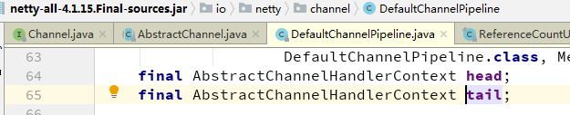

# Netty源码阅读

## NioEventLoop#processSelectedKey

- 如下图，从 `NioEventLoop#processSelectedKey` 按图索骥，可以找到 Server 端，创建`SocketChannel` 的线索


- 对应思否上的一个问题： <https://segmentfault.com/q/1010000018632056/a-1020000018633929>


## 误解

- `ctx` 比 `channel` 小， 没创建一个`handler`就要创建一个`ctx`，`ctx`相当于是`handler`与`pipeline`的纽带，它们都是运行在`channel`上的。`channel`才是航空母舰，`ctx`只是某架飞机的驾驶员（或管家）而已，不要颠倒主次！
- 一个`channel`上只有一个`pipeline`，相当于只有一条跑道；但，可以容纳很多`handler`，每个`handler`都有一个与之对应的`ctx`。

```java
ctx.writeAndFlush();
channel.writeAndFlush(); // -> pipeline.writeAndFlush();
```

如上，在 `ctx` 上调用 `writeAndFlush()` ，与在 `channel` 上调用 `writeAndFlush()` 有什么不同呢？


- 上图，`Channel`的实现`AbstractChannel`，及`ChannelPipeline`的实现`DefaultChannelPipeline`，
- 可以看出，对`channel`的调用最终会转交给`pipeline`



- 如上图，`tail` 的类型是 `AbstractChannelHandlerContext` ，
- 那么，最终，对`pipeline`的调用会转交给`ctx`
- 最终都是对 `ctx` 的调用。


- 上图可以说明，`ctx`和`channel`上调用的区别。


--------


## PooledByteBufAllocator

`io.netty.buffer.PooledByteBufAllocator`

| 常量（原始）                          | 常量（小写）                          |
| ------------------------------------- | ------------------------------------- |
| DEFAULT_NUM_HEAP_ARENA                | default_num_heap_arena                |
| DEFAULT_NUM_DIRECT_ARENA              | default_num_direct_arena              |
| DEFAULT_PAGE_SIZE                     | default_page_size                     |
| DEFAULT_MAX_ORDER                     | default_max_order                     |
| DEFAULT_TINY_CACHE_SIZE               | default_tiny_cache_size               |
| DEFAULT_SMALL_CACHE_SIZE              | default_small_cache_size              |
| DEFAULT_NORMAL_CACHE_SIZE             | default_normal_cache_size             |
| DEFAULT_MAX_CACHED_BUFFER_CAPACITY    | default_max_cached_buffer_capacity    |
| DEFAULT_CACHE_TRIM_INTERVAL           | default_cache_trim_interval           |
| DEFAULT_USE_CACHE_FOR_ALL_THREADS     | default_use_cache_for_all_threads     |
| DEFAULT_DIRECT_MEMORY_CACHE_ALIGNMENT | default_direct_memory_cache_alignment |
| MIN_PAGE_SIZE                         | min_page_size                         |
| MAX_CHUNK_SIZE                        | max_chunk_size                        |

这个类偏底层，我今天花费了一个小时浏览了整个类，仍然没有找到脉络，没有理清关系。还得投入时间，从出版物，从博客，从代码中，找关键点，积累知识点。


## sync()

各种各样的`sync()`，如下：

```java
// Start the client.
ChannelFuture f = b.connect(HOST, PORT).sync();

// Wait until the connection is closed.
f.channel().closeFuture().sync();

// If user typed the 'bye' command, wait until the server closes
// the connection.
if ("bye".equals(line.toLowerCase())) {
	ch.closeFuture().sync();
	break;
}

// Wait until all messages are flushed before closing the channel.
if (lastWriteFuture != null) {
	lastWriteFuture.sync();
}

// ...
```

但`sync()`是如何实现的呢，是for循环吗（不是，是wait）？我一直很好奇！然后，踏上了寻找`sync()`源头的旅程。很奇怪，`sync()`是在接口`io.netty.util.concurrent.Future`中定义的，但是它的子类都是直接`return this`好像没有实现wait。比如：

- `io.netty.util.concurrent.CompleteFuture` 和 `io.netty.channel.CompleteChannelFuture`

```java
@Override
public Future<V> sync() throws InterruptedException {
	return this;
}
```

- `io.netty.util.concurrent.FailedFuture` 和`io.netty.channel.FailedChannelFuture`

```java
@Override
public Future<V> sync() {
	PlatformDependent.throwException(cause);
	return this;
}
```

但是在`Promise`中找到了wait的代码，`io.netty.util.concurrent.Promise`是继承`Future`的，它也是一个接口，在其子实现`io.netty.util.concurrent.DefaultPromise`类中的`sync()`方法中我看到了等待的代码，如下：

```java
@Override
public Promise<V> sync() throws InterruptedException {
	await();
	rethrowIfFailed();
	return this;
}

@Override
public Promise<V> await() throws InterruptedException {
	if (isDone()) {
		return this;
	}

	if (Thread.interrupted()) {
		throw new InterruptedException(toString());
	}

	checkDeadLock();

	synchronized (this) {
		while (!isDone()) {
			incWaiters();
			try {
				wait();
			} finally {
				decWaiters();
			}
		}
	}
	return this;
}

```

- 最终会调用`Object`的`wait()`方法。

有`wait()`相应的就有`notify()`，在`DefaultPromise`看到很多以`notifyXXX`开头的方法，但最实在的方法还是`notifyListenersNow()`，源码如下：

```java
private void notifyListenersNow() {
	Object listeners;
	synchronized (this) {
		// Only proceed if there are listeners to notify and we are not already notifying listeners.
		if (notifyingListeners || this.listeners == null) {
			return;
		}
		notifyingListeners = true;
		listeners = this.listeners;
		this.listeners = null;
	}
	for (;;) {
		if (listeners instanceof DefaultFutureListeners) {
			notifyListeners0((DefaultFutureListeners) listeners);
		} else {
			notifyListener0(this, (GenericFutureListener<?>) listeners);
		}
		synchronized (this) {
			if (this.listeners == null) {
				// Nothing can throw from within this method, so setting notifyingListeners back to false does not
				// need to be in a finally block.
				notifyingListeners = false;
				return;
			}
			listeners = this.listeners;
			this.listeners = null;
		}
	}
}

private void notifyListeners0(DefaultFutureListeners listeners) {
	GenericFutureListener<?>[] a = listeners.listeners();
	int size = listeners.size();
	for (int i = 0; i < size; i ++) {
		notifyListener0(this, a[i]);
	}
}

@SuppressWarnings({ "unchecked", "rawtypes" })
private static void notifyListener0(Future future, GenericFutureListener l) {
	try {
		l.operationComplete(future);
	} catch (Throwable t) {
		logger.warn("An exception was thrown by " + l.getClass().getName() + ".operationComplete()", t);
	}
}

```

最终是抵达到`GenericFutureListener.operationComplete(..)`方法，`GenericFutureListener`是一个接口，让我们看看它的其中一个子实现`io.netty.util.concurrent.PromiseNotifier`：

```java
@Override
public void operationComplete(F future) throws Exception {
	InternalLogger internalLogger = logNotifyFailure ? logger : null;
	if (future.isSuccess()) {
		V result = future.get();
		for (Promise<? super V> p: promises) {
			PromiseNotificationUtil.trySuccess(p, result, internalLogger);
		}
	} else if (future.isCancelled()) {
		for (Promise<? super V> p: promises) {
			PromiseNotificationUtil.tryCancel(p, internalLogger);
		}
	} else {
		Throwable cause = future.cause();
		for (Promise<? super V> p: promises) {
			PromiseNotificationUtil.tryFailure(p, cause, internalLogger);
		}
	}
}

```

从上面的`PromiseNotificationUtil.trySuccess`跟踪源码，你又会回到`DefaultPromise`，以下是相关代码：

```java
@Override
public boolean trySuccess(V result) {
	if (setSuccess0(result)) {
		notifyListeners();
		return true;
	}
	return false;
}

private boolean setSuccess0(V result) {
	return setValue0(result == null ? SUCCESS : result);
}

private boolean setFailure0(Throwable cause) {
	return setValue0(new CauseHolder(checkNotNull(cause, "cause")));
}

private boolean setValue0(Object objResult) {
	if (RESULT_UPDATER.compareAndSet(this, null, objResult) ||
		RESULT_UPDATER.compareAndSet(this, UNCANCELLABLE, objResult)) {
		checkNotifyWaiters();
		return true;
	}
	return false;
}

private synchronized void checkNotifyWaiters() {
	if (waiters > 0) {
		notifyAll();
	}
}

```

- 从 `if (setSuccess0(result)) {` 开始，最终会调用到`Object.notifyAll()`方法上。


# End

