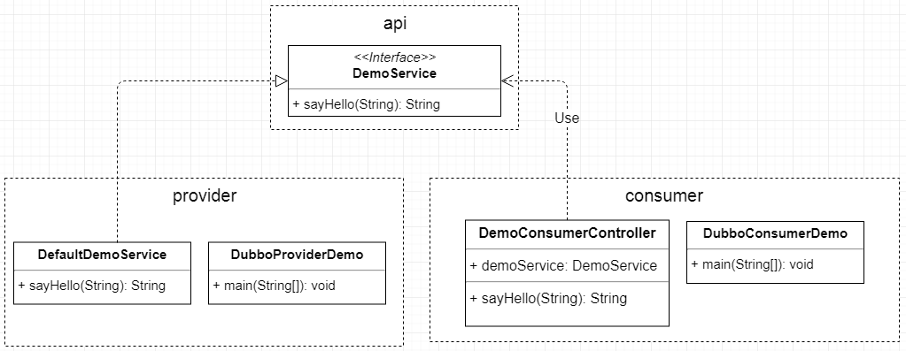
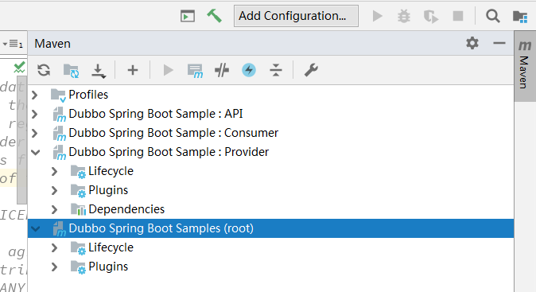
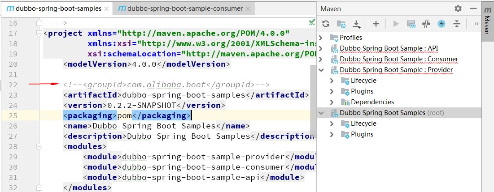

# （一）Dubbo

## Maven私有库

自己做练习时，特别是在使用“Jenkins”这样的自动构建工具时，可能需要搭建一个Maven私有库（Nexus），发布自己的jar，但是自己的机器可能不够用，这时可以阿里云-云效。

- http://maven.aliyun.com/mvn/view
- https://rdc.aliyun.com/my ，通过这个链接进入，需要登录。找到管理控制台-搜索-云效，……然后按照说明一步一步的操作即可！

## dubbo文档

- https://dubbo.gitbooks.io/dubbo-user-book/content/preface/background.html
- http://dubbo.apache.org/zh-cn/docs/user/preface/background.html

一个是“gitbooks”上的，一个是“apache”上的。

- github： https://github.com/apache/incubator-dubbo
- dubbo-spring-boot
  - https://github.com/alibaba/dubbo-spring-boot-starter/blob/master/README_zh.md
  - ✓ https://github.com/apache/incubator-dubbo-spring-boot-project/blob/master/README_CN.md
- 

# （二）hello dubbo

## 01 git clone

```shell
git clone https://github.com/apache/incubator-dubbo-spring-boot-project.git
```

把官方的代码克隆到本地，使用IDEA导入其中的`dubbo-spring-boot-samples`，但是，会有问题：

- `com.alibaba.boot:dubbo-spring-boot-starter:0.2.1-SNAPSHOT`
- `com.alibaba.boot:dubbo-spring-boot-actuator:0.2.1-SNAPSHOT`

以上这两个会找不到，其实应该将`incubator-dubbo-spring-boot-project`整个工程导入，但是，这样又引入一些我们不需要的东西，让整个工程看起来复杂。

## 02 导入IDEA

我从clone下来的项目中，将`dubbo-spring-boot-samples`提取出来，拷贝到一个新的目录下。然后导入到`IDEA`中。

这是一个多模块的Maven项目，一个parent，三个子module：

- dubbo-spring-boot-samples（parent）
  - dubbo-spring-boot-sample-api（api）
  - dubbo-spring-boot-sample-consumer（consumer）
  - dubbo-spring-boot-sample-provider（provider）

首先需要修改`parent`中的pom.xml配置

### pom.xml（parent）

```xml
<project xmlns="http://maven.apache.org/POM/4.0.0"
         xmlns:xsi="http://www.w3.org/2001/XMLSchema-instance"
         xsi:schemaLocation="http://maven.apache.org/POM/4.0.0 http://maven.apache.org/xsd/maven-4.0.0.xsd">
    <modelVersion>4.0.0</modelVersion>

    <groupId>com.alibaba.boot</groupId>
    <artifactId>dubbo-spring-boot-samples</artifactId>
	<version>0.2.2-SNAPSHOT</version>
    <packaging>pom</packaging>
    <name>Dubbo Spring Boot Samples</name>
    <description>Dubbo Spring Boot Samples</description>
    <modules>
        <module>dubbo-spring-boot-sample-provider</module>
        <module>dubbo-spring-boot-sample-consumer</module>
        <module>dubbo-spring-boot-sample-api</module>
    </modules>

    <parent>
        <groupId>org.springframework.boot</groupId>
        <artifactId>spring-boot-starter-parent</artifactId>
        <version>2.1.0.RELEASE</version>
        <!--<relativePath/> &lt;!&ndash; lookup parent from repository &ndash;&gt;-->
    </parent>

    <properties>
        <project.build.sourceEncoding>UTF-8</project.build.sourceEncoding>
        <project.reporting.outputEncoding>UTF-8</project.reporting.outputEncoding>
        <java.version>1.8</java.version>
        <dubbo-spring-boot-starter.version>0.2.0</dubbo-spring-boot-starter.version>
    </properties>

    <dependencyManagement>
        <dependencies>
            <dependency>
                <groupId>com.alibaba.boot</groupId>
                <artifactId>dubbo-spring-boot-starter</artifactId>
                <version>${dubbo-spring-boot-starter.version}</version>
            </dependency>

            <dependency>
                <groupId>com.alibaba.boot</groupId>
                <artifactId>dubbo-spring-boot-actuator</artifactId>
                <version>${dubbo-spring-boot-starter.version}</version>
            </dependency>

            <dependency>
                <groupId>org.springframework.boot</groupId>
                <artifactId>spring-boot-starter-actuator</artifactId>
                <version>2.1.0.RELEASE</version>
            </dependency>

            <!-- Dubbo -->
            <dependency>
                <groupId>com.alibaba</groupId>
                <artifactId>dubbo</artifactId>
                <version>2.6.5</version>
            </dependency>
            <!-- Spring Context Extras -->
            <dependency>
                <groupId>com.alibaba.spring</groupId>
                <artifactId>spring-context-support</artifactId>
                <version>1.0.2</version>
            </dependency>

            <dependency>
                <groupId>javax.servlet</groupId>
                <artifactId>javax.servlet-api</artifactId>
                <version>3.1.0</version>
                <scope>provided</scope>
            </dependency>
        </dependencies>
    </dependencyManagement>

    <build>
        <pluginManagement>
            <plugins>
                <plugin>
                    <groupId>org.springframework.boot</groupId>
                    <artifactId>spring-boot-maven-plugin</artifactId>
                </plugin>
                <plugin>
                    <groupId>org.apache.maven.plugins</groupId>
                    <artifactId>maven-deploy-plugin</artifactId>
                    <configuration>
                        <skip>true</skip>
                    </configuration>
                </plugin>
            </plugins>
        </pluginManagement>
    </build>
</project>
```


### pom.xml（consumer）

```xml
<project xmlns="http://maven.apache.org/POM/4.0.0"
         xmlns:xsi="http://www.w3.org/2001/XMLSchema-instance"
         xsi:schemaLocation="http://maven.apache.org/POM/4.0.0 http://maven.apache.org/xsd/maven-4.0.0.xsd">
    <parent>
        <groupId>com.alibaba.boot</groupId>
        <artifactId>dubbo-spring-boot-samples</artifactId>
        <version>0.2.2-SNAPSHOT</version>
        <relativePath>../pom.xml</relativePath>
    </parent>
    <modelVersion>4.0.0</modelVersion>

    <artifactId>dubbo-spring-boot-sample-consumer</artifactId>
    <name>Dubbo Spring Boot Sample : Consumer</name>

    <dependencies>

        <dependency>
            <groupId>${project.groupId}</groupId>
            <artifactId>dubbo-spring-boot-sample-api</artifactId>
            <version>${project.version}</version>
        </dependency>

        <!-- Spring Boot dependencies -->
        <dependency>
            <groupId>org.springframework.boot</groupId>
            <artifactId>spring-boot-starter-web</artifactId>
        </dependency>

        <dependency>
            <groupId>org.springframework.boot</groupId>
            <artifactId>spring-boot-starter-actuator</artifactId>
        </dependency>

        <dependency>
            <groupId>com.alibaba.boot</groupId>
            <artifactId>dubbo-spring-boot-starter</artifactId>
        </dependency>

        <dependency>
            <groupId>com.alibaba.boot</groupId>
            <artifactId>dubbo-spring-boot-actuator</artifactId>
        </dependency>

        <!-- Dubbo -->
        <dependency>
            <groupId>com.alibaba</groupId>
            <artifactId>dubbo</artifactId>
        </dependency>
        <!-- Spring Context Extras -->
        <dependency>
            <groupId>com.alibaba.spring</groupId>
            <artifactId>spring-context-support</artifactId>
        </dependency>

    </dependencies>

    <build>
        <plugins>
            <!--<plugin>-->
                <!--<groupId>org.springframework.boot</groupId>-->
                <!--<artifactId>spring-boot-maven-plugin</artifactId>-->
                <!--<version>${spring-boot.version}</version>-->
                <!--<executions>-->
                    <!--<execution>-->
                        <!--<goals>-->
                            <!--<goal>repackage</goal>-->
                        <!--</goals>-->
                    <!--</execution>-->
                <!--</executions>-->
            <!--</plugin>-->
            <plugin>
                <groupId>org.springframework.boot</groupId>
                <artifactId>spring-boot-maven-plugin</artifactId>
            </plugin>
        </plugins>
    </build>

</project>
```


### pom.xml（provider）

```xml
<project xmlns="http://maven.apache.org/POM/4.0.0"
         xmlns:xsi="http://www.w3.org/2001/XMLSchema-instance"
         xsi:schemaLocation="http://maven.apache.org/POM/4.0.0 http://maven.apache.org/xsd/maven-4.0.0.xsd">
    <parent>
        <groupId>com.alibaba.boot</groupId>
        <artifactId>dubbo-spring-boot-samples</artifactId>
        <version>0.2.2-SNAPSHOT</version>
        <relativePath>../pom.xml</relativePath>
    </parent>
    <modelVersion>4.0.0</modelVersion>

    <artifactId>dubbo-spring-boot-sample-provider</artifactId>
    <name>Dubbo Spring Boot Sample : Provider </name>

    <dependencies>

        <dependency>
            <groupId>${project.groupId}</groupId>
            <artifactId>dubbo-spring-boot-sample-api</artifactId>
            <version>${project.version}</version>
        </dependency>

        <!-- Spring Boot dependencies -->
        <dependency>
            <groupId>org.springframework.boot</groupId>
            <artifactId>spring-boot-starter</artifactId>
        </dependency>

        <dependency>
            <groupId>org.springframework.boot</groupId>
            <artifactId>spring-boot-starter-actuator</artifactId>
        </dependency>

        <dependency>
            <!--<groupId>${project.groupId}</groupId>-->
            <!--<artifactId>dubbo-spring-boot-starter</artifactId>-->
            <groupId>com.alibaba.boot</groupId>
            <artifactId>dubbo-spring-boot-starter</artifactId>
        </dependency>

        <dependency>
            <groupId>com.alibaba.boot</groupId>
            <artifactId>dubbo-spring-boot-actuator</artifactId>
        </dependency>

        <!-- Dubbo -->
        <dependency>
            <groupId>com.alibaba</groupId>
            <artifactId>dubbo</artifactId>
        </dependency>
        <!-- Spring Context Extras -->
        <dependency>
            <groupId>com.alibaba.spring</groupId>
            <artifactId>spring-context-support</artifactId>
        </dependency>

    </dependencies>

    <build>
        <plugins>
            <plugin>
                <groupId>org.springframework.boot</groupId>
                <artifactId>spring-boot-maven-plugin</artifactId>
            </plugin>
            <!--<plugin>-->
                <!--<groupId>org.springframework.boot</groupId>-->
                <!--<artifactId>spring-boot-maven-plugin</artifactId>-->
                <!--<version>${spring-boot.version}</version>-->
                <!--<executions>-->
                    <!--<execution>-->
                        <!--<goals>-->
                            <!--<goal>repackage</goal>-->
                        <!--</goals>-->
                    <!--</execution>-->
                <!--</executions>-->
            <!--</plugin>-->
        </plugins>
    </build>

</project>
```

## 03 简单分析

### api

api-模块中就一个接口，是唯一一个不用修改pom.xml的模块，因为不需要其他依赖。但是`api`模块被`consumer`和`provider`这两个模块引用，这也是将其独立成一个模块的原因。

### provider

provider-模块，这是dubbo中提供接口服务的一方。在这个例子中使用的是`dubbo`协议，端口是`1234`，没有使用zookeeper组件。从`application.properties`文件中可以看出端倪：

#### application.properties

```java
# Spring boot application
spring.application.name = dubbo-provider-demo
server.port = 9090


# DemoService service version
demo.service.version = 1.0.0

# Base packages to scan Dubbo Component: @com.alibaba.dubbo.config.annotation.Service
dubbo.scan.basePackages  = com.alibaba.boot.dubbo.demo.provider.service


# Dubbo Config properties
## ApplicationConfig Bean
dubbo.application.id = dubbo-provider-demo
dubbo.application.name = dubbo-provider-demo
dubbo.application.qos.port=22222
dubbo.application.qos.enable=true

## ProtocolConfig Bean
dubbo.protocol.id = dubbo
dubbo.protocol.name = dubbo
dubbo.protocol.port = 12345
dubbo.protocol.status = server

## RegistryConfig Bean
dubbo.registry.id = my-registry
dubbo.registry.address = N/A

# Enables Dubbo All Endpoints
management.endpoint.dubbo.enabled = true
management.endpoint.dubbo-shutdown.enabled = true
management.endpoint.dubbo-configs.enabled = true
management.endpoint.dubbo-services.enabled = true
management.endpoint.dubbo-references.enabled = true
management.endpoint.dubbo-properties.enabled = true

# Dubbo Health
## StatusChecker Name defaults (default : "memory", "load" )
management.health.dubbo.status.defaults = memory
## StatusChecker Name extras (default : empty )
management.health.dubbo.status.extras = load,threadpool
```

#### DefaultDemoService.java

```java
@Service(
        version = "${demo.service.version}",
        application = "${dubbo.application.id}",
        protocol = "${dubbo.protocol.id}",
        registry = "${dubbo.registry.id}"
)
public class DefaultDemoService implements DemoService {

    public String sayHello(String name) {
        return "Hello, " + name + " (from Spring Boot)";
    }

}
```


#### DubboProviderDemo.java

```java
@SpringBootApplication
public class DubboProviderDemo {

    public static void main(String[] args) {

        new SpringApplicationBuilder(DubboProviderDemo.class)
                .web(WebApplicationType.NONE)
                .run(args);

    }

}
```

### consumer

consumer-模块是一个web项目。

#### application.properties

```java
# Spring boot application
spring.application.name = dubbo-consumer-demo
server.port = 8080
management.server.port = 8081

# DemoService service version
demo.service.version = 1.0.0

# Dubbo Config properties
## ApplicationConfig Bean
dubbo.application.id = dubbo-consumer-demo
dubbo.application.name = dubbo-consumer-demo

## Legacy QOS Config
dubbo.qos.port = 22223

## ProtocolConfig Bean
dubbo.protocol.id = dubbo
dubbo.protocol.name = dubbo
dubbo.protocol.port = 12345

# Dubbo Endpoint (default status is disable)
endpoints.dubbo.enabled = true

# Dubbo Health
## StatusChecker Name defaults (default : "memory", "load" )
management.health.dubbo.status.defaults = memory

# Enables Dubbo All Endpoints
management.endpoint.dubbo.enabled = true
management.endpoint.dubbo-shutdown.enabled = true
management.endpoint.dubbo-configs.enabled = true
management.endpoint.dubbo-services.enabled = true
management.endpoint.dubbo-references.enabled = true
management.endpoint.dubbo-properties.enabled = true

# Exposes all web endpoints
management.endpoints.web.exposure.include = *
```

#### DemoConsumerController.java

```java
@RestController
public class DemoConsumerController {

    @Reference(version = "${demo.service.version}",
            application = "${dubbo.application.id}",
            url = "dubbo://localhost:12345")
    private DemoService demoService;

    @RequestMapping("/sayHello")
    public String sayHello(@RequestParam String name) {
        return demoService.sayHello(name);
    }

}
```


#### DubboConsumerDemo.java

```java
@SpringBootApplication(scanBasePackages = "com.alibaba.boot.dubbo.demo.consumer.controller")
public class DubboConsumerDemo {

    public static void main(String[] args) {

        SpringApplication.run(DubboConsumerDemo.class,args);

    }

}
```

## 04 体验

先启动`provider`再启动`consumer`，然后，在浏览器中访问

- <http://localhost:8080/sayHello?name=HelloWorld>，

还可以访问<http://localhost:8081/actuator/health> 和 <http://localhost:8081/actuator/dubbo>，

需要注意，在springboot2.x中`actuator`的api链接有所不同，直接访问<http://localhost:8081/actuator/>，此链接会展示一个列表，dubbo有好几个服务，可以`Ctrl + F`搜索关键字`dubbo`找到。

## 05 ✓ 类图



如上图，三个模块，其实只编写了六个类。大量的逻辑在配置文件和注解中。

# （三）✓ 踩坑记录

## 01 没有"groupId"

因为嫌弃官方github中clone下来的内容太多、累赘，就把`dubbo-spring-boot-samples`单独拷贝到一个目录下，然后在修改`pom.xml`时疏忽了，没有添加`groupId`。（这是在拷贝多模块项目时最容易忽视的地方，可以自己测试一下，将`groupId`删除，看看IDEA怎样报错）

事实上，我之前没有这样做过（将一个多模块项目中的子模块拷贝出来，独立导入到IDEA中）。所以，我一直没看明白，IDEA的错误提示！

文字描述有些苍白，来看看下面两张截图吧：





下图是注释掉`groupId`时的情形，上图是正确的。现在我没法重现之前的情形了，一开始，pom.xml文件中就没有`groupId`这一行，所以，上图中的`Dependencies`就没有。

这给我们一个提示，如果你导入项目，发现没有`Dependencies`那一定是parent（在这里就是`Dubbo Spring Boot Samples (root)`）中缺少了`groupId`，`artifactId`和`version`一般不会省略，只有`groupId`在多模块项目中可以省略，因为整个项目都是共用一个`groupId`的，子模块可以继承parent中的`groupId`，所以子模块可以省略这一行。复制模块时要小心！

## 02 没有"management"

这个问题比较好定位，`Dubbo Spring Boot Samples : API`模块中只包含一个接口，不需要任何额外的maven依赖，`clean compile`是没问题的，但是`package`时却报错了。

```java
[ERROR] Failed to execute goal org.springframework.boot:spring-boot-maven-plugin:2.1.0.RELEASE:repackage (repackage) on project dubbo-spring-boot-sample-api: Execution repackage of goal org.springframework.boot:spring-boot-maven-plugin:2.1.0.RELEASE:repackage failed: Unable to find main class -> [Help 1]
```
下面这行是重点
```java
Execution repackage of goal org.springframework.boot:spring-boot-maven-plugin:2.1.0.RELEASE:repackage failed
```

可以看到`spring-boot-maven-plugin:2.1.0.RELEASE`，略加思索，我想到是parent中的plugin依赖没有放入`pluginManagement`中管理的缘故，如果不使用`pluginManagement`进行管理，那所有的子模块将自动依赖，这样是不友好的，特别是 API 模块一般是POJO或公共接口，不需要依赖任何第三方类，依赖了反而会出现错误。

修改了parent（`Dubbo Spring Boot Samples (root)`）中的plugin配置之后，再`clean package`就正常了！


# dubbo-服务降级

- ~~https://blog.csdn.net/luckykapok918/article/details/72381992~~
- https://blog.csdn.net/wsm0712syb/article/details/61413276
- ✓ http://dubbo.apache.org/zh-cn/docs/user/demos/service-downgrade.html
  - 服务降级-官方解释


# End