> 2019年3月5日20:10:51， 这个文档是半成品，草稿！现在阅读起来很晦涩，只有类图有点小作用。


# Dubbo

- https://github.com/apache/incubator-dubbo
- http://dubbo.apache.org/zh-cn/docs/user/quick-start.html

## Getting started

### dubbo-samples-api

按照  [dubbo|github官网](https://github.com/apache/incubator-dubbo)  上的Getting started，克隆官方样例。

```shell
# git clone https://github.com/dubbo/dubbo-samples.git
```

我是克隆到本地`F:\wxg118_dubbo\dubbo-samples`下，

然后，启动`IDEA`将整个工程导入。

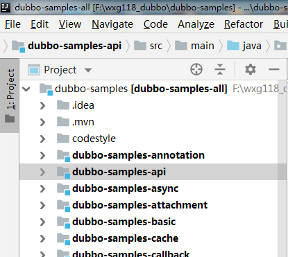

子模块很多，`dubbo-samples-api`就是官方推荐的第一个样例。

按照官方的说法，在命令行中输入以下命令启动测试：

```shell
mvn -Djava.net.preferIPv4Stack=true -Dexec.mainClass=org.apache.dubbo.samples.provider.Application exec:java

mvn -Djava.net.preferIPv4Stack=true -Dexec.mainClass=org.apache.dubbo.samples.consumer.Application exec:java
```

上面的命令是启动`provider`，下面的是启动`consumer`，`provider`先启动，它会一直运行，等待`consumer`的连接。

因为我已经导入到`IDEA`中了，所以直接在`IDEA`中启动就可以看到测试结果了（没有使用`-Djava.net.preferIPv4Stack=true`，可能有些版本的IDE需要添加这个，我测试时没有添加这个参数）。

#### 简单分析

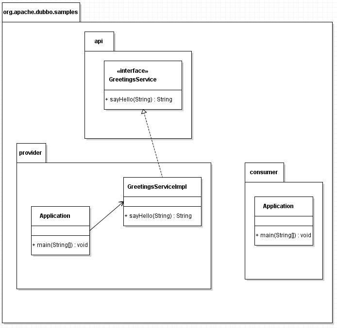

如上图，`dubbo-samples-api`有三个包`api`，`provider`，`consumer`，`GreetingsService`是接口，`GreetingsServiceImpl`是实现，两个`Application`分别是`provider`和`consumer`的启动类。

##### api

没什么好研究的，就一个接口`GreetingsService`

##### provider

`GreetingsServiceImpl`是接口`GreetingsService`的实现；

`Application`是启动类，代码如下：

```java
public class Application {
    public static void main(String[] args) throws IOException {
        ServiceConfig<GreetingsService> service = new ServiceConfig<>();
        service.setApplication(new ApplicationConfig("first-dubbo-provider"));
        service.setRegistry(new RegistryConfig("multicast://224.5.6.7:1234"));
        service.setInterface(GreetingsService.class);
        service.setRef(new GreetingsServiceImpl());
        service.export();
        System.out.println("first-dubbo-provider is running.");
        System.in.read();
    }
}
```


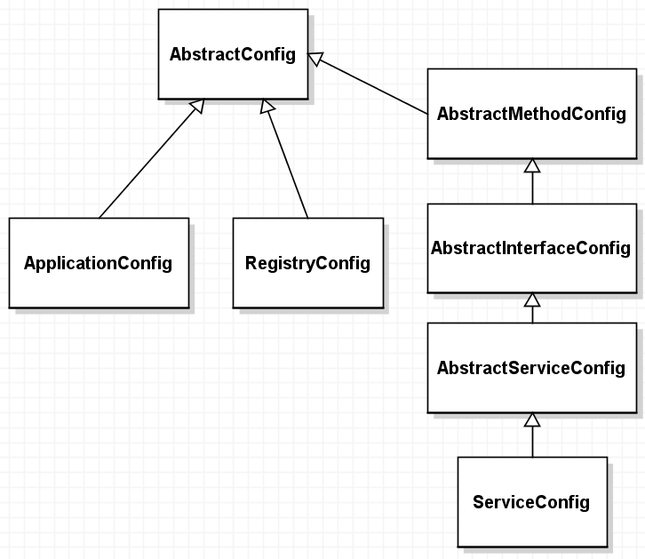

`ApplicationConfig`，`RegistryConfig`，`ServiceConfig`都是继承自`AbstractConfig`，如上图。

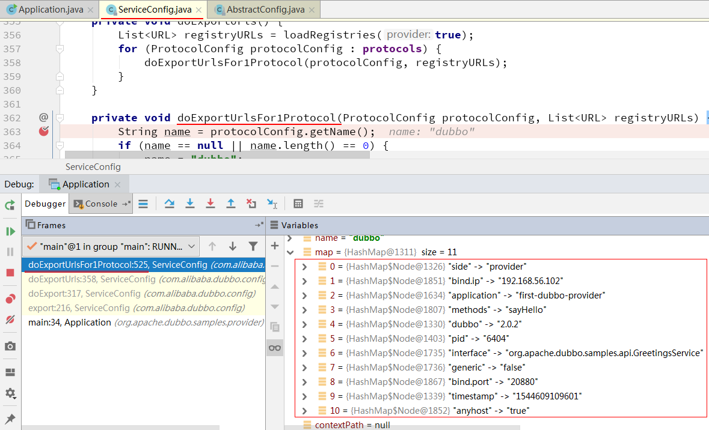

配置属性都在`ServiceConfig.doExportUrlsFor1Protocol`方法中组装，如上图，`11`个属性添加到`map`中了：

| 属性        | 值                                           |
| ----------- | -------------------------------------------- |
| side        | provider                                     |
| bind.ip     | 192.168.56.102                               |
| application | first-dubbo-provider                         |
| methods     | sayHello                                     |
| dubbo       | 2.0.2                                        |
| pid         | 6404                                         |
| interface   | org.apache.dubbo.samples.api.GreetingService |
| generic     | false                                        |
| bind.port   | 20880                                        |
| timestamp   | 1544609109601                                |
| anyhost     | true                                         |

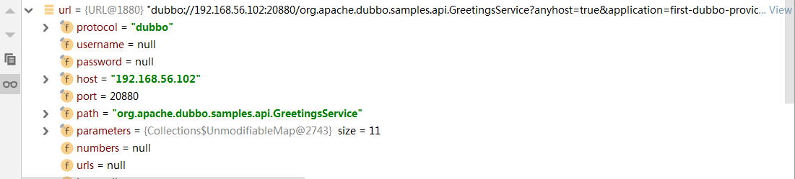

`url`，如上图，内容很长，完整内容展示在下面：

> dubbo://192.168.56.102:20880/org.apache.dubbo.samples.api.GreetingsService?anyhost=true&application=first-dubbo-provider&bind.ip=192.168.56.102&bind.port=20880&dubbo=2.0.2&generic=false&interface=org.apache.dubbo.samples.api.GreetingsService&methods=sayHello&pid=6404&side=provider&timestamp=1544609109601

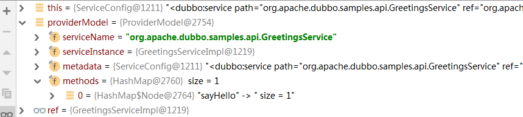

`providerModel`，如上图，一个`ProviderModel`就代表一个接口吧？！

| 属性            | 值                                            |
| --------------- | --------------------------------------------- |
| serviceName     | org.apache.dubbo.samples.api.GreetingsService |
| serviceInstance | GreetingsServiceImpl@1219                     |
| metadata        | ...                                           |
| methods         | sayHello                                      |

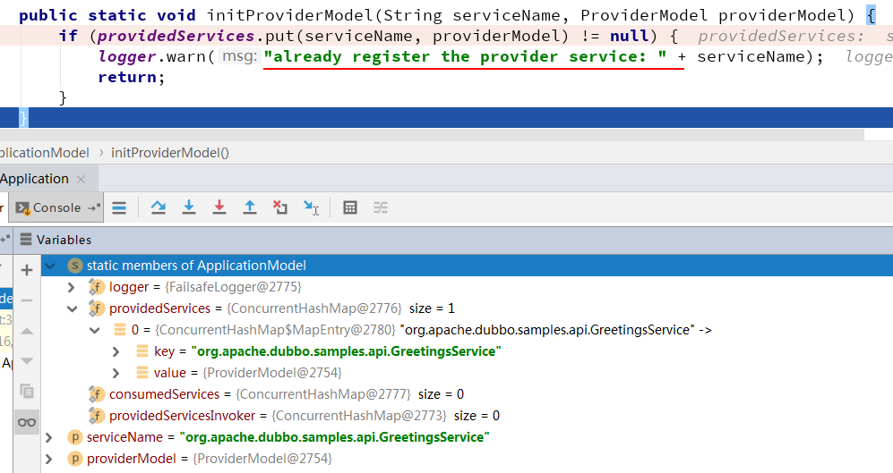

承上，把`serviceName`和`providerModel`添加到`ConcurrentHashMap providedServices`中后，dubbo会向控制台输出"already register the provider service: org.apache.dubbo.samples.api.GreetingsService"。

----


至此，对provider端的代码总算是有了一定的认识：

- 主要是创建`ServiceConfig`实例，然后设置不可或缺的属性
  - setApplication
  - setRegistry
  - setInterface
  - setRef
- 重点是`ServiceConfig.export()`，这个方法的细节，上面有截图阐述。

```java
public class Application {
    public static void main(String[] args) throws IOException {
        ServiceConfig<GreetingsService> service = new ServiceConfig<>();
        service.setApplication(new ApplicationConfig("first-dubbo-provider"));
        service.setRegistry(new RegistryConfig("multicast://224.5.6.7:1234"));
        service.setInterface(GreetingsService.class);
        service.setRef(new GreetingsServiceImpl());
        service.export();
        System.out.println("first-dubbo-provider is running.");
        System.in.read();
    }
}
```

##### consumer

`Application`是启动类，代码如下：

```java
public class Application {
    public static void main(String[] args) {
        ReferenceConfig<GreetingsService> reference = new ReferenceConfig<>();
        reference.setApplication(new ApplicationConfig("first-dubbo-consumer"));
        reference.setRegistry(new RegistryConfig("multicast://224.5.6.7:1234"));
        reference.setInterface(GreetingsService.class);
        GreetingsService greetingsService = reference.get();
        String message = greetingsService.sayHello("dubbo");
        System.out.println(message);
    }
}
```

核心类是`ReferenceConfig`，同provider中的`ServiceConfig`一样，都位于`com.alibaba.dubbo.config`包下。它们有很多共同点，如下图：

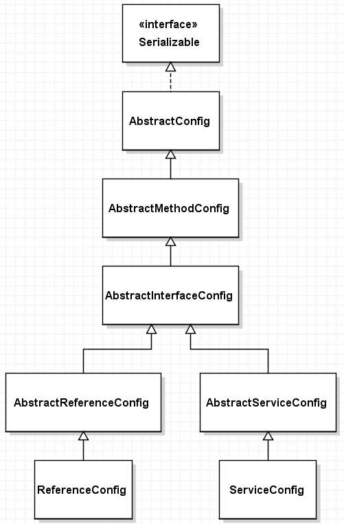


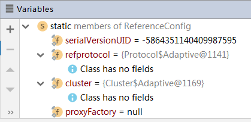

如上图，`ReferenceConfig`中的`refprotocol`，`cluster`

- `refprotocol` ： Protocol$Adaptive
- `cluster` ： Cluster$Adaptive

带有`$Adaptive`的类都是`dubbo`合成的类。

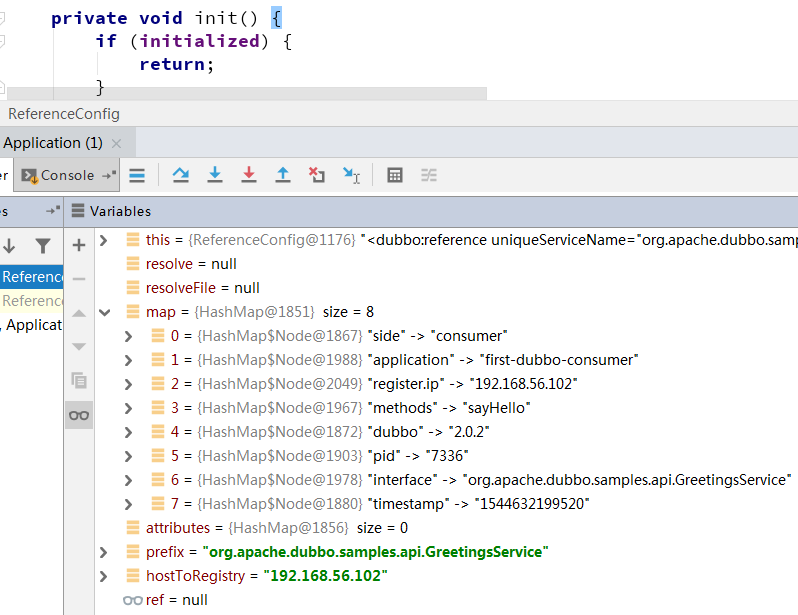

在`ReferenceConfig`中，最主要的方法是`init()`，如上图，`map`的填充就是在这个方法中完成的：

| 属性        | 值                                            |
| ----------- | --------------------------------------------- |
| side        | consumer                                      |
| application | first-dubbo-consumer                          |
| register.ip | 192.168.56.102                                |
| methods     | sayHello                                      |
| dubbo       | 2.0.2                                         |
| pid         | 7336                                          |
| interface   | org.apache.dubbo.samples.api.GreetingsService |
| timestamp   | 1544632199520                                 |

`init()`方法中还有对其他重要方法的调用~

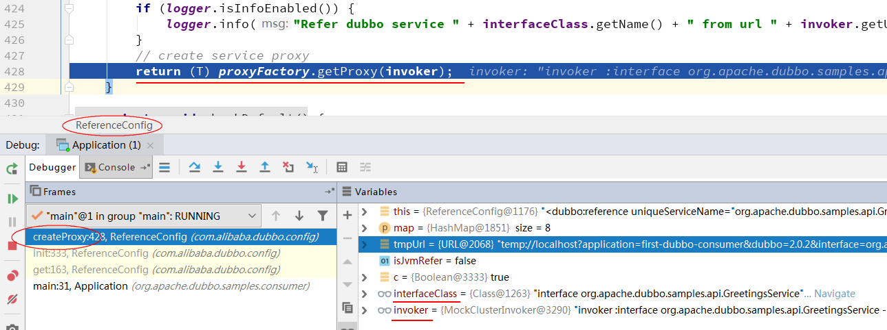

`createProxy()` ： ……

tmpUrl

> temp://localhost?application=first-dubbo-consumer&dubbo=2.0.2&interface=org.apache.dubbo.samples.api.GreetingsService&methods=sayHello&pid=7336&register.ip=192.168.56.102&side=consumer&timestamp=1544632199520

> multicast://224.5.6.7:1234/com.alibaba.dubbo.registry.RegistryService?application=first-dubbo-consumer&dubbo=2.0.2&pid=7336&timestamp=1544632836595

> registry://224.5.6.7:1234/com.alibaba.dubbo.registry.RegistryService?application=first-dubbo-consumer&dubbo=2.0.2&pid=7336&registry=multicast&timestamp=1544632836595


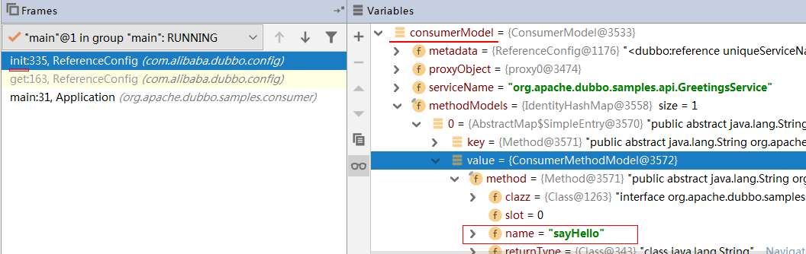

如上图，`ConsumerModel`应该是和`ProviderModel`相对应的。

----

因为先对`provider`进行过探索，再探索`consumer`会轻松很多。provider是`ServiceConfig`，consumer是`ReferenceConfig`。

- `setApplication()`
- `setRegistry()`
- `setInterface()`
- `get()`

重点是`ReferenceConfig.init()`，重要的逻辑都在这个方法中实现，或者是在这个方法中被调用。

```java
public class Application {
    public static void main(String[] args) {
        ReferenceConfig<GreetingsService> reference = new ReferenceConfig<>();
        reference.setApplication(new ApplicationConfig("first-dubbo-consumer"));
        reference.setRegistry(new RegistryConfig("multicast://224.5.6.7:1234"));
        reference.setInterface(GreetingsService.class);
        GreetingsService greetingsService = reference.get();
        String message = greetingsService.sayHello("dubbo");
        System.out.println(message);
    }
}
```


## 源码摘录

### AbstractConfig

com.alibaba.dubbo.config.AbstractConfig

```java
static {
	legacyProperties.put("dubbo.protocol.name", "dubbo.service.protocol");
	legacyProperties.put("dubbo.protocol.host", "dubbo.service.server.host");
	legacyProperties.put("dubbo.protocol.port", "dubbo.service.server.port");
	legacyProperties.put("dubbo.protocol.threads", "dubbo.service.max.thread.pool.size");
	legacyProperties.put("dubbo.consumer.timeout", "dubbo.service.invoke.timeout");
	legacyProperties.put("dubbo.consumer.retries", "dubbo.service.max.retry.providers");
	legacyProperties.put("dubbo.consumer.check", "dubbo.service.allow.no.provider");
	legacyProperties.put("dubbo.service.url", "dubbo.service.address");

	// this is only for compatibility
	Runtime.getRuntime().addShutdownHook(DubboShutdownHook.getDubboShutdownHook());
}

```

| 旧                     | 新                                 |
| ---------------------- | ---------------------------------- |
| dubbo.protocol.name    | dubbo.service.protocol             |
| dubbo.protocol.host    | dubbo.service.server.host          |
| dubbo.protocol.port    | dubbo.service.server.port          |
| dubbo.protocol.threads | dubbo.service.max.thread.pool.size |
| dubbo.consumer.timeout | dubbo.service.invoke.timeout       |
| dubbo.consumer.retries | dubbo.service.max.retry.providers  |
| dubbo.consumer.check   | dubbo.service.allow.no.provider    |
| dubbo.service.url      | dubbo.service.address              |

### ExtensionLoader

```java
private static <T> boolean withExtensionAnnotation(Class<T> type) {
	return type.isAnnotationPresent(SPI.class);
}
```

```java
if (!type.isInterface()) {
	throw new IllegalArgumentException("Extension type(" + type + ") is not interface!");
}

if (!withExtensionAnnotation(type)) {
	throw new IllegalArgumentException("Extension type(" + type +
			") is not extension, because WITHOUT @" + SPI.class.getSimpleName() + " Annotation!");
}
```

如果不是接口，并且没有被`@SPI`标注，就不能被`ExtensionLoader`的`getExtensionLoader()`调用。

这个类有点复杂，不太好理解。特别是`createAdaptiveExtensionClassCode()`方法，这个方法将为接口生成其对应的子类（？）

META-INF

- `META-INF/services/`
- `META-INF/dubbo/`
- `META-INF/dubbo/internal/`

在`dubbo-2.6.4.jar`中可以找到`META-INF/dubbo/internal/`，内有`31`个文件，我快速浏览了一遍它们的内容，感兴趣的类通过`IDEA`快速定位到并查看了代码内容，有一些感悟，但，需要加深加强（需要更多时间）。

### Constants

`com.alibaba.dubbo.common.Constants`

定义常量的类，……


# 官方解释

在 http://dubbo.apache.org/zh-cn/blog/dubbo-101.html 可以找到`第一个样例`的解释，摘抄如下：

### 实现 Dubbo 服务提供方

```java
public class Application {
    public static void main(String[] args) throws IOException {
        ServiceConfig<GreetingsService> service = new ServiceConfig<>(); // #1
        service.setApplication(new ApplicationConfig("first-dubbo-provider")); // #2
        service.setRegistry(new RegistryConfig("multicast://224.5.6.7:1234")); // #3
        service.setInterface(GreetingsService.class); // #4
        service.setRef(new GreetingsServiceImpl()); // #5
        service.export(); // #6
        System.in.read(); // #7
    }
}
```

**说明**：

1. 创建一个 *ServiceConfig* 的实例，泛型参数信息是服务接口类型，即 *GreetingsService*。
2. 生成一个 *AplicatonConfig* 的实例，并将其装配进 *ServiceConfig*。
3. 生成一个 *RegistryConfig* 实例，并将其装配进 *ServiceConfig*，这里使用的是组播方式，参数是 `multicast://224.5.6.7:1234`。合法的组播地址范围为：*224.0.0.0 - 239.255.255.255*
4. 将服务契约 *GreetingsService* 装配进 *ServiceConfig*。
5. 将服务提供者提供的实现 *GreetingsServiceImpl* 的实例装配进 *ServiceConfig*。
6. *ServiceConfig* 已经具备足够的信息，开始对外暴露服务，默认监听端口是 *20880*。
7. 为了防止服务端退出，按任意键或者 *ctrl-c* 退出。

> 新学到知识：合法的组播地址范围为：*224.0.0.0 - 239.255.255.255*

### 实现 Dubbo 服务调用方

```java
public class Application {
    public static void main(String[] args) {
        ReferenceConfig<GreetingsService> reference = new ReferenceConfig<>(); // #1
        reference.setApplication(new ApplicationConfig("first-dubbo-client")); // #2
        reference.setRegistry(new RegistryConfig("multicast://224.5.6.7:1234")); // #3
        reference.setInterface(GreetingsService.class); // #4
        GreetingsService greetingsService = reference.get(); // #5
        String message = greetingsService.sayHi("dubbo"); // #6
        System.out.println(message); // #7
    }
}
```

**说明**：

1. 创建一个 *ReferenceConfig* 的实例，同样，泛型参数信息是服务接口类型，即 *GreetingService*。
2. 生成一个 *AplicatonConfig* 的实例，并将其装配进 *ReferenceConfig*。
3. 生成一个 *RegistryConfig* 实例，并将其装配进 *ReferenceConfig*，注意这里的组播地址信息需要与服务提供方的相同。
4. 将服务契约 *GreetingsService* 装配进 *ReferenceConfig*。
5. 从 *ReferenceConfig* 中获取到 *GreetingService* 的代理。
6. 通过 *GreetingService* 的代理发起远程调用，传入的参数为 *dubbo*。
7. 打印返回结果 *hi, dubbo*。


# start.dubbo.io

http://start.dubbo.io/

， 类似 Spring Initializr ：  https://start.spring.io/

，http://dubbo.apache.org/zh-cn/blog/dubbo-101.html 上有解释，如何使用 start.dubbo.io 。

启动，之后，可以`telnet`

```shell
telnet localhost 22222
```

- help
- ls
- online
- offline
- quit


# End