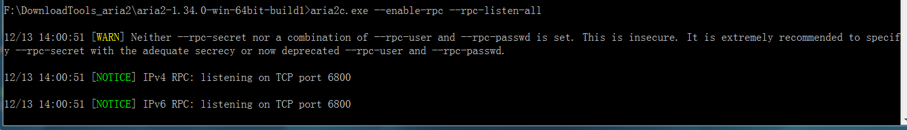

# aria2

github: https://github.com/aria2/aria2

首页： https://aria2.github.io/

下载： https://github.com/aria2/aria2/releases

~~F:\DownloadTools_aria2~~

# 文档

https://aria2.github.io/

但是这个页面打开太难（我每次打开这个页面都要很久），所以，我将这个页面上的重要的信息点，罗列下来。

下载链接： https://github.com/aria2/aria2/releases ，这个是github上的链接，打开比较容易。

特性：这个就不罗列了。

## 使用样例

Download from WEB:

```shell
$ aria2c http://example.org/mylinux.iso
```

Download from 2 sources:

```shell
$ aria2c http://a/f.iso ftp://b/f.iso
```

Download using 2 connections per host:

```shell
$ aria2c -x2 http://a/f.iso
```

BitTorrent:

```shell
$ aria2c http://example.org/mylinux.torrent
```

BitTorrent Magnet URI:

```shell
$ aria2c 'magnet:?xt=urn:btih:248D0A1CD08284299DE78D5C1ED359BB46717D8C'
```

Metalink:

```shell
$ aria2c http://example.org/mylinux.metalink
```

Download URIs found in text file:

```shell
$ aria2c -i uris.txt
```

## UI Frontends

- [**webui-aria2**](https://github.com/ziahamza/webui-aria2): Web browser interface for aria2 (2012 GSOC project)

这是`aria2`的UI，上面的链接是指向github的。

看完“README”，发现使用很简单，把github上的code下载下来，运行`docs/index.html`就启动了这个UI（不需要任何额外的安装）。

当然，启动UI之前，应该先启动`aria2`，启动方式如下：

```shell
aria2c --enable-rpc --rpc-listen-all
```



在windows下的启动截图如上，可能看不清晰，我将内容输出到下面：

```shell
F:\DownloadTools_aria2\aria2-1.34.0-win-64bit-build1>aria2c.exe --enable-rpc --rpc-listen-all

12/13 14:00:51 [WARN] Neither --rpc-secret nor a combination of --rpc-user and --rpc-passwd is set. 
This is insecure. 
It is extremely recommended to specify --rpc-secret with the adequate secrecy 
or now deprecated --rpc-user and --rpc-passwd.

12/13 14:00:51 [NOTICE] IPv4 RPC: listening on TCP port 6800

12/13 14:00:51 [NOTICE] IPv6 RPC: listening on TCP port 6800
```

有“简体中文”，所以，如何设置，一目了然。

# 测试

不行啊，我按照上面的方式启动了`aria2`，然后在bt上搜索了一个磁力链接，但是，下载不了。

# End