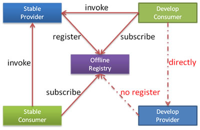
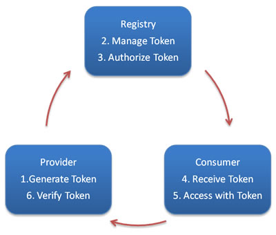

# 文档

http://dubbo.apache.org/zh-cn/docs/user/quick-start.html


# 示例

## 01 启动时检查

http://dubbo.apache.org/zh-cn/docs/user/demos/preflight-check.html

关闭某个服务的启动时检查 (没有提供者时报错)：

```xml
<dubbo:reference interface="com.foo.BarService" check="false" />
```

关闭所有服务的启动时检查 (没有提供者时报错)：

```xml
<dubbo:consumer check="false" />
```

关闭注册中心启动时检查 (注册订阅失败时报错)：

```xml
<dubbo:registry check="false" />
```

通过 dubbo.properties

```
dubbo.reference.com.foo.BarService.check=false
dubbo.reference.check=false
dubbo.consumer.check=false
dubbo.registry.check=false
```

通过 -D 参数

```
java -Ddubbo.reference.com.foo.BarService.check=false
java -Ddubbo.reference.check=false
java -Ddubbo.consumer.check=false 
java -Ddubbo.registry.check=false
```


## 02 集群容错

http://dubbo.apache.org/zh-cn/docs/user/demos/fault-tolerent-strategy.html


各节点关系：

- 这里的 `Invoker` 是 `Provider` 的一个可调用 `Service` 的抽象，`Invoker` 封装了 `Provider` 地址及 `Service` 接口信息
- `Directory` 代表多个 `Invoker`，可以把它看成 `List<Invoker>` ，但与 `List` 不同的是，它的值可能是动态变化的，比如注册中心推送变更
- `Cluster` 将 `Directory` 中的多个 `Invoker` 伪装成一个 `Invoker`，对上层透明，伪装过程包含了容错逻辑，调用失败后，重试另一个
- `Router` 负责从多个 `Invoker` 中按路由规则选出子集，比如读写分离，应用隔离等
- `LoadBalance` 负责从多个 `Invoker` 中选出具体的一个用于本次调用，选的过程包含了负载均衡算法，调用失败后，需要重选

| NO   | 模式      | 描述                                                         |
| ---- | --------- | ------------------------------------------------------------ |
| 01   | Failover  | 失败自动切换，当出现失败，重试其它服务器 。通常用于读操作，但重试会带来更长延迟。可通过 `retries="2"` 来设置重试次数(不含第一次)。 |
| 02   | Failfast  | 快速失败，只发起一次调用，失败立即报错。通常用于非幂等性的写操作，比如新增记录。 |
| 03   | Failsafe  | 失败安全，出现异常时，直接忽略。通常用于写入审计日志等操作。 |
| 04   | Failback  | 失败自动恢复，后台记录失败请求，定时重发。通常用于消息通知操作。 |
| 05   | Forking   | 并行调用多个服务器，只要一个成功即返回。通常用于实时性要求较高的读操作，但需要浪费更多服务资源。可通过 `forks="2"` 来设置最大并行数。 |
| 06   | Broadcast | 广播调用所有提供者，逐个调用，任意一台报错则报错 。通常用于通知所有提供者更新缓存或日志等本地资源信息。 |

**集群模式配置：**

```xml
<dubbo:service cluster="failsafe" />
```

```xml
<dubbo:reference cluster="failsafe" />
```

重试次数配：

```xml
<dubbo:service retries="2" />
```

```xml
<dubbo:reference retries="2" />
```

```xml
<dubbo:reference>
    <dubbo:method name="findFoo" retries="2" />
</dubbo:reference>
```

>  按照上面的描述，重试次数可以配置到method级别


## 03 负载均衡

http://dubbo.apache.org/zh-cn/docs/user/demos/loadbalance.html

，缺省为 `random` 随机调用。

| NO   |                |                                                              |
| ---- | -------------- | ------------------------------------------------------------ |
| 1    | Random         | **随机**，按权重设置随机概率。 <br />在一个截面上碰撞的概率高，但调用量越大分布越均匀，而且按概率使用权重后也比较均匀，有利于动态调整提供者权重。 |
| 2    | RoundRobin     | **轮询**，按公约后的权重设置轮询比率。<br /> 存在慢的提供者累积请求的问题，比如：第二台机器很慢，但没挂，当请求调到第二台时就卡在那，久而久之，所有请求都卡在调到第二台上。 |
| 3    | LeastActive    | **最少活跃调用数**，相同活跃数的随机，活跃数指调用前后计数差。 <br />使慢的提供者收到更少请求，因为越慢的提供者的调用前后计数差会越大。 |
| 4    | ConsistentHash | **一致性 Hash**，相同参数的请求总是发到同一提供者。 <br />当某一台提供者挂时，原本发往该提供者的请求，基于虚拟节点，平摊到其它提供者，不会引起剧烈变动。 |

服务端服务级别

```xml
<dubbo:service interface="..." loadbalance="roundrobin" />
```


客户端服务级别

```xml
<dubbo:reference interface="..." loadbalance="roundrobin" />
```


服务端方法级别

```xml
<dubbo:service interface="...">
    <dubbo:method name="..." loadbalance="roundrobin"/>
</dubbo:service>
```


客户端方法级别

```xml
<dubbo:reference interface="...">
    <dubbo:method name="..." loadbalance="roundrobin"/>
</dubbo:reference>
```


## 04 线程模型

http://dubbo.apache.org/zh-cn/docs/user/demos/thread-model.html

```xml
<dubbo:protocol name="dubbo" dispatcher="all" threadpool="fixed" threads="100" />
```

**Dispatcher**

- `all` 所有消息都派发到线程池，包括请求，响应，连接事件，断开事件，心跳等。
- `direct` 所有消息都不派发到线程池，全部在 IO 线程上直接执行。
- `message` 只有请求响应消息派发到线程池，其它连接断开事件，心跳等消息，直接在 IO 线程上执行。
- `execution` 只请求消息派发到线程池，不含响应，响应和其它连接断开事件，心跳等消息，直接在 IO 线程上执行。
- `connection` 在 IO 线程上，将连接断开事件放入队列，有序逐个执行，其它消息派发到线程池。

**ThreadPool**

- `fixed` 固定大小线程池，启动时建立线程，不关闭，一直持有。(缺省)
- `cached` 缓存线程池，空闲一分钟自动删除，需要时重建。
- `limited` 可伸缩线程池，但池中的线程数只会增长不会收缩。只增长不收缩的目的是为了避免收缩时突然来了大流量引起的性能问题。
- `eager` 优先创建`Worker`线程池。在任务数量大于`corePoolSize`但是小于`maximumPoolSize`时，优先创建`Worker`来处理任务。当任务数量大于`maximumPoolSize`时，将任务放入阻塞队列中。阻塞队列充满时抛出`RejectedExecutionException`。(相比于`cached`:`cached`在任务数量超过`maximumPoolSize`时直接抛出异常而不是将任务放入阻塞队列)


## 05 直连提供者

http://dubbo.apache.org/zh-cn/docs/user/demos/explicit-target.html

在开发及测试环境下，经常需要绕过注册中心，只测试指定服务提供者，这时候可能需要点对点直连，点对点直连方式，将以服务接口为单位，忽略注册中心的提供者列表，A 接口配置点对点，不影响 B 接口从注册中心获取列表。

三种方式：

- xml
- -D
- 文件

**xml**

```xml
<dubbo:reference id="xxxService" interface="com.alibaba.xxx.XxxService" url="dubbo://localhost:20890" />
```

**通过 -D 参数指定**

```sh
java -Dcom.alibaba.xxx.XxxService=dubbo://localhost:20890
```

**通过文件映射**

```sh
java -Ddubbo.resolve.file=xxx.properties
```

xxx.properties

```
com.alibaba.xxx.XxxService=dubbo://localhost:20890
```

**注意** 为了避免复杂化线上环境，不要在线上使用这个功能，只应在测试阶段使用。


## 06 只订阅

http://dubbo.apache.org/zh-cn/docs/user/demos/subscribe-only.html

禁用注册中心的注册，让-正在开发的服务-通过-直连-来测试。



禁用注册配置

```xml
<dubbo:registry address="10.20.153.10:9090" register="false" />
```

或者

```xml
<dubbo:registry address="10.20.153.10:9090?register=false" />
```


## 07 只注册

http://dubbo.apache.org/zh-cn/docs/user/demos/registry-only.html

禁用订阅配置

```xml
<dubbo:registry id="hzRegistry" address="10.20.153.10:9090" />
<dubbo:registry id="qdRegistry" address="10.20.141.150:9090" subscribe="false" />
```

或者

```xml
<dubbo:registry id="hzRegistry" address="10.20.153.10:9090" />
<dubbo:registry id="qdRegistry" address="10.20.141.150:9090?subscribe=false" />
```


## 08 静态服务

有时候希望人工管理服务提供者的上线和下线，此时需将注册中心标识为非动态管理模式。

```xml
<dubbo:registry address="10.20.141.150:9090" dynamic="false" />
```

或者

```xml
<dubbo:registry address="10.20.141.150:9090?dynamic=false" />
```

如果是一个第三方服务提供者，比如 memcached，可以直接向注册中心写入提供者地址信息，消费者正常使用

```java
RegistryFactory registryFactory = ExtensionLoader.getExtensionLoader(RegistryFactory.class).getAdaptiveExtension();
Registry registry = registryFactory.getRegistry(URL.valueOf("zookeeper://10.20.153.10:2181"));
registry.register(URL.valueOf("memcached://10.20.153.11/com.foo.BarService?category=providers&dynamic=false&application=foo"));
```


## 09 多协议

http://dubbo.apache.org/zh-cn/docs/user/demos/multi-protocols.html

不同服务在性能上适用不同协议进行传输，比如大数据用短连接协议，小数据大并发用长连接协议

```xml
<?xml version="1.0" encoding="UTF-8"?>
<beans xmlns="http://www.springframework.org/schema/beans"
    xmlns:xsi="http://www.w3.org/2001/XMLSchema-instance"
    xmlns:dubbo="http://dubbo.apache.org/schema/dubbo"
    xsi:schemaLocation="http://www.springframework.org/schema/beans 
	http://www.springframework.org/schema/beans/spring-beans-4.3.xsd 
	http://dubbo.apache.org/schema/dubbo 
	http://dubbo.apache.org/schema/dubbo/dubbo.xsd"> 
    <dubbo:application name="world"  />
    <dubbo:registry id="registry" address="10.20.141.150:9090" username="admin" password="hello1234" />
    <!-- 多协议配置 -->
    <dubbo:protocol name="dubbo" port="20880" />
    <dubbo:protocol name="rmi" port="1099" />
    <!-- 使用dubbo协议暴露服务 -->
    <dubbo:service interface="com.alibaba.hello.api.HelloService" version="1.0.0" ref="helloService" protocol="dubbo" />
    <!-- 使用rmi协议暴露服务 -->
    <dubbo:service interface="com.alibaba.hello.api.DemoService" version="1.0.0" ref="demoService" protocol="rmi" /> 
</beans>
```

需要与 http 客户端互操作

```xml
<?xml version="1.0" encoding="UTF-8"?>
<beans xmlns="http://www.springframework.org/schema/beans"
    xmlns:xsi="http://www.w3.org/2001/XMLSchema-instance"
    xmlns:dubbo="http://dubbo.apache.org/schema/dubbo"
    xsi:schemaLocation="http://www.springframework.org/schema/beans
	http://www.springframework.org/schema/beans/spring-beans-4.3.xsd 
	http://dubbo.apache.org/schema/dubbo 
	http://dubbo.apache.org/schema/dubbo/dubbo.xsd">
    <dubbo:application name="world"  />
    <dubbo:registry id="registry" address="10.20.141.150:9090" username="admin" password="hello1234" />
    <!-- 多协议配置 -->
    <dubbo:protocol name="dubbo" port="20880" />
    <dubbo:protocol name="hessian" port="8080" />
    <!-- 使用多个协议暴露服务 -->
    <dubbo:service id="helloService" interface="com.alibaba.hello.api.HelloService" version="1.0.0" protocol="dubbo,hessian" />
</beans>
```


## 10 多注册中心

http://dubbo.apache.org/zh-cn/docs/user/demos/multi-registry.html

**多注册中心注册**

比如：中文站有些服务来不及在青岛部署，只在杭州部署，而青岛的其它应用需要引用此服务，就可以将服务同时注册到两个注册中心。

```xml
<?xml version="1.0" encoding="UTF-8"?>
<beans xmlns="http://www.springframework.org/schema/beans"
    xmlns:xsi="http://www.w3.org/2001/XMLSchema-instance"
    xmlns:dubbo="http://dubbo.apache.org/schema/dubbo"
    xsi:schemaLocation="http://www.springframework.org/schema/beans
	http://www.springframework.org/schema/beans/spring-beans-4.3.xsd 
	http://dubbo.apache.org/schema/dubbo 
	http://dubbo.apache.org/schema/dubbo/dubbo.xsd">
    <dubbo:application name="world"  />
    <!-- 多注册中心配置 -->
    <dubbo:registry id="hangzhouRegistry" address="10.20.141.150:9090" />
    <dubbo:registry id="qingdaoRegistry" address="10.20.141.151:9010" default="false" />
    <!-- 向多个注册中心注册 -->
    <dubbo:service interface="com.alibaba.hello.api.HelloService" version="1.0.0" ref="helloService" registry="hangzhouRegistry,qingdaoRegistry" />
</beans>
```

**不同服务使用不同注册中心**

比如：CRM 有些服务是专门为国际站设计的，有些服务是专门为中文站设计的。

```xml
<?xml version="1.0" encoding="UTF-8"?>
<beans xmlns="http://www.springframework.org/schema/beans"
    xmlns:xsi="http://www.w3.org/2001/XMLSchema-instance"
    xmlns:dubbo="http://dubbo.apache.org/schema/dubbo"
    xsi:schemaLocation="http://www.springframework.org/schema/beans
	http://www.springframework.org/schema/beans/spring-beans-4.3.xsd 
	http://dubbo.apache.org/schema/dubbo 
	http://dubbo.apache.org/schema/dubbo/dubbo.xsd">
    <dubbo:application name="world"  />
    <!-- 多注册中心配置 -->
    <dubbo:registry id="chinaRegistry" address="10.20.141.150:9090" />
    <dubbo:registry id="intlRegistry" address="10.20.154.177:9010" default="false" />
    <!-- 向中文站注册中心注册 -->
    <dubbo:service interface="com.alibaba.hello.api.HelloService" version="1.0.0" ref="helloService" registry="chinaRegistry" />
    <!-- 向国际站注册中心注册 -->
    <dubbo:service interface="com.alibaba.hello.api.DemoService" version="1.0.0" ref="demoService" registry="intlRegistry" />
</beans>
```

**多注册中心引用**

比如：CRM 需同时调用中文站和国际站的 PC2 服务，PC2 在中文站和国际站均有部署，接口及版本号都一样，但连的数据库不一样。

```xml
<?xml version="1.0" encoding="UTF-8"?>
<beans xmlns="http://www.springframework.org/schema/beans"
    xmlns:xsi="http://www.w3.org/2001/XMLSchema-instance"
    xmlns:dubbo="http://dubbo.apache.org/schema/dubbo"
    xsi:schemaLocation="http://www.springframework.org/schema/beans
	http://www.springframework.org/schema/beans/spring-beans-4.3.xsd 
	http://dubbo.apache.org/schema/dubbo 
	http://dubbo.apache.org/schema/dubbo/dubbo.xsd">
    <dubbo:application name="world"  />
    <!-- 多注册中心配置 -->
    <dubbo:registry id="chinaRegistry" address="10.20.141.150:9090" />
    <dubbo:registry id="intlRegistry" address="10.20.154.177:9010" default="false" />
    <!-- 引用中文站服务 -->
    <dubbo:reference id="chinaHelloService" interface="com.alibaba.hello.api.HelloService" version="1.0.0" registry="chinaRegistry" />
    <!-- 引用国际站站服务 -->
    <dubbo:reference id="intlHelloService" interface="com.alibaba.hello.api.HelloService" version="1.0.0" registry="intlRegistry" />
</beans>
```

如果只是测试环境临时需要连接两个不同注册中心，使用竖号分隔多个不同注册中心地址：

```xml
<?xml version="1.0" encoding="UTF-8"?>
<beans xmlns="http://www.springframework.org/schema/beans"
    xmlns:xsi="http://www.w3.org/2001/XMLSchema-instance"
    xmlns:dubbo="http://dubbo.apache.org/schema/dubbo"
    xsi:schemaLocation="http://www.springframework.org/schema/beans
	http://www.springframework.org/schema/beans/spring-beans-4.3.xsd 
	http://dubbo.apache.org/schema/dubbo 
	http://dubbo.apache.org/schema/dubbo/dubbo.xsd">
    <dubbo:application name="world"  />
    <!-- 多注册中心配置，竖号分隔表示同时连接多个不同注册中心，同一注册中心的多个集群地址用逗号分隔 -->
    <dubbo:registry address="10.20.141.150:9090|10.20.154.177:9010" />
    <!-- 引用服务 -->
    <dubbo:reference id="helloService" interface="com.alibaba.hello.api.HelloService" version="1.0.0" />
</beans>
```


## 11 服务分组

当一个接口有多种实现时，可以用 group 区分。

**服务**

```xml
<dubbo:service group="feedback" interface="com.xxx.IndexService" />
<dubbo:service group="member" interface="com.xxx.IndexService" />
```

**引用**

```xml
<dubbo:reference id="feedbackIndexService" group="feedback" interface="com.xxx.IndexService" />
<dubbo:reference id="memberIndexService" group="member" interface="com.xxx.IndexService" />
```

这里应该配置`ref`，指向不同的Bean，不同的impl。

**任意组**

`2.2.0` 以上版本支持，总是只调一个可用组的实现

```xml
<dubbo:reference id="barService" interface="com.foo.BarService" group="*" />
```


## 12 多版本

http://dubbo.apache.org/zh-cn/docs/user/demos/multi-versions.html

当一个接口实现，出现不兼容升级时，可以用版本号过渡，版本号不同的服务相互间不引用。

可以按照以下的步骤进行版本迁移：

1. 在低压力时间段，先升级一半提供者为新版本
2. 再将所有消费者升级为新版本
3. 然后将剩下的一半提供者升级为新版本

老版本服务提供者配置：

```xml
<dubbo:service interface="com.foo.BarService" version="1.0.0" />
```

新版本服务提供者配置：

```xml
<dubbo:service interface="com.foo.BarService" version="2.0.0" />
```

老版本服务消费者配置：

```xml
<dubbo:reference id="barService" interface="com.foo.BarService" version="1.0.0" />
```

新版本服务消费者配置：

```xml
<dubbo:reference id="barService" interface="com.foo.BarService" version="2.0.0" />
```

如果不需要区分版本，可以按照以下的方式配置

> `2.2.0` 以上版本支持

```xml
<dubbo:reference id="barService" interface="com.foo.BarService" version="*" />
```


## 13 分组聚合

http://dubbo.apache.org/zh-cn/docs/user/demos/group-merger.html

按组合并返回结果 ，比如菜单服务，接口一样，但有多种实现，用group区分，现在消费方需从每种group中调用一次返回结果，合并结果返回，这样就可以实现聚合菜单项。

> 从 `2.1.0` 版本开始支持

搜索所有分组

```xml
<dubbo:reference interface="com.xxx.MenuService" group="*" merger="true" />
```

合并指定分组

```xml
<dubbo:reference interface="com.xxx.MenuService" group="aaa,bbb" merger="true" />
```

指定方法合并结果，其它未指定的方法，将只调用一个 Group

```xml
<dubbo:reference interface="com.xxx.MenuService" group="*">
    <dubbo:method name="getMenuItems" merger="true" />
</dubbo:reference>
```

某个方法不合并结果，其它都合并结果

```xml
<dubbo:reference interface="com.xxx.MenuService" group="*" merger="true">
    <dubbo:method name="getMenuItems" merger="false" />
</dubbo:reference>
```

指定合并策略，缺省根据返回值类型自动匹配，如果同一类型有两个合并器时，需指定合并器的名称

```xml
<dubbo:reference interface="com.xxx.MenuService" group="*">
    <dubbo:method name="getMenuItems" merger="mymerge" />
</dubbo:reference>
```

指定合并方法，将调用返回结果的指定方法进行合并，合并方法的参数类型必须是返回结果类型本身

```xml
<dubbo:reference interface="com.xxx.MenuService" group="*">
    <dubbo:method name="getMenuItems" merger=".addAll" />
</dubbo:reference>
```


## 14 参数验证

http://dubbo.apache.org/zh-cn/docs/user/demos/parameter-validation.html

参数验证功能  是基于 JSR303 实现的，用户只需标识 JSR303 标准的验证 annotation，并通过声明 filter 来实现验证 。

> 自 `2.1.0` 版本开始支持

**Maven 依赖**

```xml
<dependency>
    <groupId>javax.validation</groupId>
    <artifactId>validation-api</artifactId>
    <version>1.0.0.GA</version>
</dependency>
<dependency>
    <groupId>org.hibernate</groupId>
    <artifactId>hibernate-validator</artifactId>
    <version>4.2.0.Final</version>
</dependency>
```

示例参考： https://github.com/apache/incubator-dubbo-samples/tree/master/dubbo-samples-validation


## 15 结果缓存

http://dubbo.apache.org/zh-cn/docs/user/demos/result-cache.html

结果缓存 ，用于加速热门数据的访问速度，Dubbo 提供声明式缓存，以减少用户加缓存的工作量 。

> `2.1.0` 以上版本支持

**缓存类型**

- `lru` 基于最近最少使用原则删除多余缓存，保持最热的数据被缓存。
- `threadlocal` 当前线程缓存，比如一个页面渲染，用到很多 portal，每个 portal 都要去查用户信息，通过线程缓存，可以减少这种多余访问。
- `jcache` 与 [JSR107](http://jcp.org/en/jsr/detail?id=107%27) 集成，可以桥接各种缓存实现。

```xml
<dubbo:reference interface="com.foo.BarService" cache="lru" />
```

或者

```xml
<dubbo:reference interface="com.foo.BarService">
    <dubbo:method name="findBar" cache="lru" />
</dubbo:reference>
```


## 16 泛化引用

http://dubbo.apache.org/zh-cn/docs/user/demos/generic-reference.html

泛化接口调用方式主要用于客户端没有 API 接口及模型类元的情况，参数及返回值中的所有 POJO 均用 `Map`表示，通常用于框架集成，比如：实现一个通用的服务测试框架，可通过 `GenericService` 调用所有服务实现。

> 这功能不得了啊，厉害！

**通过 Spring 使用泛化调用**

在 Spring 配置申明 `generic="true"`：

```xml
<dubbo:reference id="barService" interface="com.foo.BarService" generic="true" />
```

在 Java 代码获取 barService 并开始泛化调用：

```java
GenericService barService = (GenericService) applicationContext.getBean("barService");
Object result = barService.$invoke("sayHello", new String[] { "java.lang.String" }, new Object[] { "World" });
```

**通过 API 方式使用泛化调用**

```java
import org.apache.dubbo.rpc.service.GenericService; 
... 
 
// 引用远程服务 
// 该实例很重量，里面封装了所有与注册中心及服务提供方连接，请缓存
ReferenceConfig<GenericService> reference = new ReferenceConfig<GenericService>(); 
// 弱类型接口名
reference.setInterface("com.xxx.XxxService");  
reference.setVersion("1.0.0");
// 声明为泛化接口 
reference.setGeneric(true);  

// 用org.apache.dubbo.rpc.service.GenericService可以替代所有接口引用  
GenericService genericService = reference.get(); 
 
// 基本类型以及Date,List,Map等不需要转换，直接调用 
Object result = genericService.$invoke("sayHello", new String[] {"java.lang.String"}, new Object[] {"world"}); 
 
// 用Map表示POJO参数，如果返回值为POJO也将自动转成Map 
Map<String, Object> person = new HashMap<String, Object>(); 
person.put("name", "xxx"); 
person.put("password", "yyy"); 
// 如果返回POJO将自动转成Map 
Object result = genericService.$invoke("findPerson", new String[]
{"com.xxx.Person"}, new Object[]{person}); 
 
...
```

**有关泛化类型的进一步解释**

假设存在 POJO 如：

```java
package com.xxx;

public class PersonImpl implements Person {
    private String name;
    private String password;

    public String getName() {
        return name;
    }

    public void setName(String name) {
        this.name = name;
    }

    public String getPassword() {
        return password;
    }

    public void setPassword(String password) {
        this.password = password;
    }
}
```

则 POJO 数据：

```java
Person person = new PersonImpl(); 
person.setName("xxx"); 
person.setPassword("yyy");
```

可用下面 Map 表示：

```java
Map<String, Object> map = new HashMap<String, Object>(); 
// 注意：如果参数类型是接口，或者List等丢失泛型，可通过class属性指定类型。
map.put("class", "com.xxx.PersonImpl"); 
map.put("name", "xxx"); 
map.put("password", "yyy");
```


## 17 泛化实现

http://dubbo.apache.org/zh-cn/docs/user/demos/generic-service.html

泛接口实现方式主要用于服务器端没有API接口及模型类元的情况，参数及返回值中的所有POJO均用Map表示，通常用于框架集成，比如：实现一个通用的远程服务Mock框架，可通过实现GenericService接口处理所有服务请求。

在 Java 代码中实现 `GenericService` 接口：

```java
package com.foo;
public class MyGenericService implements GenericService {
 
    public Object $invoke(String methodName, String[] parameterTypes, Object[] args) throws GenericException {
        if ("sayHello".equals(methodName)) {
            return "Welcome " + args[0];
        }
    }
}
```

在 Spring 配置申明服务的实现：

```xml
<bean id="genericService" class="com.foo.MyGenericService" />
<dubbo:service interface="com.foo.BarService" ref="genericService" />
```

通过 API 方式暴露泛化实现

```java
... 
// 用org.apache.dubbo.rpc.service.GenericService可以替代所有接口实现 
GenericService xxxService = new XxxGenericService(); 

// 该实例很重量，里面封装了所有与注册中心及服务提供方连接，请缓存 
ServiceConfig<GenericService> service = new ServiceConfig<GenericService>();
// 弱类型接口名 
service.setInterface("com.xxx.XxxService");  
service.setVersion("1.0.0"); 
// 指向一个通用服务实现 
service.setRef(xxxService); 
 
// 暴露及注册服务 
service.export();
```


## 18 回声测试

http://dubbo.apache.org/zh-cn/docs/user/demos/echo-service.html

回声测试用于检测服务是否可用，回声测试按照正常请求流程执行，能够测试整个调用是否通畅，可用于监控。

所有服务自动实现 `EchoService` 接口，只需将任意服务引用强制转型为 `EchoService`，即可使用。

Spring 配置：

```xml
<dubbo:reference id="memberService" interface="com.xxx.MemberService" />
```

代码：

```java
// 远程服务引用
MemberService memberService = ctx.getBean("memberService"); 
 
EchoService echoService = (EchoService) memberService; // 强制转型为EchoService

// 回声测试可用性
String status = echoService.$echo("OK"); 
 
assert(status.equals("OK"));
```

发送什么信息，返回什么信息！


## 19 上下文信息

http://dubbo.apache.org/zh-cn/docs/user/demos/context.html

上下文中存放的是当前调用过程中所需的环境信息。所有配置信息都将转换为 URL 的参数，参见 [schema 配置参考手册](http://dubbo.apache.org/zh-cn/docs/user/references/xml/introduction.html) 中的**对应URL参数**一列。

RpcContext 是一个 ThreadLocal 的临时状态记录器，当接收到 RPC 请求，或发起 RPC 请求时，RpcContext 的状态都会变化。比如：A 调 B，B 再调 C，则 B 机器上，在 B 调 C 之前，RpcContext 记录的是 A 调 B 的信息，在 B 调 C 之后，RpcContext 记录的是 B 调 C 的信息。

**服务消费方**

```java
// 远程调用
xxxService.xxx();
// 本端是否为消费端，这里会返回true
boolean isConsumerSide = RpcContext.getContext().isConsumerSide();
// 获取最后一次调用的提供方IP地址
String serverIP = RpcContext.getContext().getRemoteHost();
// 获取当前服务配置信息，所有配置信息都将转换为URL的参数
String application = RpcContext.getContext().getUrl().getParameter("application");
// 注意：每发起RPC调用，上下文状态会变化
yyyService.yyy();
```

**服务提供方**

```java
public class XxxServiceImpl implements XxxService {
 
    public void xxx() {
        // 本端是否为提供端，这里会返回true
        boolean isProviderSide = RpcContext.getContext().isProviderSide();
        // 获取调用方IP地址
        String clientIP = RpcContext.getContext().getRemoteHost();
        // 获取当前服务配置信息，所有配置信息都将转换为URL的参数
        String application = RpcContext.getContext().getUrl().getParameter("application");
        // 注意：每发起RPC调用，上下文状态会变化
        yyyService.yyy();
        // 此时本端变成消费端，这里会返回false
        boolean isProviderSide = RpcContext.getContext().isProviderSide();
    } 
}
```


## 20 隐式参数

http://dubbo.apache.org/zh-cn/docs/user/demos/attachment.html

可以通过 `RpcContext` 上的 `setAttachment` 和 `getAttachment` 在服务消费方和提供方之间进行参数的隐式传递。

> 注意：path, group, version, dubbo, token, timeout 几个 key 是保留字段，请使用其它值。


**在服务消费方端设置隐式参数**

`setAttachment` 设置的 KV 对，在完成下面一次远程调用会被清空，即多次远程调用要多次设置。

```java
// 隐式传参，后面的远程调用都会隐式将这些参数发送到服务器端，类似cookie，用于框架集成，不建议常规业务使用
RpcContext.getContext().setAttachment("index", "1"); 
xxxService.xxx(); // 远程调用
// ...
```

**在服务提供方端获取隐式参数**

```java
public class XxxServiceImpl implements XxxService {
 
    public void xxx() {
        // 获取客户端隐式传入的参数，用于框架集成，不建议常规业务使用
        String index = RpcContext.getContext().getAttachment("index"); 
    }
}
```


## 21 异步调用

http://dubbo.apache.org/zh-cn/docs/user/demos/async-call.html

非阻塞实现并行调用，基于 NIO ，客户端不需要启动多线程即可完成并行调用多个远程服务，相对多线程开销较小。

> `2.0.6` 及其以上版本支持


在 consumer.xml 中配置：

```xml
<dubbo:reference id="fooService" interface="com.alibaba.foo.FooService">
      <dubbo:method name="findFoo" async="true" />
</dubbo:reference>
<dubbo:reference id="barService" interface="com.alibaba.bar.BarService">
      <dubbo:method name="findBar" async="true" />
</dubbo:reference>
```

调用代码:

```java
// 此调用会立即返回null
fooService.findFoo(fooId);
// 拿到调用的Future引用，当结果返回后，会被通知和设置到此Future
Future<Foo> fooFuture = RpcContext.getContext().getFuture(); 
 
// 此调用会立即返回null
barService.findBar(barId);
// 拿到调用的Future引用，当结果返回后，会被通知和设置到此Future
Future<Bar> barFuture = RpcContext.getContext().getFuture(); 
 
// 此时findFoo和findBar的请求同时在执行，客户端不需要启动多线程来支持并行，而是借助NIO的非阻塞完成
 
// 如果foo已返回，直接拿到返回值，否则线程wait住，等待foo返回后，线程会被notify唤醒
Foo foo = fooFuture.get(); 
// 同理等待bar返回
Bar bar = barFuture.get(); 
 
// 如果foo需要5秒返回，bar需要6秒返回，实际只需等6秒，即可获取到foo和bar，进行接下来的处理。
```

你也可以设置是否等待消息发出： 

> 异步总是不等待返回

- `sent="true"` 等待消息发出，消息发送失败将抛出异常。
- `sent="false"` 不等待消息发出，将消息放入 IO 队列，即刻返回。

```xml
<dubbo:method name="findFoo" async="true" sent="true" />
```

如果你只是想异步，完全忽略返回值，可以配置 `return="false"`，以减少 Future 对象的创建和管理成本：

```xml
<dubbo:method name="findFoo" async="true" return="false" />
```


## 22 本地调用

http://dubbo.apache.org/zh-cn/docs/user/demos/local-call.html

本地调用使用了 injvm 协议，是一个伪协议，它不开启端口，不发起远程调用，只在 JVM 内直接关联，但执行 Dubbo 的 Filter 链。

**定义 injvm 协议**

```xml
<dubbo:protocol name="injvm" />
```

**设置默认协议**

```xml
<dubbo:provider protocol="injvm" />
```

**设置服务协议**

```xml
<dubbo:service protocol="injvm" />
```

**优先使用 injvm**

```
<dubbo:consumer injvm="true" .../>
<dubbo:provider injvm="true" .../>
```

或

```xml
<dubbo:reference injvm="true" .../>
<dubbo:service injvm="true" .../>
```

注意：服务暴露与服务引用都需要声明 `injvm="true"`

**自动暴露、引用本地服务**

从 `2.2.0` 开始，每个服务默认都会在本地暴露。在引用服务的时候，默认优先引用本地服务。如果希望引用远程服务可以使用以下配置强制引用远程服务。

```xml
<dubbo:reference ... scope="remote" />
```


## 23 参数回调

http://dubbo.apache.org/zh-cn/docs/user/demos/callback-parameter.html

参数回调方式与调用本地 callback 或 listener 相同，只需要在 Spring 的配置文件中声明哪个参数是 callback 类型即可。Dubbo 将基于长连接生成反向代理，这样就可以从服务器端调用客户端逻辑。

参考： https://github.com/apache/incubator-dubbo-samples/tree/master/dubbo-samples-callback

> 参数回调，比较难理解！要仔细揣摩一下，要多绕几个弯！


## 24 事件通知

http://dubbo.apache.org/zh-cn/docs/user/demos/events-notify.html

在调用之前、调用之后、出现异常时，会触发 `oninvoke`、`onreturn`、`onthrow` 三个事件，可以配置当事件发生时，通知哪个类的哪个方法。

> 支持版本：`2.0.7` 之后

样例参考： https://github.com/apache/incubator-dubbo-samples/tree/master/dubbo-samples-notify


## 25 本地存根

http://dubbo.apache.org/zh-cn/docs/user/demos/local-stub.html

远程服务后，客户端通常只剩下接口，而实现全在服务器端，但提供方有些时候想在客户端也执行部分逻辑，比如：做 ThreadLocal 缓存，提前验证参数，调用失败后伪造容错数据等等，此时就需要在 API 中带上 Stub，客户端生成 Proxy 实例，会把 Proxy 通过构造函数传给 Stub ，然后把 Stub 暴露给用户，Stub 可以决定要不要去调 Proxy。

> Stub 必须有可传入 Proxy 的构造函数。


在 spring 配置文件中按以下方式配置：

```xml
<dubbo:service interface="com.foo.BarService" stub="true" />
```

或

```xml
<dubbo:service interface="com.foo.BarService" stub="com.foo.BarServiceStub" />
```

提供 Stub 的实现：

> 在 interface 旁边放一个 Stub 实现，它实现 BarService 接口，并有一个传入远程 BarService 实例的构造函数

```java
package com.foo;
public class BarServiceStub implements BarService { 
    private final BarService barService;
    
    // 构造函数传入真正的远程代理对象
    public (BarService barService) {
        this.barService = barService;
    }
 
    public String sayHello(String name) {
        // 此代码在客户端执行, 你可以在客户端做ThreadLocal本地缓存，或预先验证参数是否合法，等等
        try {
            return barService.sayHello(name);
        } catch (Exception e) {
            // 你可以容错，可以做任何AOP拦截事项
            return "容错数据";
        }
    }
}
```


## 26 本地伪装

http://dubbo.apache.org/zh-cn/docs/user/demos/local-mock.html

本地伪装  通常用于服务降级，比如某验权服务，当服务提供方全部挂掉后，客户端不抛出异常，而是通过 Mock 数据返回授权失败。

> Mock 是 Stub 的一个子集，便于服务提供方在客户端执行容错逻辑，因经常需要在出现 RpcException (比如网络失败，超时等)时进行容错，而在出现业务异常(比如登录用户名密码错误)时不需要容错，如果用 Stub，可能就需要捕获并依赖 RpcException 类，而用 Mock 就可以不依赖 RpcException，因为它的约定就是只有出现 RpcException 时才执行。

在 spring 配置文件中按以下方式配置：

```xml
<dubbo:reference interface="com.foo.BarService" mock="true" />
```

或

```xml
<dubbo:reference interface="com.foo.BarService" mock="com.foo.BarServiceMock" />
```

在工程中提供 Mock 实现：

> 在 interface 旁放一个 Mock 实现，它实现 BarService 接口，并有一个无参构造函数

```java
package com.foo;
public class BarServiceMock implements BarService {
    public String sayHello(String name) {
        // 你可以伪造容错数据，此方法只在出现RpcException时被执行
        return "容错数据";
    }
}
```

如果服务的消费方经常需要 try-catch 捕获异常，如：

```java
Offer offer = null;
try {
    offer = offerService.findOffer(offerId);
} catch (RpcException e) {
   logger.error(e);
}
```

请考虑改为 Mock 实现，并在 Mock 实现中 return null。如果只是想简单的忽略异常，在 `2.0.11` 以上版本可用：

```xml
<dubbo:reference interface="com.foo.BarService" mock="return null" />
```

### 进阶用法

**return**

使用 `return` 来返回一个字符串表示的对象，作为 Mock 的返回值。合法的字符串可以是：

- *empty*: 代表空，基本类型的默认值，或者集合类的空值
- *null*: `null`
- *true*: `true`
- *false*: `false`
- *JSON 格式*: 反序列化 JSON 所得到的对象

**throw**

使用 `throw` 来返回一个 Exception 对象，作为 Mock 的返回值。

当调用出错时，抛出一个默认的 RPCException:

```xml
<dubbo:reference interface="com.foo.BarService" mock="throw" />
```

当调用出错时，抛出指定的 Exception：

```xml
<dubbo:reference interface="com.foo.BarService" mock="throw com.foo.MockException" />
```

**force 和 fail**

在 `2.6.6` 以上的版本，可以开始在 Spring XML 配置文件中使用 `fail:` 和 `force:`。`force:` 代表强制使用 Mock 行为，在这种情况下不会走远程调用。`fail:` 与默认行为一致，只有当远程调用发生错误时才使用 Mock 行为。`force:` 和 `fail:` 都支持与 `throw` 或者 `return` 组合使用。

强制返回指定值：

```xml
<dubbo:reference interface="com.foo.BarService" mock="force:return fake" />
```

强制抛出指定异常：

```xml
<dubbo:reference interface="com.foo.BarService" mock="force:throw com.foo.MockException" />
```

**在方法级别配置 Mock**

Mock 可以在方法级别上指定，假定 `com.foo.BarService` 上有好几个方法，我们可以单独为 `sayHello()` 方法指定 Mock 行为。具体配置如下所示，在本例中，只要 `sayHello()` 被调用到时，强制返回 "fake":

```xml
<dubbo:reference id="demoService" check="false" interface="com.foo.BarService">
    <dubbo:parameter key="sayHello.mock" value="force:return fake"/>
</dubbo:reference>
```


## 27 延迟暴露

http://dubbo.apache.org/zh-cn/docs/user/demos/delay-publish.html

如果你的服务需要预热时间，比如初始化缓存，等待相关资源就位等，可以使用 delay 进行延迟暴露。我们在 Dubbo 2.6.5 版本中对服务延迟暴露逻辑进行了细微的调整，将需要延迟暴露（delay > 0）服务的倒计时动作推迟到了 Spring 初始化完成后进行。你在使用 Dubbo 的过程中，并不会感知到此变化，因此请放心使用。

### Dubbo-2.6.5 之前版本

**延迟到 Spring 初始化完成后，再暴露服务**

> 基于 Spring 的 ContextRefreshedEvent 事件触发暴露

```xml
<dubbo:service delay="-1" />
```

**延迟 5 秒暴露服务**

```xml
<dubbo:service delay="5000" />
```

### Dubbo-2.6.5 及以后版本

所有服务都将在 Spring 初始化完成后进行暴露，如果你不需要延迟暴露服务，无需配置 delay。

**延迟 5 秒暴露服务**

```xml
<dubbo:service delay="5000" />
```

### Spring 2.x 初始化死锁问题

> 省略…… 具体内容参考上面的链接

**规避办法**

1. 强烈建议不要在服务的实现类中有 applicationContext.getBean() 的调用，全部采用 IoC 注入的方式使用 Spring的Bean。
2. 如果实在要调 getBean()，可以将 Dubbo 的配置放在 Spring 的最后加载。
3. 如果不想依赖配置顺序，可以使用 `<dubbo:provider delay=”-1” />`，使 Dubbo 在 Spring 容器初始化完后，再暴露服务。
4. 如果大量使用 getBean()，相当于已经把 Spring 退化为工厂模式在用，可以将 Dubbo 的服务隔离单独的 Spring 容器。


## 28 并发控制

http://dubbo.apache.org/zh-cn/docs/user/demos/concurrency-control.html

### 配置样例

**样例 1**

限制 `com.foo.BarService` 的每个方法，服务器端并发执行（或占用线程池线程数）不能超过 10 个：

```xml
<dubbo:service interface="com.foo.BarService" executes="10" />
```


**样例 2**

限制 `com.foo.BarService` 的 `sayHello` 方法，服务器端并发执行（或占用线程池线程数）不能超过 10 个：

```xml
<dubbo:service interface="com.foo.BarService">
    <dubbo:method name="sayHello" executes="10" />
</dubbo:service>
```


**样例 3**

限制 `com.foo.BarService` 的每个方法，每客户端并发执行（或占用连接的请求数）不能超过 10 个：

```xml
<dubbo:service interface="com.foo.BarService" actives="10" />
```

或

```xml
<dubbo:reference interface="com.foo.BarService" actives="10" />
```


**样例 4**

限制 `com.foo.BarService` 的 `sayHello` 方法，每客户端并发执行（或占用连接的请求数）不能超过 10 个：

```xml
<dubbo:service interface="com.foo.BarService">
    <dubbo:method name="sayHello" actives="10" />
</dubbo:service>
```

或

```xml
<dubbo:reference interface="com.foo.BarService">
    <dubbo:method name="sayHello" actives="10" />
</dubbo:service>
```

如果 `<dubbo:service>` 和 `<dubbo:reference>` 都配了actives，`<dubbo:reference>` 优先，参见：[配置的覆盖策略](http://dubbo.apache.org/zh-cn/docs/user/configuration/xml.md#%E9%85%8D%E7%BD%AE%E8%A6%86%E7%9B%96%E5%85%B3%E7%B3%BB)。


### Load Balance 均衡

配置服务的客户端的 `loadbalance` 属性为 `leastactive`，此 Loadbalance 会调用并发数最小的 Provider（Consumer端并发数）。

```xml
<dubbo:reference interface="com.foo.BarService" loadbalance="leastactive" />
```

或

```xml
<dubbo:service interface="com.foo.BarService" loadbalance="leastactive" />
```


## 29 连接控制

http://dubbo.apache.org/zh-cn/docs/user/demos/config-connections.html

### 服务端连接控制：

限制服务器端接受的连接不能超过 10 个

> 因为连接在 Server上，所以配置在 Provider 上

```xml
<dubbo:provider protocol="dubbo" accepts="10" />
```

或者

```xml
<dubbo:protocol name="dubbo" accepts="10" />
```


### 客户端连接控制：

限制客户端服务使用连接不能超过 10 个

> 如果是长连接，比如 Dubbo 协议，connections 表示该服务对每个提供者建立的长连接数

```xml
<dubbo:reference interface="com.foo.BarService" connections="10" />
```

或者

```xml
<dubbo:service interface="com.foo.BarService" connections="10" />
```

如果 `<dubbo:service>` 和 `<dubbo:reference>` 都配了 connections，`<dubbo:reference>` 优先，参见：[配置的覆盖策略](http://dubbo.apache.org/zh-cn/docs/user/configuration/xml.html)


## 30 延迟连接

http://dubbo.apache.org/zh-cn/docs/user/demos/lazy-connect.html

延迟连接用于减少长连接数。当有调用发起时，再创建长连接。

> 注意：该配置只对使用长连接的 dubbo 协议生效。

```xml
<dubbo:protocol name="dubbo" lazy="true" />
```


## 31 粘滞连接

http://dubbo.apache.org/zh-cn/docs/user/demos/stickiness.html

粘滞连接用于有状态服务，尽可能让客户端总是向同一提供者发起调用，除非该提供者挂了，再连另一台。

粘滞连接将自动开启[延迟连接](http://dubbo.apache.org/zh-cn/docs/user/demos/lazy-connect.html)，以减少长连接数。

```xml
<dubbo:reference id="xxxService" interface="com.xxx.XxxService" sticky="true" />
```

Dubbo 支持方法级别的粘滞连接，如果你想进行更细力度的控制，还可以这样配置。

```xml
<dubbo:reference id="xxxService" interface="com.xxx.XxxService">
    <dubbo:mothod name="sayHello" sticky="true" />
</dubbo:reference>
```


## 32 令牌验证

http://dubbo.apache.org/zh-cn/docs/user/demos/token-authorization.html

通过令牌验证在注册中心控制权限，以决定要不要下发令牌给消费者，可以防止消费者绕过注册中心访问提供者，另外通过注册中心可灵活改变授权方式，而不需修改或升级提供者



可以全局设置开启令牌验证：

```xml
<!--随机token令牌，使用UUID生成-->
<dubbo:provider interface="com.foo.BarService" token="true" />
```

或

```xml
<!--固定token令牌，相当于密码-->
<dubbo:provider interface="com.foo.BarService" token="123456" />
```

**也可在服务级别设置：**

```xml
<!--随机token令牌，使用UUID生成-->
<dubbo:service interface="com.foo.BarService" token="true" />
```

或

```xml
<!--固定token令牌，相当于密码-->
<dubbo:service interface="com.foo.BarService" token="123456" />
```

**还可在协议级别设置：**

```xml
<!--随机token令牌，使用UUID生成-->
<dubbo:protocol name="dubbo" token="true" />
```

或

```xml
<!--固定token令牌，相当于密码-->
<dubbo:protocol name="dubbo" token="123456" />
```


## 33 路由规则

http://dubbo.apache.org/zh-cn/docs/user/demos/routing-rule.html

路由规则 决定一次 dubbo 服务调用的目标服务器，分为条件路由规则和脚本路由规则，并且支持可扩展 。

> `2.2.0` 以上版本支持
>
> 路由规则扩展点：[路由扩展](http://dubbo.apache.org/books/dubbo-dev-book/impls/router.html)

### 写入路由规则

向注册中心写入路由规则的操作通常由监控中心或治理中心的页面完成

```java
RegistryFactory registryFactory = ExtensionLoader.getExtensionLoader(RegistryFactory.class).getAdaptiveExtension();
Registry registry = registryFactory.getRegistry(URL.valueOf("zookeeper://10.20.153.10:2181"));
registry.register(URL.valueOf("condition://0.0.0.0/com.foo.BarService?category=routers&dynamic=false&rule=" 
+ URL.encode("host = 10.20.153.10 => host = 10.20.153.11")));
```

其中：

- `condition://` 表示路由规则的类型，支持条件路由规则和脚本路由规则，可扩展，**必填**。
- `0.0.0.0` 表示对所有 IP 地址生效，如果只想对某个 IP 的生效，请填入具体 IP，**必填**。
- `com.foo.BarService` 表示只对指定服务生效，**必填**。
- `group=foo` 对指定服务的指定group生效，不填表示对未配置group的指定服务生效
- `version=1.0`对指定服务的指定version生效，不填表示对未配置version的指定服务生效
- `category=routers` 表示该数据为动态配置类型，**必填**。
- `dynamic=false` 表示该数据为持久数据，当注册方退出时，数据依然保存在注册中心，**必填**。
- `enabled=true` 覆盖规则是否生效，可不填，缺省生效。
- `force=false` 当路由结果为空时，是否强制执行，如果不强制执行，路由结果为空的路由规则将自动失效，可不填，缺省为 `false`。
- `runtime=false` 是否在每次调用时执行路由规则，否则只在提供者地址列表变更时预先执行并缓存结果，调用时直接从缓存中获取路由结果。如果用了参数路由，必须设为 `true`，需要注意设置会影响调用的性能，可不填，缺省为 `false`。
- `priority=1` 路由规则的优先级，用于排序，优先级越大越靠前执行，可不填，缺省为 `0`。
- `rule=URL.encode("host = 10.20.153.10 => host = 10.20.153.11")` 表示路由规则的内容，**必填**。

### 条件路由规则

基于条件表达式的路由规则，如：`host = 10.20.153.10 => host = 10.20.153.11`

**规则：**

- `=>` 之前的为消费者匹配条件，所有参数和消费者的 URL 进行对比，当消费者满足匹配条件时，对该消费者执行后面的过滤规则。
- `=>` 之后为提供者地址列表的过滤条件，所有参数和提供者的 URL 进行对比，消费者最终只拿到过滤后的地址列表。
- 如果匹配条件为空，表示对所有消费方应用，如：`=> host != 10.20.153.11`
- 如果过滤条件为空，表示禁止访问，如：`host = 10.20.153.10 =>`

**表达式：**

参数支持：

- 服务调用信息，如：method, argument 等，暂不支持参数路由
- URL 本身的字段，如：protocol, host, port 等
- 以及 URL 上的所有参数，如：application, organization 等

条件支持：

- 等号 `=` 表示"匹配"，如：`host = 10.20.153.10`
- 不等号 `!=` 表示"不匹配"，如：`host != 10.20.153.10`

值支持：

- 以逗号 `,` 分隔多个值，如：`host != 10.20.153.10,10.20.153.11`
- 以星号 `*` 结尾，表示通配，如：`host != 10.20.*`
- 以美元符 `$` 开头，表示引用消费者参数，如：`host = $host`

**示例：**

1. 排除预发布机：

```
=> host != 172.22.3.91
```

2. 白名单

> 注意：一个服务只能有一条白名单规则，否则两条规则交叉，就都被筛选掉了

```
host != 10.20.153.10,10.20.153.11 =>
```

3. 黑名单：

```
host = 10.20.153.10,10.20.153.11 =>
```

4. 服务寄宿在应用上，只暴露一部分的机器，防止整个集群挂掉：

```
=> host = 172.22.3.1*,172.22.3.2*
```

5. 为重要应用提供额外的机器：

```
application != kylin => host != 172.22.3.95,172.22.3.96
```

6. 读写分离：

```
method = find*,list*,get*,is* => host = 172.22.3.94,172.22.3.95,172.22.3.96
method != find*,list*,get*,is* => host = 172.22.3.97,172.22.3.98
```

7. 前后台分离：

```
application = bops => host = 172.22.3.91,172.22.3.92,172.22.3.93
application != bops => host = 172.22.3.94,172.22.3.95,172.22.3.96
```

8. 隔离不同机房网段：

```
host != 172.22.3.* => host != 172.22.3.*
```

9. 提供者与消费者部署在同集群内，本机只访问本机的服务：

```
=> host = $host
```

### 脚本路由规则

脚本路由规则 支持 JDK 脚本引擎的所有脚本，比如：javascript, jruby, groovy 等，通过 type=javascript 参数设置脚本类型，缺省为 javascript。

> 注意：脚本没有沙箱约束，可执行任意代码，存在后门风险

```
"script://0.0.0.0/com.foo.BarService?category=routers&dynamic=false&rule=" + URL.encode("（function route(invokers) { ... } (invokers)）")
```

基于脚本引擎的路由规则，如：

```javascript
（function route(invokers) {
    var result = new java.util.ArrayList(invokers.size());
    for (i = 0; i < invokers.size(); i ++) {
        if ("10.20.153.10".equals(invokers.get(i).getUrl().getHost())) {
            result.add(invokers.get(i));
        }
    }
    return result;
} (invokers)）; // 表示立即执行方法
```

### 标签路由规则

标签路由规则  ，当应用选择装配标签路由(TagRouter)之后，一次 dubbo 调用能够根据请求携带的 tag 标签智能地选择对应 tag 的服务提供者进行调用。

> 该特性在 `2.7.0` 以上版本支持

**服务提供者**

1. 给应用装配标签路由器：

```java
@Bean
public ApplicationConfig applicationConfig() {
    ApplicationConfig applicationConfig = new ApplicationConfig();
    applicationConfig.setName("provider-book");
    applicationConfig.setQosEnable(false);
    // instruct tag router
    Map<String,String> parameters = new HashMap<>();
    parameters.put(Constants.ROUTER_KEY, "tag");
    applicationConfig.setParameters(parameters);
    return applicationConfig;
}
```

2. 给应用设置具体的标签：

```java
@Bean
public ProviderConfig providerConfig(){
	ProviderConfig providerConfig = new ProviderConfig();
	providerConfig.setTag("red");
	return providerConfig;
}
```

应用未装配 tag 属性或服务提供者未设置 tag 属性，都将被认为是默认的应用，这些默认应用将会，"在调用无法匹配 provider 时"，当作降级方案。

**服务消费者**

```java
RpcContext.getContext().setAttachment(Constants.REQUEST_TAG_KEY,"red");
```

请求标签的作用域为每一次 invocation，使用 attachment 来传递请求标签，注意保存在 attachment 中的值将会在一次完整的远程调用中持续传递，得益于这样的特性，我们只需要在起始调用时，通过一行代码的设置，达到标签的持续传递。

> 目前仅仅支持 hardcoding 的方式设置 requestTag。注意到 RpcContext 是线程绑定的，优雅的使用 TagRouter 特性，建议通过 servlet 过滤器(在 web 环境下)，或者定制的 SPI 过滤器设置 requestTag。

**规则描述**

1. request.tag=red 时优先选择 tag=red 的 provider。若集群中不存在与请求标记对应的服务，可以降级请求 tag=null 的 provider，即默认 provider。
2. request.tag=null 时，只会匹配 tag=null 的 provider。即使集群中存在可用的服务，若 tag 不匹配就无法调用，这与规则1不同，携带标签的请求可以降级访问到无标签的服务，但不携带标签/携带其他种类标签的请求永远无法访问到其他标签的服务。


## 34 配置规则

http://dubbo.apache.org/zh-cn/docs/user/demos/config-rule.html

向注册中心写入动态配置覆盖规则 。该功能通常由监控中心或治理中心的页面完成。

> `2.2.0` 以上版本支持 

```java
RegistryFactory registryFactory = ExtensionLoader.getExtensionLoader(RegistryFactory.class).getAdaptiveExtension();
Registry registry = registryFactory.getRegistry(URL.valueOf("zookeeper://10.20.153.10:2181"));
registry.register(URL.valueOf("override://0.0.0.0/com.foo.BarService?category=configurators&dynamic=false&application=foo&timeout=1000"));
```

其中：

- `override://` 表示数据采用覆盖方式，支持 `override` 和 `absent`，可扩展，**必填**。
- `0.0.0.0` 表示对所有 IP 地址生效，如果只想覆盖某个 IP 的数据，请填入具体 IP，**必填**。
- `com.foo.BarService` 表示只对指定服务生效，**必填**。
- `category=configurators` 表示该数据为动态配置类型，**必填**。
- `dynamic=false` 表示该数据为持久数据，当注册方退出时，数据依然保存在注册中心，**必填**。
- `enabled=true` 覆盖规则是否生效，可不填，缺省生效。
- `application=foo` 表示只对指定应用生效，可不填，表示对所有应用生效。
- `timeout=1000` 表示将满足以上条件的 `timeout` 参数的值覆盖为 1000。如果想覆盖其它参数，直接加在 `override` 的 URL 参数上。

### 示例：

禁用提供者：(通常用于临时踢除某台提供者机器，相似的，禁止消费者访问请使用路由规则)

```
override://10.20.153.10/com.foo.BarService?category=configurators&dynamic=false&disbaled=true
```

调整权重：(通常用于容量评估，缺省权重为 100)

```
 override://10.20.153.10/com.foo.BarService?category=configurators&dynamic=false&weight=200
```

调整负载均衡策略：(缺省负载均衡策略为 random)

```
override://10.20.153.10/com.foo.BarService?category=configurators&dynamic=false&loadbalance=leastactive
```

服务降级：(通常用于临时屏蔽某个出错的非关键服务)

```
override://0.0.0.0/com.foo.BarService?category=configurators&dynamic=false&application=foo&mock=force:return+null
```


## 35 服务降级

http://dubbo.apache.org/zh-cn/docs/user/demos/service-downgrade.html

可以通过服务降级功能  临时屏蔽某个出错的非关键服务，并定义降级后的返回策略。

> `2.2.0` 以上版本支持

向注册中心写入动态配置覆盖规则：

```java
RegistryFactory registryFactory = ExtensionLoader.getExtensionLoader(RegistryFactory.class).getAdaptiveExtension();
Registry registry = registryFactory.getRegistry(URL.valueOf("zookeeper://10.20.153.10:2181"));
registry.register(URL.valueOf("override://0.0.0.0/com.foo.BarService?category=configurators&dynamic=false&application=foo&mock=force:return+null"));
```

其中：

- `mock=force:return+null` 表示消费方对该服务的方法调用都直接返回 null 值，不发起远程调用。用来屏蔽不重要服务不可用时对调用方的影响。
- 还可以改为 `mock=fail:return+null` 表示消费方对该服务的方法调用在失败后，再返回 null 值，不抛异常。用来容忍不重要服务不稳定时对调用方的影响。


## 36 优雅停机

http://dubbo.apache.org/zh-cn/docs/user/demos/graceful-shutdown.html

Dubbo 是通过 JDK 的 ShutdownHook 来完成优雅停机的，所以如果用户使用 `kill -9 PID` 等强制关闭指令，是不会执行优雅停机的，只有通过 `kill PID` 时，才会执行。

### 原理

**服务提供方**

- 停止时，先标记为不接收新请求，新请求过来时直接报错，让客户端重试其它机器。
- 然后，检测线程池中的线程是否正在运行，如果有，等待所有线程执行完成，除非超时，则强制关闭。

**服务消费方**

- 停止时，不再发起新的调用请求，所有新的调用在客户端即报错。
- 然后，检测有没有请求的响应还没有返回，等待响应返回，除非超时，则强制关闭。

**设置方式**

设置优雅停机超时时间，缺省超时时间是 10 秒，如果超时则强制关闭。

```
# dubbo.properties
dubbo.service.shutdown.wait=15000
```

如果 ShutdownHook 不能生效，可以自行调用，**使用tomcat等容器部署的場景，建议通过扩展ContextListener等自行调用以下代码实现优雅停机**：

```
ProtocolConfig.destroyAll();
```


## 37 主机绑定

http://dubbo.apache.org/zh-cn/docs/user/demos/hostname-binding.html

**查找顺序**

缺省主机 IP 查找顺序：

- 通过 `LocalHost.getLocalHost()` 获取本机地址。
- 如果是 `127.*` 等 loopback 地址，则扫描各网卡，获取网卡 IP。

**主机配置**

注册的地址如果获取不正确，比如需要注册公网地址，可以：

1. 可以在 `/etc/hosts` 中加入：机器名 公网 IP，比如：

```
test1 205.182.23.201
```

2. 在 `dubbo.xml` 中加入主机地址的配置：

```xml
<dubbo:protocol host="205.182.23.201">
```

3. 或在 `dubbo.properties` 中加入主机地址的配置：

```
dubbo.protocol.host=205.182.23.201
```

**端口配置**

缺省主机端口与协议相关：

| 协议       | 端口  |
| ---------- | ----- |
| dubbo      | 20880 |
| rmi        | 1099  |
| http       | 80    |
| hessian    | 80    |
| webservice | 80    |
| memcached  | 11211 |
| redis      | 6379  |

可以按照下面的方式配置端口：

1. 在 `dubbo.xml` 中加入主机地址的配置：

```xml
<dubbo:protocol name="dubbo" port="20880">
```

2. 或在 `dubbo.properties` 中加入主机地址的配置：

```
dubbo.protocol.dubbo.port=20880
```


## 38 日志适配

http://dubbo.apache.org/zh-cn/docs/user/demos/logger-strategy.html

自 2.2.1 开始，dubbo 开始内置 log4j、slf4j、jcl、jdk 这些日志框架的适配，也可以通过以下方式显示配置日志输出策略：

1. 命令行

```
  java -Ddubbo.application.logger=log4j
```

2. 在 `dubbo.properties` 中指定

```
  dubbo.application.logger=log4j
```

3. 在 `dubbo.xml` 中配置

```xml
  <dubbo:application logger="log4j" />
```


## 39 访问日志

http://dubbo.apache.org/zh-cn/docs/user/demos/accesslog.html

如果你想记录每一次请求信息，可开启访问日志，类似于apache的访问日志。**注意**：此日志量比较大，请注意磁盘容量。

将访问日志输出到当前应用的log4j日志：

```xml
<dubbo:protocol accesslog="true" />
```

将访问日志输出到指定文件：

```xml
<dubbo:protocol accesslog="http://10.20.160.198/wiki/display/dubbo/foo/bar.log" />
```


## 40 服务容器

http://dubbo.apache.org/zh-cn/docs/user/demos/service-container.html

服务容器是一个 standalone 的启动程序，因为后台服务不需要 Tomcat 或 JBoss 等 Web 容器的功能，如果硬要用 Web 容器去加载服务提供方，增加复杂性，也浪费资源。

服务容器只是一个简单的 Main 方法，并加载一个简单的 Spring 容器，用于暴露服务。

服务容器的加载内容可以扩展，内置了 spring, jetty, log4j 等加载，可通过[容器扩展点](http://dubbo.apache.org/books/dubbo-dev-book/impls/container.html)进行扩展。配置配在 java 命令的 -D 参数或者 `dubbo.properties` 中。

### 容器类型

**Spring Container**

- 自动加载 `META-INF/spring` 目录下的所有 Spring 配置。
- 配置 spring 配置加载位置：

```
dubbo.spring.config=classpath*:META-INF/spring/*.xml
```

**Jetty Container**

- 启动一个内嵌 Jetty，用于汇报状态。
- 配置：
  - `dubbo.jetty.port=8080`：配置 jetty 启动端口
  - `dubbo.jetty.directory=/foo/bar`：配置可通过 jetty 直接访问的目录，用于存放静态文件
  - `dubbo.jetty.page=log,status,system`：配置显示的页面，缺省加载所有页面

**Log4j Container**

- 自动配置 log4j 的配置，在多进程启动时，自动给日志文件按进程分目录。
- 配置：
  - `dubbo.log4j.file=/foo/bar.log`：配置日志文件路径
  - `dubbo.log4j.level=WARN`：配置日志级别
  - `dubbo.log4j.subdirectory=20880`：配置日志子目录，用于多进程启动，避免冲突


### 容器启动

缺省只加载 spring

```sh
java org.apache.dubbo.container.Main
```

通过 main 函数参数传入要加载的容器

```
java org.apache.dubbo.container.Main spring jetty log4j
```

通过 JVM 启动参数传入要加载的容器

```
java org.apache.dubbo.container.Main -Ddubbo.container=spring,jetty,log4j
```

通过 classpath 下的 `dubbo.properties` 配置传入要加载的容器

```
dubbo.container=spring,jetty,log4j
```


## 41 Reference Config 缓存

http://dubbo.apache.org/zh-cn/docs/user/demos/reference-config-cache.html

`ReferenceConfig` 实例很重，封装了与注册中心的连接以及与提供者的连接，需要缓存。否则重复生成 `ReferenceConfig` 可能造成性能问题并且会有内存和连接泄漏。在 API 方式编程时，容易忽略此问题。

因此，自 `2.4.0` 版本开始， dubbo 提供了简单的工具类 `ReferenceConfigCache`用于缓存 `ReferenceConfig`实例。

使用方式如下：

```java
ReferenceConfig<XxxService> reference = new ReferenceConfig<XxxService>();
reference.setInterface(XxxService.class);
reference.setVersion("1.0.0");
......
ReferenceConfigCache cache = ReferenceConfigCache.getCache();
// cache.get方法中会缓存 Reference对象，并且调用ReferenceConfig.get方法启动ReferenceConfig
XxxService xxxService = cache.get(reference);
// 注意！ Cache会持有ReferenceConfig，不要在外部再调用ReferenceConfig的destroy方法，
// 导致Cache内的ReferenceConfig失效！
// 使用xxxService对象
xxxService.sayHello();
```

消除 Cache 中的 `ReferenceConfig`，将销毁 `ReferenceConfig` 并释放对应的资源。

```java
ReferenceConfigCache cache = ReferenceConfigCache.getCache();
cache.destroy(reference);
```

缺省 `ReferenceConfigCache` 把相同服务 Group、接口、版本的 `ReferenceConfig` 认为是相同，缓存一份。即以服务 Group、接口、版本为缓存的 Key。

可以修改这个策略，在 `ReferenceConfigCache.getCache` 时，传一个 `KeyGenerator`。详见 `ReferenceConfigCache` 类的方法。

```java
KeyGenerator keyGenerator = new ...
ReferenceConfigCache cache = ReferenceConfigCache.getCache(keyGenerator );
```


## 42 分布式事务

http://dubbo.apache.org/zh-cn/docs/user/demos/distributed-transaction.html

> 本功能暂未实现


## 43 线程栈自动dump

http://dubbo.apache.org/zh-cn/docs/user/demos/dump.html

当业务线程池满时，我们需要知道线程都在等待哪些资源、条件，以找到系统的瓶颈点或异常点。dubbo通过Jstack自动导出线程堆栈来保留现场，方便排查问题

默认策略:

- 导出路径，user.home标识的用户主目录
- 导出间隔，最短间隔允许每隔10分钟导出一次

指定导出路径：

```
# dubbo.properties
dubbo.application.dump.directory=/tmp
```

```xml
<dubbo:application ...>
    <dubbo:parameter key="dump.directory" value="/tmp" />
</dubbo:application>
```


## 44 Netty4

http://dubbo.apache.org/zh-cn/docs/user/demos/netty4.html

dubbo 2.5.6版本新增了对netty4通信模块的支持，启用方式如下

provider端：

```xml
<dubbo:protocol server="netty4" />
```

或

```xml
<dubbo:provider server="netty4" />
```

consumer端：

```xml
<dubbo:consumer client="netty4" />
```

**注意**

1. provider端如需不同的协议使用不同的通信层框架，请配置多个protocol分别设置
2. consumer端请使用如下形式：

```xml
<dubbo:consumer client="netty">
  <dubbo:reference />
</dubbo:consumer>
```

```xml
<dubbo:consumer client="netty4">
  <dubbo:reference />
</dubbo:consumer>
```


## 45 Kryo和FST序列化

### 启用Kryo和FST

使用Kryo和FST非常简单，只需要在dubbo RPC的XML配置中添加一个属性即可：

```xml
<dubbo:protocol name="dubbo" serialization="kryo"/>
```

```xml
<dubbo:protocol name="dubbo" serialization="fst"/>
```

### 注册被序列化类

要让Kryo和FST完全发挥出高性能，最好将那些需要被序列化的类注册到dubbo系统中，例如，我们可以实现如下回调接口：

```java
public class SerializationOptimizerImpl implements SerializationOptimizer {

    public Collection<Class> getSerializableClasses() {
        List<Class> classes = new LinkedList<Class>();
        classes.add(BidRequest.class);
        classes.add(BidResponse.class);
        classes.add(Device.class);
        classes.add(Geo.class);
        classes.add(Impression.class);
        classes.add(SeatBid.class);
        return classes;
    }
}
```

然后在XML配置中添加：

```xml
<dubbo:protocol name="dubbo" serialization="kryo" optimizer="org.apache.dubbo.demo.SerializationOptimizerImpl"/>
```

在注册这些类后，序列化的性能可能被大大提升，特别针对小数量的嵌套对象的时候。

当然，在对一个类做序列化的时候，可能还级联引用到很多类，比如Java集合类。针对这种情况，我们已经自动将JDK中的常用类进行了注册，所以你不需要重复注册它们（当然你重复注册了也没有任何影响），包括：

```java
GregorianCalendar
InvocationHandler
BigDecimal
BigInteger
Pattern
BitSet
URI
UUID
HashMap
ArrayList
LinkedList
HashSet
TreeSet
Hashtable
Date
Calendar
ConcurrentHashMap
SimpleDateFormat
Vector
BitSet
StringBuffer
StringBuilder
Object
Object[]
String[]
byte[]
char[]
int[]
float[]
double[]
```

由于注册被序列化的类仅仅是出于性能优化的目的，所以即使你忘记注册某些类也没有关系。事实上，即使不注册任何类，Kryo和FST的性能依然普遍优于hessian和dubbo序列化。


# End