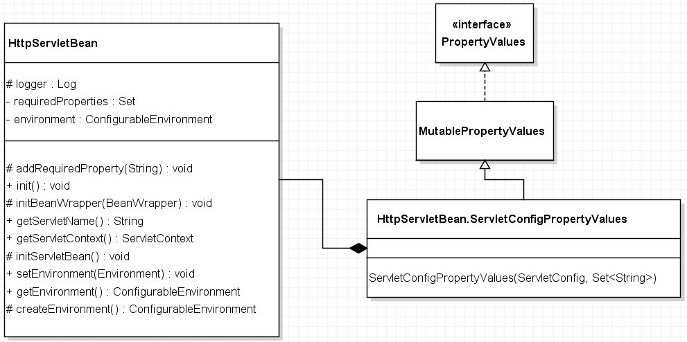
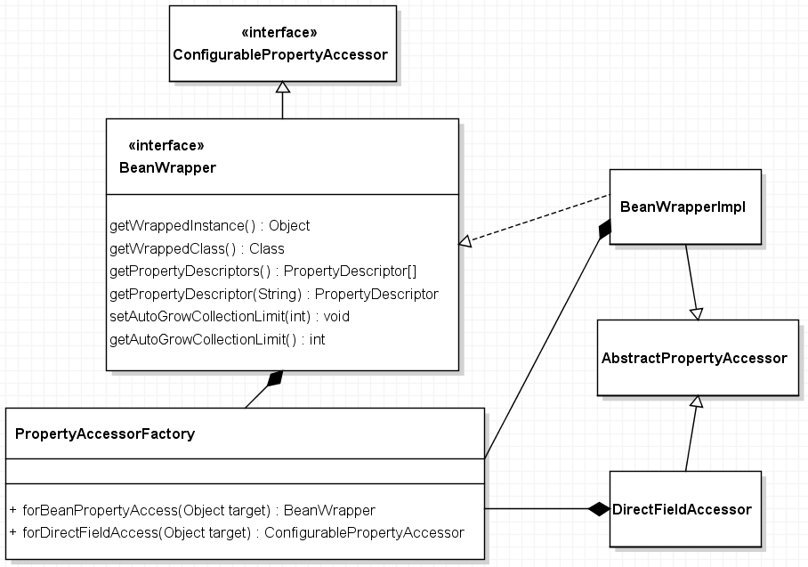
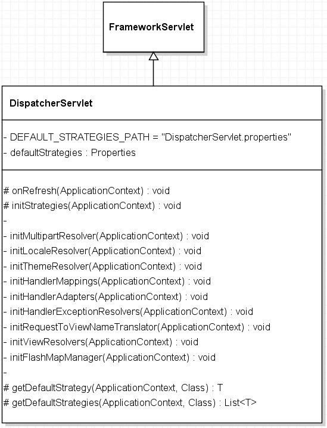
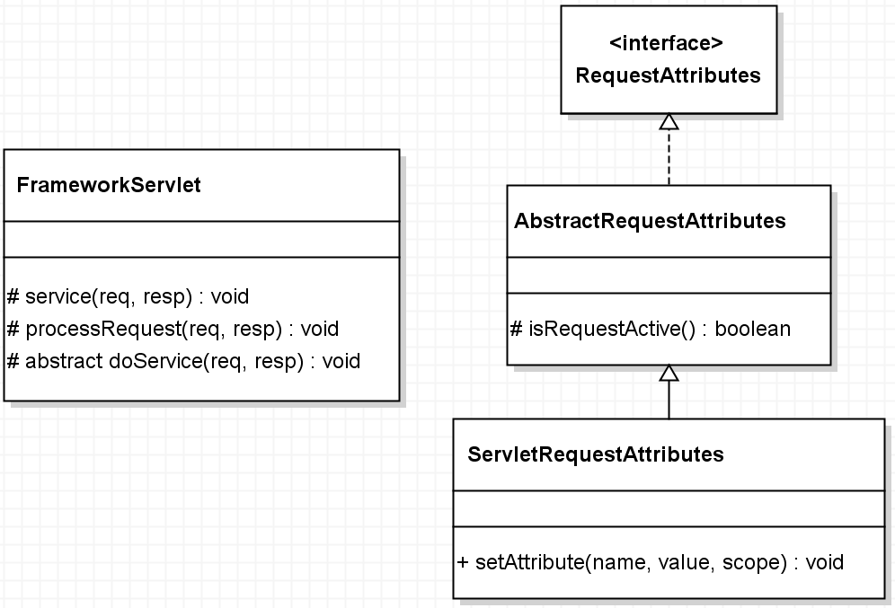
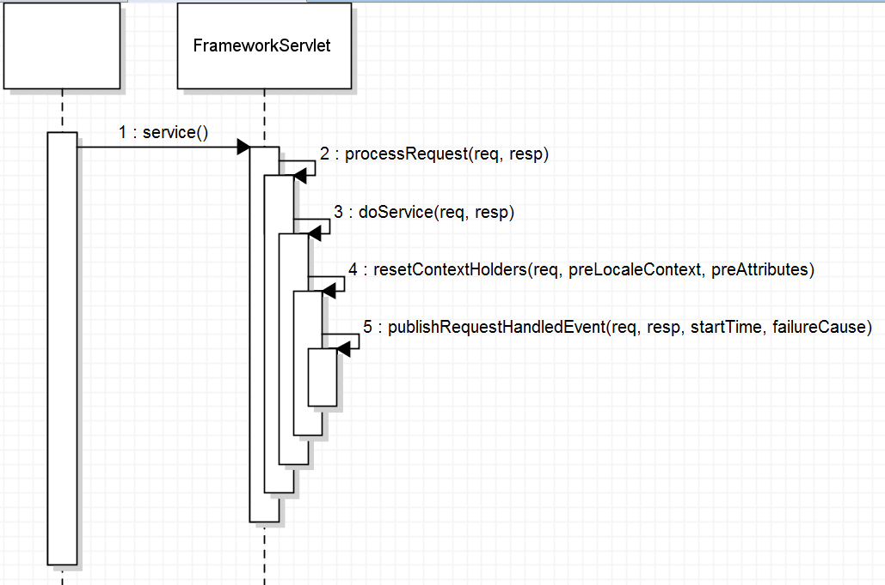
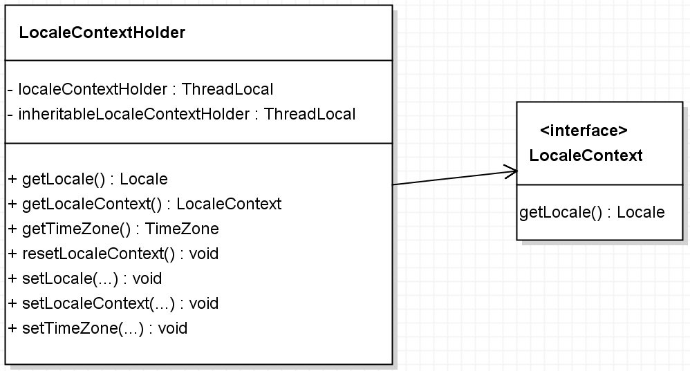
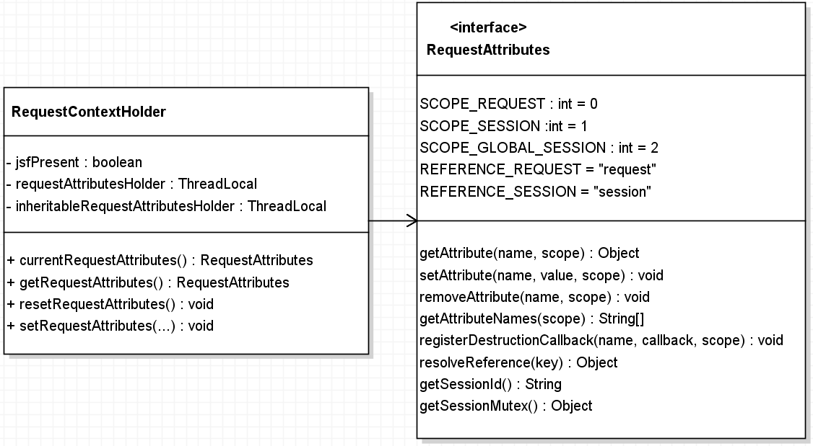
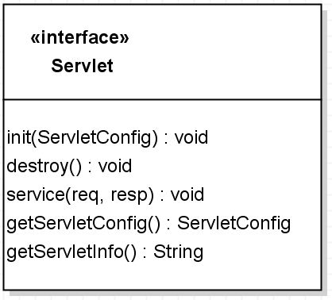
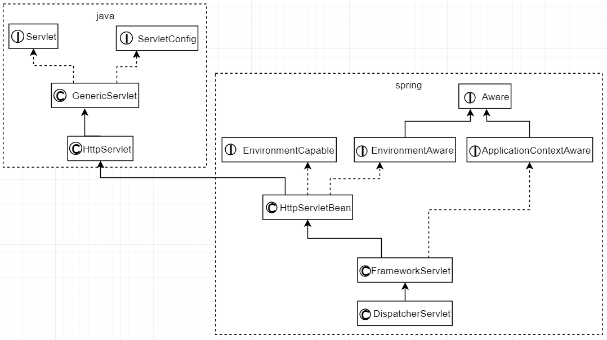

# SpringMVC

## Book01

《看透Spring MVC: 源代码分析与实践》

韩路彪 著

2016年1月第1版第1次印刷

机械工业出版社

### 知识点索引

1.5.4 反向代理， P14 反向代理服务器和代理服务器的区别

#### 第8章

Spring MVC之初体验

`web.xml`中配置`DispatcherServlet`，可以设置`contextConfigLocation`参数来指定Spring MVC配置文件的位置，默认是`WEB-INF/[ServletName]-servlet.xml`文件。这里使用默认值，也就是`WEB-INF/let'sGo-servlet.xml`文件。

let'sGo-servlet.xml

- `<mvc:annotation-driven/>`是Spring MVC提供的一键式的配置方法
- `context:component-scan`标签：扫描通过注释配置的类
- 另外还有`context:include-filter`，可以通过配置此标签来设置只扫描`@Controller`

```xml
<context:component-scan base-package="com.excelib" use-default-filters="false">
	<context:include-filter type="annotation" expression="org.springframework.stereotype.Controller"/>
</context:component-scan>
```

#### 第9章

`XxxAware`在spring里表示对`Xxx`可以感知，通俗点的解释就是：如果在某个类里面想要使用spring的一些东西，就可以通过实现`XxxAware`接口告诉spring，spring看到后就会给你送过来，而接受的方式是通过实现接口唯一的方法`setXxx()`。

**【Debug】**  第9章，讲到`Debug`调试的问题，我使用的是Maven的`mvn tomcat7:run`，使用的是`IntelliJ IDEA`，一开始不知道，后来百度一下，发现非常简单： 先选择右侧的Maven，然后点击展开，再点击到`tomcat7:run`，右键选择`Debug`方式启动，就可以开启`Debug`之旅！

##### HttpServletBean



书中的介绍不多，没抓住知识点，所以也就不知道如何写。

##### BeanWraper

```java
public class BeanWrapperTest {
    static class User {
        private String userName;
        public String getUserName() {
            return userName;
        }
        public void setUserName(String userName) {
            this.userName = userName;
        }
    }

    public static void main(String[] args) {
        User user = new User();
        BeanWrapper bw = PropertyAccessorFactory.forBeanPropertyAccess(user);
        bw.setPropertyValue("userName", "张三");
        System.out.println(user.getUserName());
        PropertyValue value = new PropertyValue("userName", "李四");
        bw.setPropertyValue(value);
        System.out.println(user.getUserName());
    }
}
```

P94， `BeanWrapper`是 Spring 提供的一个用于操作 JavaBean 属性的工具，使用它可以直接修改一个对象的属性，示例如上。简单的类图如下：



##### webApplicationContext

设置`webApplicationContext`一共有三种方式：

1. Servlet3.0 之后可以在程序中使用`ServletContext.addServlet`方式注册 Servlet，可以在新建`FrameworkServlet`和其子类的时候通过构造方法传递已经准备好的的`webApplicationContext`。

2. 在`web.xml`文件中配置。比如，在 ServletContext 中有一个叫`haha`的`webApplicationContext`，可以按如下方式配置到 SpringMVC 中。

```xml
<!-- WEB-INF/web.xml -->
<servlet>
	<servlet-name>let'sGo</servlet-name>
	<servlet-class>org.springframework.web.servlet.DispatcherServlet</servlet-class>
	<init-param>
		<param-name>contextAttribute</param-name>
		<param-value>haha</param-value>
	</init-param>
	<load-on-startup>1</load-on-startup>
</servlet>
```

还有第三种方式，书中罗列大片代码辅助说明，但是我没看懂……

##### DispatcherServlet



`DispatcherServlet.properties`， 可以使用`ctrl + shift + R`在`IntelliJ IDEA`中搜索这个文件。

- 这里定义了不同组件的类型（class全限定名），默认配置
- 默认配置并不是最优配置，也不是 spring 的推荐配置，只是在没有配置时可以有个默认值，不至于空着。

##### 命令空间配置

P104，在 spring 的 xml 文件中通过命名空间配置的标签是怎么解析的

命名空间配置的标签 ： `c:`， `p:` ……

#### 第10章

##### FrameworkServlet



如上图，`FrameworkServlet`在`service(req, resp)`中处理所有的请求，实际工作是交给`processRequest(req, resp)`来处理的，`processRequest()`又将工作交给`doService(req, resp)`来处理， `doService()`是抽象方法，实际的处理会转交给子类来处理。

`RequestAttributes`是一个接口，处理`request`、`session`中的属性（Attribute），看到不要感到陌生，`ServletRequestAttributes`是其具体实现。

`FrameworkServlet`的内部调用序列图，如下：



首先是`service()`方法被调用，然后`service()`方法调用`processRequest()`方法，`processRequest()`内部又调用`doService()`方法（这是一个抽象方法，具体逻辑由子类实现），然后在`finally`代码块中调用`resetContextHolders()`方法，最终会调用`publishRequestHandlerEvent()`方法！

##### LocaleContextHolder



在程序中需要用到`Locale`的时候，首先想到的是`request.getLocale()`，这是最直接的方法。但是，有时候在 service 层需要用到 `Locale` ，此时没有 `request`，就可以使用`LocaleContextHolder.getLocale()`获得。

##### RequestContextHolder



同`LocaleContextHolder`一样，`RequestContextHolder`也是为方便获取 attribute 的。

##### publishRequestHandledEvent

`publishRequestHandledEvent(req, resp, startTime, Throwable) : void`内部发布了一个`ServletRequestHandledEvent`消息。

当`publishEvents : boolean`设置为`true`时，请求处理结束后就会发出这个消息。默认为`true`，可以在`web.xml`中配置。

我们可以通过监听这个事件来做一些事情，比如，记录日志，如下：

```java
@Component
public class ServletRequestHandlerEventListener
        implements ApplicationListener<ServletRequestHandledEvent> {
    final static Logger logger = LoggerFactory
            .getLogger("ServletRequestHandlerEventListener");
    @Override
    public void onApplicationEvent(ServletRequestHandledEvent event) {
        logger.info(event.getDescription());
    }
}
```

只要简单的继承`ApplicationListener`，并且把自己要做的事情写到`onApplicationEvent(...)`里面就行了。别忘了在类上面标注`@Component`。


### uml图

#### Servlet



P37 6.1 Servlet 接口， 如上图

`init()`方法在容器启动时被容器调用，只会调用一次；（当`load-on-startup`设置为负数或者不设置时会在Servlet第一次用到时被调用）

`getServletConfig()`方法用于获取ServletConfig；

`service()`方法用于具体处理一个请求；

`getServletInfo()`方法可以获取一些Servlet相关的信息，这个方法需要自己实现，默认返回空字符串；

`destroy()`方法用于在Servlet销毁（一般指关闭服务器）时释放一些资源，只会调用一次。

-----

`init()`方法被调用时会接收到一个`ServletConfig`类型的参数，是容器传进去的。比如 Spring MVC 的`contextConfigLocation`参数就保存在`ServletConfig`中，配置如下：

```xml
<servlet>
    <servlet-name>demoDispatcher</servlet-name>
    <servlet-class>org.springframework.web.servlet.DispatcherServlet</servlet-class>
    <init-param>
        <param-name>contextConfiguration</param-name>
        <param-value>demo-servlet.xml</param-value>
    </init-param>
    <load-on-startup>1</load-on-startup>
</servlet>
```

#### DispatcherServlet



（上图采用`draw.io`绘制）


## tomcat

### 嵌入式使用

参考： http://www.javacreed.com/how-to-run-embedded-tomcat-with-maven/

```xml
<build>
	<finalName>springMvc</finalName>
	<plugins>
		<plugin>
			<groupId>org.apache.tomcat.maven</groupId>
			<artifactId>tomcat7-maven-plugin</artifactId>
			<version>2.2</version>
			<configuration>
				<port>9090</port>
				<path>/</path>
			</configuration>
		</plugin>
	</plugins>
</build>
```

如上，需要将以上maven插件添加到工程中。至于`configuration`下还能配置哪些其他的元素，我没有找到答案。现在，上面的配置是参考上面的链接得到的。

```sh
mvn clean package

mvn tomcat7:run
```

按以上的命令启动tomcat，在浏览器访问 http://localhost:9090/

使用 https://google.suanfazu.com/ 搜索谷歌！


# End