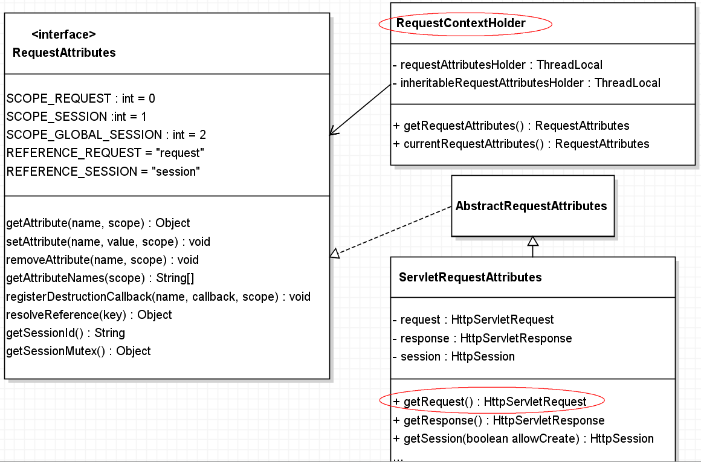

# SpringMVC

## Book01

《看透Spring MVC: 源代码分析与实践》

韩路彪 著

2016年1月第1版第1次印刷

机械工业出版社

### 知识点索引

1.5.4 反向代理， P14 反向代理服务器和代理服务器的区别

#### 第8章

Spring MVC之初体验

`web.xml`中配置`DispatcherServlet`，可以设置`contextConfigLocation`参数来指定Spring MVC配置文件的位置，默认是`WEB-INF/[ServletName]-servlet.xml`文件。这里使用默认值，也就是`WEB-INF/let'sGo-servlet.xml`文件。

let'sGo-servlet.xml

- `<mvc:annotation-driven/>`是Spring MVC提供的一键式的配置方法
- `context:component-scan`标签：扫描通过注释配置的类
- 另外还有`context:include-filter`，可以通过配置此标签来设置只扫描`@Controller`

```xml
<context:component-scan base-package="com.excelib" use-default-filters="false">
	<context:include-filter type="annotation" expression="org.springframework.stereotype.Controller"/>
</context:component-scan>
```

#### 第9章

`XxxAware`在spring里表示对`Xxx`可以感知，通俗点的解释就是：如果在某个类里面想要使用spring的一些东西，就可以通过实现`XxxAware`接口告诉spring，spring看到后就会给你送过来，而接受的方式是通过实现接口唯一的方法`setXxx()`。

**【Debug】**  第9章，讲到`Debug`调试的问题，我使用的是Maven的`mvn tomcat7:run`，使用的是`IntelliJ IDEA`，一开始不知道，后来百度一下，发现非常简单： 先选择右侧的Maven，然后点击展开，再点击到`tomcat7:run`，右键选择`Debug`方式启动，就可以开启`Debug`之旅！

##### HttpServletBean


书中的介绍不多，没抓住知识点，所以也就不知道如何写。

##### BeanWraper

```java
public class BeanWrapperTest {
    static class User {
        private String userName;
        public String getUserName() {
            return userName;
        }
        public void setUserName(String userName) {
            this.userName = userName;
        }
    }

    public static void main(String[] args) {
        User user = new User();
        BeanWrapper bw = PropertyAccessorFactory.forBeanPropertyAccess(user);
        bw.setPropertyValue("userName", "张三");
        System.out.println(user.getUserName());
        PropertyValue value = new PropertyValue("userName", "李四");
        bw.setPropertyValue(value);
        System.out.println(user.getUserName());
    }
}
```

P94， `BeanWrapper`是 Spring 提供的一个用于操作 JavaBean 属性的工具，使用它可以直接修改一个对象的属性，示例如上。简单的类图如下：


##### webApplicationContext

设置`webApplicationContext`一共有三种方式：

1. Servlet3.0 之后可以在程序中使用`ServletContext.addServlet`方式注册 Servlet，可以在新建`FrameworkServlet`和其子类的时候通过构造方法传递已经准备好的的`webApplicationContext`。

2. 在`web.xml`文件中配置。比如，在 ServletContext 中有一个叫`haha`的`webApplicationContext`，可以按如下方式配置到 SpringMVC 中。

```xml
<!-- WEB-INF/web.xml -->
<servlet>
	<servlet-name>let'sGo</servlet-name>
	<servlet-class>org.springframework.web.servlet.DispatcherServlet</servlet-class>
	<init-param>
		<param-name>contextAttribute</param-name>
		<param-value>haha</param-value>
	</init-param>
	<load-on-startup>1</load-on-startup>
</servlet>
```

还有第三种方式，书中罗列大片代码辅助说明，但是我没看懂……

##### DispatcherServlet


`DispatcherServlet.properties`， 可以使用`ctrl + shift + R`在`IntelliJ IDEA`中搜索这个文件。

- 这里定义了不同组件的类型（class全限定名），默认配置
- 默认配置并不是最优配置，也不是 spring 的推荐配置，只是在没有配置时可以有个默认值，不至于空着。

##### 命令空间配置

P104，在 spring 的 xml 文件中通过命名空间配置的标签是怎么解析的

命名空间配置的标签 ： `c:`， `p:` ……

#### 第10章

##### FrameworkServlet


如上图，`FrameworkServlet`在`service(req, resp)`中处理所有的请求，实际工作是交给`processRequest(req, resp)`来处理的，`processRequest()`又将工作交给`doService(req, resp)`来处理， `doService()`是抽象方法，实际的处理会转交给子类来处理。

`RequestAttributes`是一个接口，处理`request`、`session`中的属性（Attribute），看到不要感到陌生，`ServletRequestAttributes`是其具体实现。

`FrameworkServlet`的内部调用序列图，如下：


首先是`service()`方法被调用，然后`service()`方法调用`processRequest()`方法，`processRequest()`内部又调用`doService()`方法（这是一个抽象方法，具体逻辑由子类实现），然后在`finally`代码块中调用`resetContextHolders()`方法，最终会调用`publishRequestHandlerEvent()`方法！

##### LocaleContextHolder


在程序中需要用到`Locale`的时候，首先想到的是`request.getLocale()`，这是最直接的方法。但是，有时候在 service 层需要用到 `Locale` ，此时没有 `request`，就可以使用`LocaleContextHolder.getLocale()`获得。

##### RequestContextHolder


同`LocaleContextHolder`一样，`RequestContextHolder`也是为方便获取 attribute 的。

##### publishRequestHandledEvent

`publishRequestHandledEvent(req, resp, startTime, Throwable) : void`内部发布了一个`ServletRequestHandledEvent`消息。

当`publishEvents : boolean`设置为`true`时，请求处理结束后就会发出这个消息。默认为`true`，可以在`web.xml`中配置。

我们可以通过监听这个事件来做一些事情，比如，记录日志，如下：

```java
@Component
public class ServletRequestHandlerEventListener
        implements ApplicationListener<ServletRequestHandledEvent> {
    final static Logger logger = LoggerFactory
            .getLogger("ServletRequestHandlerEventListener");
    @Override
    public void onApplicationEvent(ServletRequestHandledEvent event) {
        logger.info(event.getDescription());
    }
}
```

只要简单的继承`ApplicationListener`，并且把自己要做的事情写到`onApplicationEvent(...)`里面就行了。别忘了在类上面标注`@Component`。

##### DispatcherServlet


如上图，`DispatcherServlet`继承自`FrameworkServlet`。

第10章， 10.3 `DispatcherServlet`，…… P118 ~ ，


上图，是原班照抄第10章结尾处的图，我是使用`draw.io`绘制的，原稿在 https://github.com/juedui0769/BitDiagram2019/tree/master/springmvc 目录下的 `springmvc_101_DispatcherServlet.xml` 文件中。（以后，遇到比较难理解的调用逻辑时，可以像上图这样绘制出来；看图还是比看代码清晰很多，特别是自己绘制出来的，更觉清晰）

- 说明： `draw.io`导出时，可以设置“缩放”和“边框宽度”，默认是“缩放”为`100%`，“边框宽度”为`0`；经过测试，我将“缩放”调整为`145%`，将“边框宽度”设置为`2`，导出为`png`图片，效果还可以；之前的导出是`63KB`，现在的导出为`99KB`。
- 

#### 第11章

##### HandlerMapping


##### HandlerAdapter


##### HandlerExceptionResolver


- 如开发内网系统，可以在错误页面显示一些细节，这样方便调试；
- 但如果是互联网系统，最好不要将异常的太多细节显示给用户，这样很容易被黑客利用。

##### ViewResolver


##### RequestToViewNameTranslator


`RequestToViewNameTranslator`在 Spring MVC 容器里只能配置一个，所有 request 到 ViewName 的转换规则都要在一个 Translator 中实现。

##### LocaleResolver


```xml
<mvc:interceptors>
	<mvc:interceptor>
		<mvc:mapping path="/*"/>
		<bean class="org.springframework.web.servlet.i18n.LocaleChangeInterceptor" />
	</mvc:interceptor>
</mvc:interceptors>
```

如上，这样就可以通过`http://localhost:8080?locale=zh_CN`，`http://localhost:8080?locale=en`来设置了 Locale 了；也可以向下面这样把`locale`替换为`lang`。

```xml
<mvc:interceptors>
	<mvc:interceptor>
		<mvc:mapping path="/*"/>
		<bean class="org.springframework.web.servlet.i18n.LocaleChangeInterceptor">
			<property name="paramName" value="lang"/>
		</bean>
	</mvc:interceptor>
</mvc:interceptors>
```

##### ThemeResolver


Spring MVC 的主题也支持国际化，同一个主题不同的区域也可以显示不同的风格。

```java
// org.springframework.web.servlet.support.RequestContext

public String getThemeMessage(String code, Object[] args, String defaultMessage) {
	return getTheme().getMessageSource().getMessage(code, args, defaultMessage, this.locale);
}

public Theme getTheme() {
	if (this.theme == null) {
		// Lazily determine theme to use for this RequestContext.
		this.theme = RequestContextUtils.getTheme(this.request);
		if (this.theme == null) {
			// No ThemeResolver and ThemeSource available -> try fallback.
			this.theme = getFallbackTheme();
		}
	}
	return this.theme;
}
```

Spring MVC 中主题的切换和 Locale 的切换使用相同的模式，也是使用 Interceptor。（`ThemeChangeInterceptor`）

##### MultipartResolver


如果上传请求不用`MultipartHttpServletRequest`，直接用原来的`request`也是可以的。

##### FlashMapManager


`redirect`的参数通过 `FlashMap` 传递的过程分三步：

- （1）在处理器中将需要传递的参数设置到 `outputFlashMap`中
  - 可以先拿到 `outputFlashMap`，然后将参数`put`进去（获取`outputFlashMap`的方式： 通过`request`获取`DispatcherServelet.OUTPUT_FLASH_MAP_ATTRIBUTE`）
  - 也可以将需要传递的参数设置到处理器的 `RedirectAttributes`类型的参数中，当处理器处理完请求时，如果是`redirect`类型的返回值`RequestMappingHandlerAdapter`会将其设置到`outputFlashMap`中。
- （2）在`RedirectView`的`renderMergedOutputModel`方法中调用`FlashMapManageer`的`saveOutputFlashMap`方法，将`outputFlashMap`中的参数设置到`Session`中。
- （3）请求`redirect`后`DispatcherServlet`的`doService`会调用`FlashMapManager`的`retrieveAndUpdate`方法从 Session 中获取 `inputFlashMap` 并设置到 Request 的属性中备用，同时从 Session 中删除。

#### 第12章

##### 家谱


上图是`HandlerMapping`的家谱。

##### ApplicationContext


如上图，`ApplicationContext`继承了 6 个接口：

- EnvironmentCapable
- MessageSource
- ApplicationEventPublisher
- HierarchicalBeanFactory
- ResourcePatternResolver
- ListableBeanFactory

其中，`BeanFactory`和`ResourceLoader`是间接继承。`ApplicationContext`自身的方法如下：


### uml图

#### Servlet


P37 6.1 Servlet 接口， 如上图

`init()`方法在容器启动时被容器调用，只会调用一次；（当`load-on-startup`设置为负数或者不设置时会在Servlet第一次用到时被调用）

`getServletConfig()`方法用于获取ServletConfig；

`service()`方法用于具体处理一个请求；

`getServletInfo()`方法可以获取一些Servlet相关的信息，这个方法需要自己实现，默认返回空字符串；

`destroy()`方法用于在Servlet销毁（一般指关闭服务器）时释放一些资源，只会调用一次。

-----

`init()`方法被调用时会接收到一个`ServletConfig`类型的参数，是容器传进去的。比如 Spring MVC 的`contextConfigLocation`参数就保存在`ServletConfig`中，配置如下：

```xml
<servlet>
    <servlet-name>demoDispatcher</servlet-name>
    <servlet-class>org.springframework.web.servlet.DispatcherServlet</servlet-class>
    <init-param>
        <param-name>contextConfiguration</param-name>
        <param-value>demo-servlet.xml</param-value>
    </init-param>
    <load-on-startup>1</load-on-startup>
</servlet>
```

#### DispatcherServlet


（上图采用`draw.io`绘制）


## tomcat

### 嵌入式使用

参考： http://www.javacreed.com/how-to-run-embedded-tomcat-with-maven/

```xml
<build>
	<finalName>springMvc</finalName>
	<plugins>
		<plugin>
			<groupId>org.apache.tomcat.maven</groupId>
			<artifactId>tomcat7-maven-plugin</artifactId>
			<version>2.2</version>
			<configuration>
				<port>9090</port>
				<path>/</path>
			</configuration>
		</plugin>
	</plugins>
</build>
```

如上，需要将以上maven插件添加到工程中。至于`configuration`下还能配置哪些其他的元素，我没有找到答案。现在，上面的配置是参考上面的链接得到的。

```sh
mvn clean package

mvn tomcat7:run
```

按以上的命令启动tomcat，在浏览器访问 http://localhost:9090/，如果想要以`DEBUG`方式启动，在`IntelliJ IDEA`中可以在右侧Maven视图中选择`tomcat7:run`，然后右键以`Debug`方式启动。

使用 https://google.suanfazu.com/ 搜索谷歌！

## getRequest()

```java
public void test01() {
	(
		(FlashMap)(
			(ServletRequestAttributes)RequestContextHolder.getRequestAttributes()
		).getRequest().getAttribute(DispatcherServlet.OUTPUT_FLASH_MAP_ATTRIBUTE)
	).put("name", "张三丰");
}
```

以上代码来自，第10章 P116，首先从`RequestContextHolder`中获取`ServletRequestAttributes`（需要转义），然后在`ServletRequestAttributes`中有方法`getRequest()`。将上面的代码展开就是下面的形式：

```java
RequestAttributes reqAttributes = RequestContextHolder.getRequestAttributes();
ServletRequestAttributes requestAttributes = (ServletRequestAttributes) reqAttributes;
HttpServletRequest request = requestAttributes.getRequest();
Object attribute = request.getAttribute(DispatcherServlet.OUTPUT_FLASH_MAP_ATTRIBUTE);
FlashMap flashMap = (FlashMap) attribute;
flashMap.put("name", "张三丰");
```



这个小节的主题是`getRequest()`，其他的都不关心，`getRequestAttributes()`方法是`RequestContextHolder`类的`static`方法，返回`RequestAttributes`接口，`ServletRequestAttributes`是它的实现类，在`ServletRequestAttributes`就有获取`HttpServletRequest`的方法`getRequest()`，如上图！

## 数据传输（redirect）

```java
RequestAttributes reqAttributes = RequestContextHolder.getRequestAttributes();
ServletRequestAttributes requestAttributes = (ServletRequestAttributes) reqAttributes;
HttpServletRequest request = requestAttributes.getRequest();
Object attribute = request.getAttribute(DispatcherServlet.OUTPUT_FLASH_MAP_ATTRIBUTE);
FlashMap flashMap = (FlashMap) attribute;

flashMap.put("name", "张三丰");
```


> INPUT_FLASH_MAP_ATTRIBUTE
>
> Name of request attribute that holds a read-only Map with "input" flash attributes saved by a previous request, if any.   保存只读映射的请求属性的名称，其中包含由上一个请求保存的“输入”闪存属性（如果有）。
>
> OUTPUT_FLASH_MAP_ATTRIBUTE
>
> Name of request attribute that holds the "output" FlashMap with attributes to save for a subsequent request.   保存“输出”flashmap的请求属性的名称，其中包含为后续请求保存的属性。

以上两个属性可以直接通过 `RequestContextUtils#getInputFlashMap(HttpServletRequest)` 和 `RequestContextUtils#getOutputFlashMap(HttpServletRequest)` 获得。


```java
@Controller
public class MyCommonController {
    @RequestMapping(value = "/submit", method = RequestMethod.POST)
    public String submit(RedirectAttributes attr) {
        RequestAttributes reqAttributes = RequestContextHolder.getRequestAttributes();
        ServletRequestAttributes requestAttributes = (ServletRequestAttributes) reqAttributes;
        HttpServletRequest request = requestAttributes.getRequest();
        Object attribute = request.getAttribute(DispatcherServlet.OUTPUT_FLASH_MAP_ATTRIBUTE);
        FlashMap flashMap = (FlashMap) attribute;

        flashMap.put("name", "张三丰");
        attr.addFlashAttribute("ordersId", "xxx");
        attr.addAttribute("local", "zh-cn");
        
        FlashMap outputFlashMap = RequestContextUtils.getOutputFlashMap(request);
        outputFlashMap.put("age", 130);

        return "redirect:showorders";
    }

    @RequestMapping(value = "/showorders", method = RequestMethod.GET)
    public String showOrders(Model model) {
        // doSomthing ...
        return "orders";
    }
}

```

`INPUT_FLASH_MAP_ATTRIBUTE`和`OUTPUT_FLASH_MAP_ATTRIBUTE`的设置比较麻烦，上面代码只是展示一下操作方式；实际开发中，应该使用`RedirectAttributes`，注意看上面的代码，是传参；

- `addFlashAttribute()`方法是将传入的参数保存到`output-FlashMap`中
- `addAttribute()`方法是将参数拼接到`url`中。
- 还可以通过`RequestContextUtils`来操作……


## Book02

《Spring 源码深度解析》，郝佳 编著，人民邮电出版社，2013年9月第1版，20161029购于京东。

### XmlBeanFactory


`XmlBeanFactory`，已经被废弃了。

> @deprecated as of Spring 3.1 in favor of {@link DefaultListableBeanFactory} and {@link XmlBeanDefinitionReader}

`DefaultListableBeanFactory`， `XmlBeanDefinitionReader` ： `DefaultListableBeanFactory`如上图，就是`XmlBeanFactory`的父类；`XmlBeanDefinitionReader`如下图。


### XmlBeanDefinitionReader


# End