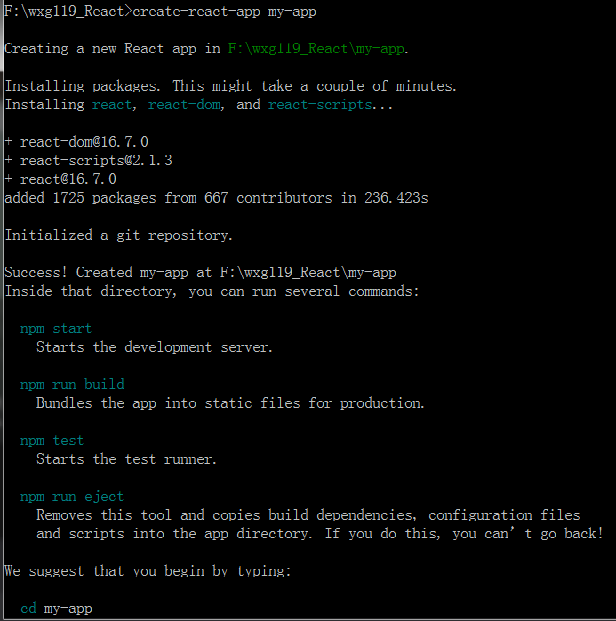

# React

https://reactjs.org/， 官网

https://react.docschina.org/， 中文，文档

## React的优势

### 声明式

React 可以非常轻松地创建用户交互界面。为你应用的每一个状态设计简洁的视图，在数据改变时 React 也可以高效地更新渲染界面。

以声明式编写UI，可以让你的代码更加可靠，且方便调试。

### 组件化

创建好拥有各自状态的组件，再由组件构成更加复杂的界面。

无需再用模版代码，通过使用JavaScript编写的组件你可以更好地传递数据，将应用状态和DOM拆分开来。

### 一次学习，随处编写

无论你现在正在使用什么技术栈，你都可以随时引入 React 开发新特性。

React 也可以用作开发原生应用的框架 [React Native](https://facebook.github.io/react-native/).


## hello world

参考 http://www.runoob.com/react/react-install.html

- 最简单的使用方式是，cdn，在国内可以使用https://www.bootcdn.cn/，
- 再就是使用`create-react-app`快速构建 React 开发环境，在国内需要先搭建`cnpm`来加速。

```sh
cnpm install -g create-react-app

create-react-app my-app
cd my-app/
npm start
```

### bootcdn

https://www.bootcdn.cn/

```html
<!DOCTYPE html>
<html>
<head>
<meta charset="UTF-8" />
<title>Hello React!</title>

<!-- <script src="https://cdn.staticfile.org/react/16.4.0/umd/react.development.js"></script>
<script src="https://cdn.staticfile.org/react-dom/16.4.0/umd/react-dom.development.js"></script>
<script src="https://cdn.staticfile.org/babel-standalone/6.26.0/babel.min.js"></script> -->

<script src="https://cdn.bootcss.com/react/16.7.0/umd/react.development.js"></script>
<script src="https://cdn.bootcss.com/react-dom/16.7.0/umd/react-dom.development.js"></script>
<script src="https://cdn.bootcss.com/babel-standalone/6.26.0/babel.js"></script>


</head>
<body>
 
<div id="example"></div>
<script type="text/babel">
ReactDOM.render(
    <h1>Hello, world!</h1>,
    document.getElementById('example')
);
</script>
 
</body>
</html>
```

代码如上，……


### create-react-app


```sh
cnpm install -g create-react-app
```

使用`cnpm`安装`create-react-app`，安装后，就可以使用`creat-react-app`来创建本地应用，比如： `create-react-app my-app`，如下：



```sh
F:\wxg119_React>create-react-app my-app

Creating a new React app in F:\wxg119_React\my-app.

Installing packages. This might take a couple of minutes.
Installing react, react-dom, and react-scripts...

+ react-dom@16.7.0
+ react-scripts@2.1.3
+ react@16.7.0
added 1725 packages from 667 contributors in 236.423s

Initialized a git repository.

Success! Created my-app at F:\wxg119_React\my-app
Inside that directory, you can run several commands:

  npm start
    Starts the development server.

  npm run build
    Bundles the app into static files for production.

  npm test
    Starts the test runner.

  npm run eject
    Removes this tool and copies build dependencies, configuration files
    and scripts into the app directory. If you do this, you can’t go back!

We suggest that you begin by typing:

  cd my-app
  npm start

Happy hacking!

F:\wxg119_React>
```

以上是`create-react-app`的安装及使用。

```sh
cd my-app
npm start
```

以上命令启动，然后在浏览器可以看到结果 http://localhost:3000/

核心文件：

```
my-app/src
|- App.js
|- index.js
```

```javascript
// App.js
import React, { Component } from 'react';
import logo from './logo.svg';
import './App.css';

class App extends Component {
  render() {
    return (
      <div className="App">
        <header className="App-header">
          
          <p>
            Edit <code>src/App.js</code> and save to reload.
          </p>
          <a
            className="App-link"
            href="https://reactjs.org"
            target="_blank"
            rel="noopener noreferrer"
          >
            Learn React
          </a>
        </header>
      </div>
    );
  }
}

export default App;
```

```javascript
// index.js
import React from 'react';
import ReactDOM from 'react-dom';
import './index.css';
import App from './App';
import * as serviceWorker from './serviceWorker';

ReactDOM.render(<App />, document.getElementById('root'));

// If you want your app to work offline and load faster, you can change
// unregister() to register() below. Note this comes with some pitfalls.
// Learn more about service workers: http://bit.ly/CRA-PWA
serviceWorker.unregister();

```

还有 css ，logo，…… 等文件，也在 src 目录下。


# End