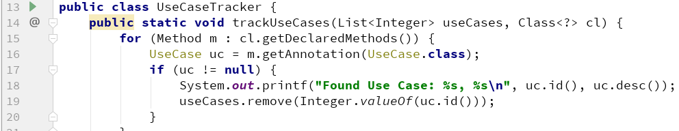
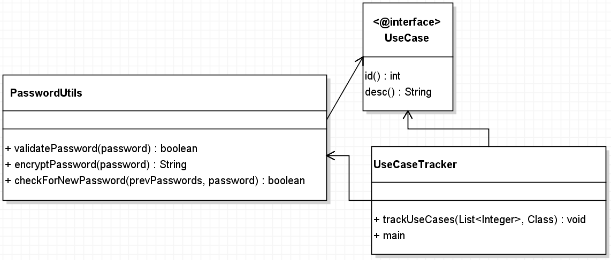

# 注解

## book01

《Java编程思想 第4版》，第20章 注解

> 注解（也被称为'元数据'）为我们在代码中添加信息提供了一种形式化的方法，使我们可以在稍后某个时刻非常方便地使用这些数据。

注解在一定程度上是在把元数据与源代码文件结合在一起，而不是保存在外部文档中这一大的趋势之下所催生的。

注解使得我们能够以将由编译器来测试和验证的格式，存储有关程序的额外信息。

注解可以用来生成描述符文件，甚至或是新的类定义，并且有助于减轻编写“样板”代码的负担。

通过使用注解，我们可以将这些元数据保存在 Java 源代码中，并利用 annotaion API 为自己的注解构造处理工具，同时，注解的优点还包括：更加干净已读的代码以及编译期类型检查等。

> 每当你创建描述符性质的类或接口时，一旦其中包含了重复性的工作，那就可以考虑使用注解来简化与自动化该过程。

注解（annotation）是在实际的源代码级别保存所有的信息，而不是某种注释性的文字（comment），这使得代码更整洁，且便于维护。通过使用扩展的 annotation API，或外部的字节码工具类库，程序员拥有对源代码以及字节码强大的检查与操作能力。

> 从语法的角度来看，注解的使用方式几乎与修饰符的使用一模一样。

> 注解的定义看起来很像接口的定义。事实上，与其他任何 Java 接口一样，注解也将会编译成 class 文件。
>
> `@Target`用来定义你的注解将应用于什么地方（方法、域……）
>
> `@Retention`用来定义该注解在哪一个级别可用（源代码、类文件、运行时）

> 注解的元素看起来就像接口的方法，唯一的区别是你可以为其指定默认值。
>
> 没有元素的注解称为'标记注解（marker annotaion）'

**编写注解处理器**

如果没有用来读取注解的工具，那注解也不会比注释更有用。使用注解的过程中，很重要的一个部分就是创建与使用‘注解处理器’。

### 例子

```java
@Target(ElementType.METHOD)
@Retention(RetentionPolicy.RUNTIME)
public @interface UseCase {
    int id();
    String desc() default "no description";
}
```

```java
public class PasswordUtils {

    @UseCase(id = 47,
            desc = "Passwords must contain at least one numeric")
    public boolean validatePassword(String password) {
        return password.matches("\\w*\\d\\w*");
    }

    @UseCase(id = 48)
    public String encryptPassword(String password) {
        return new StringBuilder(password).reverse().toString();
    }

    @UseCase(id = 49,
            desc = "New passwords can't equal previously used ones")
    public boolean checkForNewPassword(List<String> prevPasswords,
                                       String password) {
        return !prevPasswords.contains(password);
    }
}
```

```java
public class UseCaseTracker {
    public static void trackUseCases(List<Integer> useCases, Class<?> cl) {
        for (Method m : cl.getDeclaredMethods()) {
            UseCase uc = m.getAnnotation(UseCase.class);
            if (uc != null) {
                System.out.printf("Found Use Case: %s, %s\n", uc.id(), uc.desc());
                useCases.remove(Integer.valueOf(uc.id()));
            }
        }

        for (int i : useCases) {
            System.out.printf("Warning: Missing use case-%s\n", i);
        }
    }

    public static void main(String[] args) {
        List<Integer> useCases = new ArrayList<>();
        Collections.addAll(useCases, 47, 48, 49, 50);
        trackUseCases(useCases, PasswordUtils.class);
    }
}
```

**解析**



如上图，传入的第二个参数是`PasswordUtils.class`，是程序将要解析的类；通过反射API，获取`PasswordUtils.class`的所有的方法，然后调用`method.getAnnotation(UseCase.class)`，可以获取方法上的注解`UseCase`，如果不为空，就可以调用`id()`，`desc()`获得值！




# End