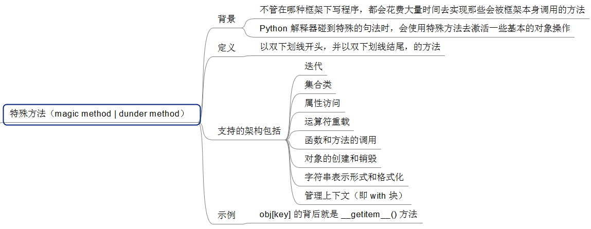
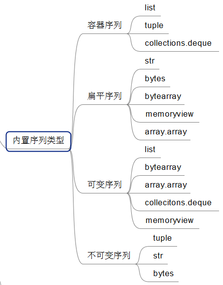
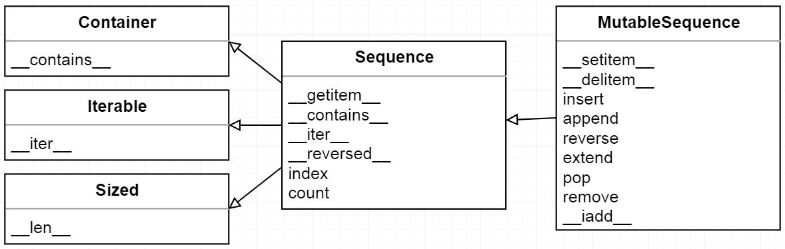
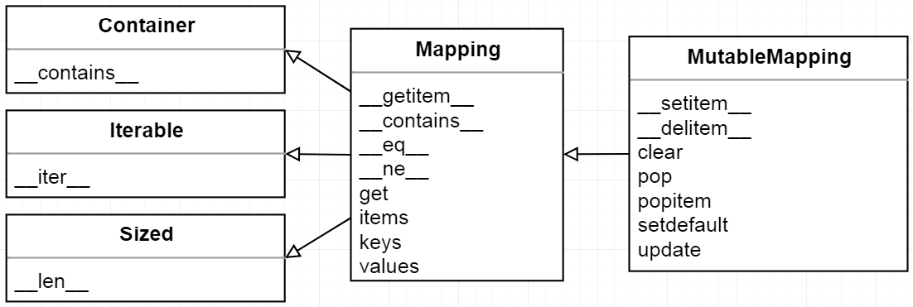
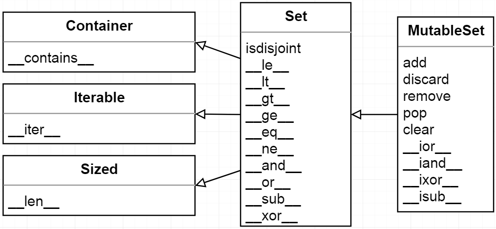
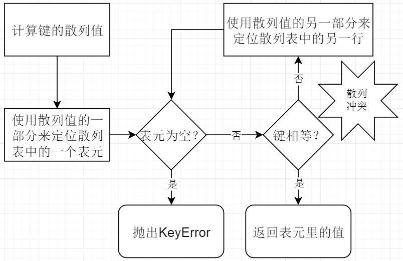

# Python学习记录


## 01 虚拟环境

可以安装一个虚拟环境，在 Python 2 和 Python 3 之间切换，安装方式如下（Linux 和 windows 不同）

**virtualenvwrapper，virtualenvwrapper-win**

- https://virtualenvwrapper.readthedocs.io/en/latest/install.html（Linux）

```sh
pip install virtualenvwrapper
# or
sudo pip install virtualenvwrapper
```

- https://pypi.org/project/virtualenvwrapper-win/（windows上）

```sh
# using pip
pip install virtualenvwrapper-win

# using easy_install
easy_install virtualenvwrapper-win

# from source
git clone git://github.com/davidmarble/virtualenvwrapper-win.git
cd virtualenvwrapper-win
python setup.py install   # or pip install .
```

可以使用`pip`安装或者`easy_install`安装，或者直接`python setup.py install`，总之首先还是得先安装Python的任意版本，再安装这个虚拟环境。（Python的安装，官网）

**虚拟环境的使用：**

```sh
# 不带参数，列举出本机所有的环境
workon
# py3 是环境名称
workon py3
# deactivate ， 退出环境
deactivate
```

```sh
python -V
```

如上，大写的`V`显示版本……

## 02 IPython

- https://ipython.org/

- ~~https://jupyter.readthedocs.io/en/latest/install.html~~
- https://jupyter.readthedocs.io/en/latest/projects/content-projects.html ，其他的编程语言也可以安装
  - Use another programming language such as R or Java
- https://ipython.readthedocs.io/en/stable/install/index.html，这篇文章是我采用的安装方式
  - `pip install ipython`
  - Beginning with version 6.0, IPython stopped supporting compatibility with Python version lower than 3.3 including all versions of Python 2.7。

```sh
pip install ipython
```

以上，就是安装`ipython`的方式，另外： 6.0版的ipython不再支持`2.7`和`3.3`以下的python

## 03 FreeMind

"FreeMind"是一款免费的“思维导图”软件，用来做笔记是最好不过的了。

- 首页： http://freemind.sourceforge.net/wiki/index.php/Main_Page
- 下载： http://freemind.sourceforge.net/wiki/index.php/Download
  - 需要先安装 Java 环境，才能使用 FreeMind。
  - 在此链接下，可以找到各种环境下的 FreeMind 的安装文件。
- windows环境下的安装文件，已上传到百度网盘备份（由于百度网盘的限速，原始链接可能下载速度更好，下载前请衡量……）
  - 链接: https://pan.baidu.com/s/1qQ7wXzoEMwMsFakXI-bk3A 提取码: j3bj 
- 快捷方式（windows）
  - `Enter` ：创建平级节点
  - `Insert` ： 创建下级节点
  - `F2` ： 编辑节点
  - `Delete` ： 删除节点
  - 更改节点顺序，这个快捷键没有找到，我目前的做法是： 创建一个平级节点，将子节点全部拖动到新的节点上，从而，达到更改顺序的目的。

## 04 PyCharm

因为有 python 虚拟环境，所以，本地可以安装很多版本的python。

那 PyCharm 可以为每个工程指定不同版本的python，不同于 Java 的 Compiler ，python 对应的是 Intercepter，在 Settings 下可以找到 Project Intercepter，在这里设置python解释器。

## 05 Python Shell 清屏命令

```python
import os
n = os.system('cls')
```

https://blog.csdn.net/howard2005/article/details/79879289， https://blog.csdn.net/cxcxrs/article/details/81219395 ， 参考上面的博文。

## 06 pythontutor

http://www.pythontutor.com/

## 07 导入py文件到命令行

在 PyCharm 中编写 Python 的代码文件，如何导入到 Python命令行中使用呢？

比如，我编写的py文件保存的位置为：“F:\wxg103\pythonProjects\FluentPython\ch06\example6_1.py” （这是一个很长的目录，但是 PyCharm 中可以使用 “copy path” 快速得到），如何导入到命令行呢？

参考： https://blog.csdn.net/Mr_Cat123/article/details/80515370 ， https://blog.csdn.net/benjamin721/article/details/77235602 

```python
import os, sys

n = os.system('cls')  # 清屏

sys.path.append('F:\\wxg103\\pythonProjects\\FluentPython\\ch06')
import example6_1
# or
from example6_1 import *
```

按照上面的方式操作，然后，就可以在命令行中使用了。


## 08  重新加载模块

安装，07 中介绍的方法，导入模块，之后，如果修改了文件，如何重新加载模块呢？

比如修改了 example6_1.py 文件，如何重新加载呢？

参考： https://python3-cookbook.readthedocs.io/zh_CN/latest/c10/p06_reloading_modules.html

```python
import example6_1
import imp

imp.reload(example6_1)

from example6_1 import *
```

承接 07 的操作……


## Books

### python3-cookbook

https://python3-cookbook.readthedocs.io/zh_CN/latest/index.html


## Book01

> 《简明Python教程第4版》

> Python 3 ： `> 3.5.1`的 Python 发行版


### 基础

#### 注释

注释，是任何存在于 `#` 号右侧的文字。

#### 字面常量

Literal Constants

#### 其他

- 数字、字符串，字符串是不可变的
- 单引号、双引号、三引号

#### 格式化方法

```python
age = 20
name = "Swaroop"

print('{0} was {1} years old when he wrote this book'.format(name, age))
print('Why is {0} playing with that python?'.format(name))
```

数字只是一个可选选项，同样可以写成：

```python
age = 20
name = "Swaroop"

print('{} was {} years old when he wrote this book'.format(name, age))
print('Why is {} playing with that python?'.format(name))
```

`format`的用法很多，……


## Book02

《 Fluent Python 流畅的Python》，[巴西] Luciano Ramalho 著，安道 吴珂 译，2017.5

代码： https://github.com/fluentpython/example-code

### 目录

- 第一部分 序幕
  - 第1章 Python数据模型
- 第二部分 数据结构
  - 第2章 序列构成的数组
  - 第3章 字典和集合
  - 第4章 文本和字节序列
- 第三部分 把函数视作对象
  - 第5章 一等函数
  - 第6章 使用一等函数实现设计模式
  - 第7章 函数装饰器和闭包
- 第四部分 面向对象惯用法
  - 第8章 对象引用、可变性和垃圾回收
  - 第9章 符合 Python 风格的对象
  - 第10章 序列的修改、散列和切片
  - 第11章 接口：从协议到抽象基类
  - 第12章 继承的优缺点
  - 第13章 正确重载运算符
- 第五部分 控制流程
  - 第14章 可迭代的对象、迭代器和生成器
  - 第15章 上下文管理器和else块
  - 第16章 协程
  - 第17章 使用期物处理并发
  - 第18章 使用 asyncio 包处理并发
- 第六部分 元编程
  - 第19章 动态属性和特性
  - 第20章 属性描述符
  - 第21章 类元编程

### dunder-method



第1章 Python数据模型，开篇讲解的就是 dunder method。

### 第1章

第一章 Python 数据模型

```python
import collections

Card = collections.namedtuple('Card', ['rank', 'suit'])


class FrenchDeck:
    ranks = [str(n) for n in range(2, 11)] + list('JQKA')
    suits = 'spades diamonds clubs hearts'.split()

    def __init__(self):
        self._cards = [Card(rank, suit) for suit in self.suits for rank in self.ranks]

    def __len__(self):
        return len(self._cards)

    def __getitem__(self, position):
        return self._cards[position]

suit_values = dict(spades=3, hearts=2, diamonds=1, clubs=0)


def spades_high(card):
    rank_value = FrenchDeck.ranks.index(card.rank)
    return rank_value * len(suit_values) + suit_values[card.suit]


if __name__ == "__main__":
    deck = FrenchDeck()
    print("扑克牌数量：{}".format(len(deck)))
    print("第一张牌是 {}, 最后一张是 {}".format(deck[0], deck[-1]))
    from random import choice
    print("随机抽取三张牌...")
    print(choice(deck))
    print(choice(deck))
    print(choice(deck))
    print("显示最上面三张牌：{}".format(deck[:3]))
    print("显示最下面三张牌：{}".format(deck[:-4:-1]))
    print("显示牌面是 A 的牌： {}".format(deck[12::13]))
    print("=== 顺序显示所有牌 ===")
    for card in deck:
        print(card)
    print("=== 逆序显示所有牌 ===")
    for card in reversed(deck):
        print(card)
    print(Card('Q', 'hearts') in deck)
    print(Card('Q', 'bearts') in deck)
    print("===")
    for card in sorted(deck, key=spades_high):
        print(card)
```

`ranks = [str(n) for n in range(2, 11)] + list('JQKA')` 这一句太简洁了，我每次读源码时，都在这里卡壳。这其实是初始化扑克牌的：2 ~ 10、 J、 Q、 K、 A ，从 2 到 A 。

我们通过数据模型和一些合成来实现我们想要的功能：

- 通过实现 `__len__` 和 `__getitem__` 这两个特殊方法，`FrenchDeck`就跟一个 Python 自有的序列数据类型一样，可以体现出 Python 的核心语言特性（例如迭代和切片）
- 同时这个类还可以用于标准库中诸如 `random.choice`、`reversed` 和 `sorted` 这些函数。
- 另外，对合成的运用使得 `__len__` 和 `__getitem__` 的具体实现可以代理给 `self._cards` 这个 Python 列表（即 list 对象）。

#### 1.2 如何使用特殊方法

首先明确一点，特殊方法的存在是为了被 Python 解释器调用的，你自己并不需要调用它们。

- 也就是说没有 `my_object.__len__()`这种写法，而应该使用 `len(my_object)` 。
- 在执行 `len(my_object)` 的时候，如果 `my_object` 是一个自定义类的对象，那么 Python 会自己去调用其中由你实现的 `__len__` 方法。

很多时候，特殊方法的调用是隐式的，比如 `for i in x:` 这个语句，背后实用的是 `iter(x)`，而这个函数的背后则是 `x.__iter__()` 方法。当然前提是这个方法在 `x` 中被实现了。

#### 1.2.4 自定义的布尔值

默认情况下，我们自己定义的类的实例总被认为是真的，除非这个类对 `__bool__` 或者 `__len__` 函数有自己的实现。

- `bool(x)` 的背后是调用 `x.__bool__()` 的结果；
- 如果不存在 `__bool__` 方法，那么 `bool(x)` 会尝试调用 `x.__len__()`。若返回 `0`，则 `bool` 会返回 `False`；否则返回 `True`。

#### 1.3 特殊方法一览

Python 语言参考手册中的“Data Model”（https://docs.python.org/3/reference/datamodel.html）一章列出了 `83` 个特殊方法的名字，其中 `47` 个用于实现算术运算、位运算和比较操作。

#### 总结

第一章是个概括性的章节，以“扑克牌”类开局，从“特殊方法”谈起；表达“自定义”类，实现某些特殊方法就可以具备内置类同样的功能和待遇；双下划线方法（特殊方法）是Python的特色，也是其简洁性的证明；第一章只是抛砖引玉，后续章节会陆续展开。

### 第2章

第2章 序列构成的数组

不管是哪种数据结构，字符串、列表、字节序列、数组、XML元素，抑或是数据库查询结果，它们都共用一套丰富的操作：迭代、切片、排序，还有拼接。

#### 2.1 内置序列类型概览



“容器序列”存放的是它们所包含的任意类型的对象的引用，而“扁平序列”里存放的是值而不是引用。换句话说，扁平序列其实是一段连续的内存空间。由此可见扁平序列其实更加紧凑，但是它里面只能存放诸如字符、字节和数值这种基础类型。



#### 2.2 列表推导和生成器表达式

> 列表推导 是构建列表（list）的快捷方式，而 生成器表达式 则可以用来创建其他任何类型的序列。
>
> .……
>
> 如果你的代码里并不经常使用它们，那么很可能你错过了许多写出可读性更好且更高效的代码的机会。

很多 Python 程序员都把 列表推导（list comprehension）简称 listcomps，生成器表达式（generator expression）则称为 genexps。

```python
if __name__ == "__main__":
    symbols = '$¢£¥€¤'
    codes = [ord(symbol) for symbol in symbols]
    print(codes)
    symbols = [ chr(x) for x in [36, 162, 163, 165, 8364, 164]]
    print(symbols)
```

`for` 循环可以胜任很多任务：遍历一个序列以求得总数或挑出某个特定的元素、用来计算总和或是平均数，还有其他任何你想做的事情。

> 列表推导 也可能被滥用。
>
> 通常的原则是： 只用列表推导来创建新的列表，并且尽量保持简短。
>
> 如果列表推导的代码超过了两行，你可能就要考虑是不是得用 `for` 循环重写了。

**列表推导不会再由变量泄漏的问题**

列表推导、生成器表达式，以及同它们很相似的集合推导和字典推导，在 Python3 中都有了自己的局部作用域，就像函数似的。表达式内部的变量和赋值只在局部起作用，表达式的上下文里的同名变量还可以被正常引用，局部变量并不会影响到它们。

```python
if __name__ == '__main__':
    x = 'ABC'
    dummy = [ord(x) for x in x]
    print(x)
    print(dummy)
```

如上，外部的`x` 和生成器表达式中的 `x` 互不干扰。

> 列表推导可以帮助我们把一个序列或是其他可迭代类型中的元素过滤或是加工，然后再新建一个列表。
>
> Python 内置的 `filter` 和 `map` 函数组合起来也能达到这一效果，但是可读性上打了不小的折扣。

**列表推导同filter和map的比较**

```python
if __name__ == '__main__':
    symbols = '$¢£¥€¤'
    beyond_ascii = [ord(s) for s in symbols if ord(s) > 127]
    print(beyond_ascii)
    beyond_ascii = list(filter(lambda c: c > 127, map(ord, symbols)))
    print(beyond_ascii)
```

代码如上，列表推导比filter/map简洁很多。

**使用列表推导计算笛卡尔儿积**

```python
if __name__ == '__main__':
    colors = ['black', 'white']
    sizes = ['S', 'M', 'L']
    tshirts = [(color, size) for color in colors for size in sizes]
    print(tshirts)
    for color in colors:
        for size in sizes:
            print((color, size))
    tshirts = [(color, size) for size in sizes
                             for color in colors]
    print(tshirts)
```

#### 2.2.4  生成器表达式

> 虽然也可以用 “列表推导” 来初始化 元组、数组或其他序列类型，但是生成器表达式是更好的选择。
>
> 这是因为生成器表达式背后遵守了迭代器协议，可以逐个地产出元素，而不是先建立一个完整的列表，然后再把这个列表传递到某个构造函数里。
>
> 前面那种方式显然能够节省内存。
>
> 生成器表达式的语法跟列表推导差不多，只不过把方括号换成圆括号而已。

```python
if __name__ == '__main__':
    symbols = '$¢£¥€¤'
    a = tuple(ord(symbol) for symbol in symbols)
    print(a)

    import array

    b = array.array('I', (ord(symbol) for symbol in symbols))
    print(b)
```

`tuple(ord(symbol) for symbol in symbols)` ： 如果生成器表达式是一个函数调用过程中的唯一参数，那么不需要额外再用括号把它围起来。


```python
if __name__ == '__main__':
    colors = ['blank', 'white']
    sizes = ['S', 'M', 'L']
    for tshirt in ('%s %s' % (c, s) for c in colors for s in sizes):
        print(tshirt)
```

代码如上，生成器表达式逐个产出元素，从来不会一次性产出一个含有 `6` 个T恤样式的列表。

#### 2.3.1 元组和记录

> 元组其实是对数据的记录： 元组中的每个元素都存放了记录中一个字段的数据，外加逐个字段的位置。正是这个位置信息给数据赋予了意义。

```python
if __name__ == '__main__':
    lax_coordinates = (33.9425, -118.408056)
    city, year, pop, chg, area = ('Tokyo', 2003, 32450, 0.66, 8014)
    traveler_ids = [('USA', '31195855'), ('BRA', 'CE342567'),
                    ('ESP', 'XDA205856')]
    for passport in sorted(traveler_ids):
        print('%s/%s' % passport)
    for country, _ in traveler_ids:
        print(country)
```

#### 2.3.2 元组拆包

我们把元组 `('Tokyo', 2003, 32450, 0.66, 8014)` 里的元素分别赋值给变量 `city, year, pop, chg, area` ，而这所有的赋值我们只用一行声明就写完了。

> 元组拆包 可以应用到任何可迭代对象上，唯一的硬性要求是，被可迭代对象中的元素数量必须要跟接受这些元素的元组的空档数一致。
>
> 除非我们用 `*` 来表示忽略多余的元素

1. 最好辨认的元组拆包形式就是平行赋值

```python
lax_coordinates = (33.9425, -118.408056)
latitude, longitude = lax_coordinates
```

2. 另外一个很优雅的写法当属不使用中间变量交换两个变量的值

```python
b, a = a, b
```

3. 还可以用 `*` 运算符把一个可迭代对象拆开作为函数的参数

```python
divmod(20, 8)
t = (20, 8)
divmod(*t)
```

4. 让一个函数可以用元组的形式返回多个值，比如 `os.path.split()` 函数就会返回以路径和最后一个文件名组成的元组 `(path, last_part)`

```python
>>> import os
>>> _, filename = os.path.split('/home/luciano/.ssh/idrsa.pub')
>>> filename
'idrsa.pub'
```

> 在进行拆包的时候，我们不总是对元组里所有的数据都感兴趣，`_` 占位符能帮助处理这种情况。

5. 用 `*` 来处理剩下的元素， 在 Python 中，函数用 `*args` 来获取不确定数量的参数，算是一种经典写法了。

> 于是 Python3 里，这个概念被扩展到了平行赋值中

```python
>>> a, b, *rest = range(5)
>>> a, b, rest
(0, 1, [2, 3, 4])
>>> a, b, *rest = range(2)
>>> a, b, rest
(0, 1, [])
```

在平行赋值中，`*` 前缀只能用在一个变量名前面，但是这个变量可以出现在赋值表达式的任意位置

```python
>>> a, *body, c, d = range(5)
>>> a, *body, c, d
(0, [1, 2], 3, 4)
>>> *head, b, c, d = range(5)
>>> head, b, c, d
([0, 1], 2, 3, 4)
```

#### 2.3.3 嵌套元组拆包

接受表达式的元组可以是嵌套式的，例如 `(a, b, (c, d))` 。只要这个接受元组的嵌套结构符合表达式本身的嵌套结构，Python 就可以作出正确的对应。

```python
if __name__ == '__main__':
    metro_areas = [
        ('Tokyo', 'JP', 36.933, (35.689722, 139.691667)),  # <1>
        ('Delhi NCR', 'IN', 21.935, (28.613889, 77.208889)),
        ('Mexico City', 'MX', 20.142, (19.433333, -99.133333)),
        ('New York-Newark', 'US', 20.104, (40.808611, -74.020386)),
        ('Sao Paulo', 'BR', 19.649, (-23.547778, -46.635833)),
    ]

    print('{:15} | {:^9} | {:^9}'.format('', 'lat.', 'long.'))
    fmt = '{:15} | {:9.4f} | {:9.4f}'
    for name, cc, pop, (latitude, longitude) in metro_areas:  # <2>
        if longitude <= 0:  # <3>
            print(fmt.format(name, latitude, longitude))
```

#### 2.3.4 具名元组

`collections.namedtuple` 是一个工厂函数，它可以用来构建一个带字段名的元组和一个有名字的类——这个带名字的类对调试程序有很大帮助。

```python
if __name__ == '__main__':
    from collections import namedtuple
    City = namedtuple('City', 'name country population coordinates')
    tokyo = City('Tokyo', 'JP', 36.933, (35.689722, 139.691667))
    print(tokyo)
    print(tokyo.population)
    print(tokyo.coordinates)
    print(tokyo[1])
```

> 创建一个具名元组需要两个参数，一个是类名，另一个是类的各个字段的名字。
>
> 后者可以是由数个字符串组成的可迭代对象，或者是由空格分隔开的字段名组成的字符串。
>
> 存放在对应字段里的数据要以一串参数的形式传入到构造函数中


```python
if __name__ == '__main__':
    from collections import namedtuple
    City = namedtuple('City', 'name country population coordinates')

    print(City._fields)

    LatLong = namedtuple('LatLong', 'lat long')
    delhi_data = ('Delhi NCR', 'IN', 21.935, LatLong(28.613889, 77.208889))
    delhi = City._make(delhi_data)

    print(delhi._asdict())

    for key, value in delhi._asdict().items():
        print(key + ' : ', value)
```

- `_fields` 属性是一个包含这个类所有字段名称的元组。
- 用 `_make()` 通过接受一个可迭代对象来生成这个类的一个实例，它的作用跟 `City(*delhi_data)` 是一样的。
- `_asdict()` 把具名元组以 `collecitons.OrderedDict` 的形式返回，我们可以利用它来把元组里的信息友好地呈现出来。

#### 2.3.5 作为不可变列表的元组

|                            | 列表 | 元组 |                                                              |
| -------------------------- | ---- | ---- | ------------------------------------------------------------ |
| `s.__add__(s2)`            | ✔    | ✔    | s + s2，拼接                                                 |
| `s.__iadd__(s2)`           | ✔    |      | s += s2，就地拼接                                            |
| `s.append(e)`              | ✔    |      | 在尾部添加一个新元素                                         |
| `s.clear()`                | ✔    |      | 删除所有元素                                                 |
| `s.__contains__(e)`        | ✔    | ✔    | s 是否包含 e                                                 |
| `s.copy()`                 | ✔    |      | 列表的浅复制                                                 |
| `s.count(e)`               | ✔    | ✔    | e 在 s 中出现的次数                                          |
| `s.__delitem__(p)`         | ✔    |      | 把位于 p 的元素删除                                          |
| `s.extend(it)`             | ✔    |      | 把可迭代对象 it 追加给 s                                     |
| `s.__getitem__(p)`         | ✔    | ✔    | s[p]，获取位置 p 的元素                                      |
| `s.__getnewargs__()`       | ✔    | ✔    | 在 pickle 中支持更加优化的序列化                             |
| `s.index(e)`               | ✔    | ✔    | 在 s 中找到元素 e 第一次出现的位置                           |
| `s.insert(p, e)`           | ✔    |      | 在位置 p 之前插入元素 e                                      |
| `s.__iter__()`             | ✔    | ✔    | 获取 s 的迭代器                                              |
| `s.__len__()`              | ✔    | ✔    | len(s)，元素的数量                                           |
| `s.__mul__(n)`             | ✔    | ✔    | s * n，n 个 s 的重复拼接                                     |
| `s.__imul__(n)`            | ✔    |      | s *= n，就地重复拼接                                         |
| `s.__rmul__(n)`            | ✔    | ✔    | n * s，反向拼接                                              |
| `s.pop([p])`               | ✔    |      | 删除最后或者是（可选的）位于 p 的元素， 并返回它的值         |
| `s.remove(e)`              | ✔    |      | 删除 s 中的第一次出现的 e                                    |
| `s.reverse()`              | ✔    |      | 就地把 s 的元素倒序排列                                      |
| `s.__reversed__()`         | ✔    |      | 返回 s 的倒序迭代器                                          |
| `s.__setitem__(p, e)`      | ✔    |      | s[p] = e，把元素 e 放在位置 p，替代已经在那个位置的元素      |
| `s.sort([key], [reverse])` | ✔    |      | 就地对 s 中的元素进行排序，可选的参数有键（key）和是否倒序（reverse） |

除了跟增减元素相关的方法之外，元组支持列表的其他所有方法。

#### 2.4 切片

在 Python 里，像列表（list）、元组（tuple）和字符串（str）这类序列类型都支持切片操作

#### 2.4.1 为什么切片和区间会忽略最后一个元素

在切片和区间操作里不包含区间范围的最后一个元素是 Python 的风格，这个习惯符合 Python、C和其他语言里以 `0` 作为起始下标的传统。这样做带来的好处如下：

1. 当只有最后一个位置信息时，我们也可以快速看出切片和区间里有几个元素： `range(3)` 和 `my_list[:3]` 都返回 `3` 个元素。

2. 当起止位置信息都可见时，我们可以快速计算出切片和区间的长度，用后一个数减去第一个下标（`stop -start`）即可。

3. 这样做也让我们可以利用任意一个下标来把序列分割成不重叠的两部分，只要写成 `my_list[:x]` 和 `my_list[x:]` 就可以了，如下所示。

```python
>>> l = [10, 20, 30, 40, 50, 60]
>>> l[:2]
[10, 20]
>>> l[2:]
[30, 40, 50, 60]
```

#### 2.4.2 对对象进行切片

我们可以用 `s[a:b:c]` 的形式对 s 在 a 和 b 之间以 c 为间隔取值。c 的值还可以为负，负值意味着反向取值。

```python
>>> s = 'bicycle'
>>> s[::3]
'bye'
>>> s[::-1]
'elcycib'
>>> s[::-2]
'eccb'
```

#### 2.4.3 多维切片和省略

`[]` 运算符里还可以使用以逗号分开的多个索引或者是切片，外部库 `NumPy` 里就用到了这个特性，二维的 `numpy.ndarray` 就可以用 `a[i, j]` 这种形式来获取，抑或是用 `a[m:n, k:l]` 的方式来得到二维切片。

> 省略（ellipsis）的正确书写方法是三个英语句号（`...`）
>
> 这节没细讲

2.4.3 节，可以直接略过，没什么用，特别是初期时……

#### 2.4.4 给切片赋值

```python
>>> l = list(range(10))
>>> l
[0, 1, 2, 3, 4, 5, 6, 7, 8, 9]
>>> l[2:5] = [20, 30]
>>> l
[0, 1, 20, 30, 5, 6, 7, 8, 9]
>>> del l[5:7]
>>> l
[0, 1, 20, 30, 5, 8, 9]
>>> l[3::2] = [11, 22]
>>> l
[0, 1, 20, 11, 5, 22, 9]
>>> l[2:5] = 100
Traceback (most recent call last):
  File "<stdin>", line 1, in <module>
TypeError: can only assign an iterable
>>> l[2:5] = [100]
>>> l
[0, 1, 100, 22, 9]
```

`l[2:5] = 100` ，这句报错，赋值语句的右侧必须是个可迭代对象，`l[2:5] = [100]`

上面代码，就是切片的赋值操作，`del l[5:7]` 是删除……

#### 2.5 对序列使用`+`和`*`

```python
>>> l = [1, 2, 3]
>>> l * 5
[1, 2, 3, 1, 2, 3, 1, 2, 3, 1, 2, 3, 1, 2, 3]
>>> 5 * 'abcd'
'abcdabcdabcdabcdabcd'
```

如果想要把一个序列复制几份然后再拼接起来，更快捷的做法是把这个序列乘以一个整数。同样，这个操作会产生一个新序列。

`+` 和 `*` 都遵循这个规律，不修改原有的操作对象，而是构建一个全新的序列。

#### 建立由列表组成的列表

```python
>>> board = [['_'] * 3 for i in range(3)]
>>> board
[['_', '_', '_'], ['_', '_', '_'], ['_', '_', '_']]
>>> board[1][2] = 'X'
>>> board
[['_', '_', '_'], ['_', '_', 'X'], ['_', '_', '_']]
```

以下代码演示错误的做法：

```python
>>> weird_board = [['_'] * 3] * 3
>>> weird_board
[['_', '_', '_'], ['_', '_', '_'], ['_', '_', '_']]
>>> weird_board[1][2] = '0'
>>> weird_board
[['_', '_', '0'], ['_', '_', '0'], ['_', '_', '0']]
```

#### 2.6 序列的增量赋值

```python
>>> l = [1, 2, 3]
>>> id(l)
39467848
>>> l *= 2
>>> id(l)
39467848
>>> l
[1, 2, 3, 1, 2, 3]
>>> t = (1, 2, 3)
>>> id(t)
35889944
>>> t
(1, 2, 3)
>>> t *= 2
>>> t
(1, 2, 3, 1, 2, 3)
>>> id(t)
30530728
```

对不可变序列进行重复拼接操作的话，效率会很低，因为每次都有一个新对象，而解释器需要把原来对象中的元素先复制到新的对象里，然后再追加新的元素。

#### 2.7 list.sort方法和内置函数sorted

`list.sort` 方法会就地排序列表，也就是说不会把原列表复制一份。这也就是这个方法的返回值是 `None` 的原因，提醒你本方法不会新建一个列表。

> 在这种情况下返回 `None` 其实是 Python 的一个惯例： 如果一个函数或者方法对对象进行的是就地改动，那它就应该返回 `None`，好让调用者知道传入的参数发生了变动，而且并未产生新的对象。

与 `list.sort` 相反的是内置函数 `sorted`，它会新建一个列表作为返回值。这个方法可以接受任何形式的可迭代对象作为参数，甚至包括不可变序列或生成器。而不管 `sorted` 接受的是怎样的参数，它最后都会返回一个列表。

不管是 `list.sort` 方法还是 `sorted` 函数，都有两个可选的关键字参数。

- `reverse` ：如果被设定为 `True`，被排序的序列里的元素会以降序输出（也就是说把最大值当作最小值来排序）。这个参数的默认值是 `False`。
- `key` ： 一个只有一个参数的函数，这个函数会被用在序列里的每一个元素上，所产生的结果将是排序算法依赖的对比关键字。这个参数的默认值是恒等函数（identity function），也就是默认用元素自己的值来排序。
  - 比如说，在对一些字符串排序时，可以用 `key=str.lower` 来实现忽略大小写的排序，
  - 或者是用 `key=len` 进行基于字符串长度的排序。

> 可选参数 `key` 还可以在内置函数 `min()` 和 `max()` 中起作用。
>
> 另外，还有些标准库里的函数也接受这个参数，像 `itertools.groupby()` 和 `heapq.nlargest()` 等。

```python
>>> fruits = ['grape', 'raspberry', 'apple', 'banana']
>>> fruits
['grape', 'raspberry', 'apple', 'banana']
>>> sorted(fruits)
['apple', 'banana', 'grape', 'raspberry']
>>> fruits
['grape', 'raspberry', 'apple', 'banana']
>>> sorted(fruits, reverse=True)
['raspberry', 'grape', 'banana', 'apple']
>>> sorted(fruits, key=len)
['grape', 'apple', 'banana', 'raspberry']
>>> sorted(fruits, key=len, reverse=True)
['raspberry', 'banana', 'grape', 'apple']
>>> fruits
['grape', 'raspberry', 'apple', 'banana']
>>> fruits.sort()
>>> fruits
['apple', 'banana', 'grape', 'raspberry']
```

#### 2.8 用bisect来管理已排序的序列

> 书上提到的链接 https://code.activestate.com/recipes/577197-sortedcollection/ ，国内访问不了。

https://docs.python.org/3/library/bisect.html， Python 官方文档

```python
import bisect
import sys

HAYSTACK = [1, 4, 5, 6, 8, 12, 15, 20, 21, 23, 23, 26, 29, 30]
NEEDLES = [0, 1, 2, 5, 8, 10, 22, 23, 29, 30, 31]

ROW_FMT = '{0:2d} @ {1:2d}    {2}{0:<2d}'

def demo(bisect_fn):
    for needle in reversed(NEEDLES):
        position = bisect_fn(HAYSTACK, needle)  #1
        offset = position * '  |'  #2
        print(ROW_FMT.format(needle, position, offset)) #3

if __name__ == '__main__':
    if sys.argv[-1] == 'left':  #4
        bisect_fn = bisect.bisect_left
    else:
        bisect_fn = bisect.bisect

    print('DEMO:', bisect_fn.__name__)  #5
    print('haystack ->', ' '.join('%2d' % n for n in HAYSTACK))
    demo(bisect_fn)
```

```python
import bisect

def grade(score, breakpoints=[60, 70, 80, 90], grades='FDCBA'):
    i = bisect.bisect(breakpoints, score)
    return grades[i]

if __name__ == '__main__':
    a = [grade(score) for score in [33, 99, 77, 70, 89, 90, 100]]
    print(a)
```


这一节，没看懂，要多复习揣摩一下！

#### 2.8.2 用bisect.insort插入新元素

排序很耗时，因此在得到一个有序序列之后，我们最好能够保持它的有序。`bisect.insort` 就是为了这个而存在的。

`insort(seq, item)` 把变量 `item` 插入到序列 `seq` 中，并能保持 `seq` 的升序顺序。

```python
import bisect
import random

SIZE = 7

random.seed(1729)

if __name__ == '__main__':
    my_list = []
    for i in range(SIZE):
        new_item = random.randrange(SIZE * 2)
        bisect.insort(my_list, new_item)
        print('%2d ->' % new_item, my_list)
```

#### 2.9.1 数组

如果我们需要一个只包含数字的列表，那么 `array.array` 比 `list` 更高效。

```python
from array import array     #1
from random import random

if __name__ == '__main__':
    floats = array('d', (random() for i in range(10**7)))      #2
    print(floats[-1])   #3
    fp = open('floats.bin', 'wb')
    floats.tofile(fp)   #4
    fp.close()
    floats2 = array('d')    #5
    fp = open('floats.bin', 'rb')
    floats2.fromfile(fp, 10**7)     #6
    fp.close()
    print(floats2[-1])  #7
    print(floats2 == floats)    #8
```

生成的 `floats.bin` 文件有76.2MB，注意将其添加到`.gitignore`中。

> 另外一个快速序列化数字类型的方法是使用 `pickle` （https://docs.python.org/3/library/pickle.html）模块。

|                           | 列表 | 数组 |                                                              |
| ------------------------- | ---- | ---- | ------------------------------------------------------------ |
| `s.__add__(s2)`           | ✔    | ✔    | s + s2，拼接                                                 |
| `s.__iadd__(s2)`          | ✔    | ✔    | s += s2，就地拼接                                            |
| `s.append(e)`             | ✔    | ✔    | 在尾部添加一个元素                                           |
| `s.byteswap`              |      | ✔    | 翻转数组内每个元素的字节序列，转换字节序                     |
| `s.clear()`               | ✔    |      | 删除所有元素                                                 |
| `s.__contains__(e)`       | ✔    | ✔    | s 是否包含 e                                                 |
| `s.copy()`                | ✔    |      | 对列表浅复制                                                 |
| `s.__copy__()`            |      | ✔    | 对 `copy.copy` 的支持                                        |
| `s.count(e)`              | ✔    | ✔    | s 中 e 出现的次数                                            |
| `s.__deepcopy__()`        |      | ✔    | 对 copy.deepcopy 的支持                                      |
| `s.__delitem__(p)`        | ✔    | ✔    | 删除位置 p 的元素                                            |
| `s.extend(it)`            | ✔    | ✔    | 将可迭代对象 it 里的元素添加到尾部                           |
| `s.frombytes(b)`          |      | ✔    | 将压缩成机器值的字节序列读出来添加到尾部                     |
| `s.fromfile(f, n)`        |      | ✔    | 将二进制文件 f 内，含有机器值读出来添加到尾部，最多添加 n 项 |
| `s.fromlist(l)`           |      | ✔    | 将列表里的元素添加到尾部，如果其中任何一个元素导致了 TypeError 异常，那么所有的添加都会取消 |
| `s.__getitem__(p)`        | ✔    | ✔    | s[p]，读取位置 p 的元素                                      |
| `s.index(e)`              | ✔    | ✔    | 找到 e 在序列中第一次出现的位置                              |
| `s.insert(p, e)`          | ✔    | ✔    | 在位于 p 的元素之前插入元素 e                                |
| `s.itemsize`              |      | ✔    | 数组中每个元素的长度是几个字节                               |
| `s.__iter__()`            | ✔    | ✔    | 返回迭代器                                                   |
| `s.__len__()`             | ✔    | ✔    | len(s)，序列的长度                                           |
| `s.__mul__(n)`            | ✔    | ✔    | s * n，重复拼接                                              |
| `s.__imul__(n)`           | ✔    | ✔    | s *= n，就地重复拼接                                         |
| `s.__rmul__(n)`           | ✔    | ✔    | n * s ，反向重复拼接                                         |
| `s.pop([p])`              | ✔    | ✔    | 删除位于 p 的值并返回这个值，p 的默认值是最后一个元素的位置  |
| `s.remove(e)`             | ✔    | ✔    | 删除序列里第一次出现的 e 元素                                |
| `s.reverse()`             | ✔    | ✔    | 就地调转序列中元素的位置                                     |
| `s.__reversed__()`        | ✔    |      | 返回一个从尾部开始扫描元素的迭代器                           |
| `s.__setitem__(p, e)`     | ✔    | ✔    | s[p] = e，把位于 p 位置的元素替换成 e                        |
| `s.sort([key], [revers])` | ✔    |      | 就地排序序列，可选参数有 key 和 reverse                      |
| `s.tobytes()`             |      | ✔    | 把所有元素的机器值用 bytes 对象的形式返回                    |
| `s.tofile(f)`             |      | ✔    | 把所有元素以机器值的形式写入一个文件                         |
| `s.tolist()`              |      | ✔    | 把数组转换成列表，列表里的元素类型是数字对象                 |
| `s.typecode`              |      | ✔    | 返回只有一个字符的字符串，代表数组元素在 C 语言中的类型      |

> 从 Python 3.4 开始，数组类型不再支持诸如 `list.sort()` 这种就地排序方法。
>
> 要给数组排序的话，得用 sorted 函数新建一个数组：
>
> `a = array.array(a.typecode, sorted(a))`
>
> 想要在不打乱次序的情况下为数组添加新的元素，`bisect.insort` 能排上用场。

#### 2.9.2 内存视图

`memoryview` 是一个内置类，它能让用户在不复制内容的情况下操作同一个数组的不同切片。

> 内存视图其实是泛化和去数学化的 NumPy 数组。它让你在不需要复制内容的前提下，在数据结构之间共享内存。其中数据结构可以是任何形式，比如 PIL 图片、SQLite数据库和 NumPy 的数组，等等。这个功能在处理大型数据集合的时候非常重要。

#### 2.9.3 NumPy和SciPy

凭借着 NumPy 和 SciPy 提供的高阶数组和矩阵操作，Python 称为科学计算应用的主流语言。

NumPy 实现了多维同质数组（homogeneous array）和矩阵，这些数据结构不但能处理数字，还能存放其他由用户定义的记录。通过 NumPy，用户能对这些数据结构里的元素进行高效的操作。

SciPy 是基于 NumPy 的另一个库，它提供了很多跟科学计算有关的算法，专为线性代数、数值积分和统计学而设计。SciPy 把基于 C 和 Fortran 的工业级数学计算功能用交互式且高度抽象的 Python 包装起来，让科学家如鱼得水。


用到时再专门学习学习

#### 2.9.4 双向队列和其他形式的队列

`collections.deque`类（双向队列）是一个线程安全、可以快速从两端添加或者删除元素的数据类型。

```python
from collections import deque

if __name__ == '__main__':
    dq = deque(range(10), maxlen=10)    #1
    print(dq)
    dq.rotate(3)    #2
    print(dq)
    dq.rotate(-4)
    print(dq)
    dq.appendleft(-1)   #3
    print(dq)
    dq.extend([11, 22, 33])     #4
    print(dq)
    dq.extendleft([10, 20, 30, 40])     #5
    print(dq)
```

|                            | 列表 | 双向队列 |                                            |
| -------------------------- | ---- | -------- | ------------------------------------------ |
| `s.__add__(s2)`            | ✔    |          | s + s2， 拼接                              |
| `s.__iadd__(s2)`           | ✔    | ✔        | s += s2，就地拼接                          |
| `s.append(e)`              | ✔    | ✔        | 添加一个元素到最右侧（到最后一个元素之后） |
| `s.appendleft(e)`          |      | ✔        | 添加一个元素到最左侧（到第一个元素之前）   |
| `s.clear()`                | ✔    | ✔        | 删除所有元素                               |
| `s.__contains__(e)`        | ✔    |          | s 是否含有 e                               |
| `s.copy()`                 | ✔    |          | 对列表浅复制                               |
| `s.__copy__()`             |      | ✔        | 对 `copy.copy`（浅复制）的支持             |
| `s.count(e)`               | ✔    | ✔        | s 中 e 出现的次数                          |
| `s.__delitem__(p)`         | ✔    | ✔        | 把位置 p 的元素移除                        |
| `s.extend(i)`              | ✔    | ✔        | 将可迭代对象 i 中的元素添加到尾部          |
| `s.extendleft(i)`          |      | ✔        | 将可迭代对象 i 中的元素添加到头部          |
| `s.__getitem__(p)`         | ✔    | ✔        | s[p]，读取位置 p 的元素                    |
| `s.index(e)`               | ✔    |          | 找到 e 在序列中第一次出现的位置            |
| `s.insert(p, e)`           | ✔    |          | 在位于 p 的元素之前插入元素 e              |
| `s.__iter__()`             | ✔    | ✔        | 返回迭代器                                 |
| `s.__len__()`              | ✔    | ✔        | len(s)，序列的长度                         |
| `s.__mul__(n)`             | ✔    |          | s * n，重复拼接                            |
| `s.__imul__(n)`            | ✔    |          | s *= n，就地重复拼接                       |
| `s.__rmul__(n)`            | ✔    |          | n * s，方向重复拼接                        |
| `s.pop()`                  | ✔    | ✔        | 移除最后一个元素并返回它的值               |
| `s.popleft()`              |      | ✔        | 移除第一个元素并返回它的值                 |
| `s.remove(e)`              | ✔    | ✔        | 移除序列里第一次出现的 e 元素              |
| `s.reverse()`              | ✔    | ✔        | 调转序列中元素的位置                       |
| `s.__reversed__()`         | ✔    | ✔        | 返回一个从尾部开始扫描元素的迭代器         |
| `s.rotate(n)`              |      | ✔        | 把 n 个元素从队列的一端移动另一端          |
| `s.__setittem__(p, e)`     | ✔    | ✔        | s[p] = e，把位于 p 位置的元素替换成 e      |
| `s.sort([key], [reverse])` | ✔    |          | 就地排序序列，可选参数有 key 和 reverse    |

#### Python 标准库中其他的队列

- queue： 提供了同步（线程安全）类 Queue、LifoQueue 和 PriorityQueue
- multiprocessing ： 这个包实现了自己的 Queue，它跟 `queue.Queue` 类似，是设计给进程间通信用的。同时还有一个专门的 `multiprocessing.JoinableQueue`类型，可以让任务管理变得更方便。
- asyncio ： Python 3.4 新提供的包，里面有 Queue、LifoQueue、PriorityQueue 和 JoinableQueue，这些类受到 queue 和 multiprocessing 模块的影响，但是为异步编程里的任务管理提供了专门的便利。
- heapq ： `heapq`没有队列类，而是提供了 `heappush` 和 `heappop` 方法，让用户可以把可变序列当作堆队列或者优先级队列来使用。

#### 2.10 本章小结

要想写出准确、高效和地道的 Python 代码，对标准库里的序列类型的掌握是不可或缺的。

列表推导和生成器表达式提供了灵活构建和初始化序列的方式，

Python 里最受欢迎的一个语言特性就是序列切片，

### 第3章

字典和集合

> 字典这个数据结构活跃在所有 Python 程序的背后，即便你的源码里并没有直接用到它。
>
> ——《代码之美》第 18 章 “Python的字典类：如何打造全能战士”

#### 3.1 泛映射类型

`collections.abc` 模块中有 Mapping 和 MutableMapping 这两个抽象基类，它们的作用是为 dict 和其他类似的类型定义形式接口（在 Python 2.6 到 Python 3.2中，这些类隶属于`collections`模块）



非抽象映射类型一般不会直接继承这些抽象基类，它们会直接对 `dict` 或是 `collections.User.Dict` 进行扩展。这些抽象基类的主要作用是作为形式化的文档，它们定义了构建一个映射类型所需要的最基本的接口。然后它们还可以跟 `isinstance` 一起被用来判定某个数据是不是广义上的映射类型：

```python
>>> my_dict = {}
>>> isinstance(my_dict, abc.Mapping)
True
```

```python
>>> my_dict = {}
>>> isinstance(my_dict, abc.Mapping)
Traceback (most recent call last):
  File "<stdin>", line 1, in <module>
NameError: name 'abc' is not defined
>>> isinstance(my_dict, collections.abc.Mapping)
Traceback (most recent call last):
  File "<stdin>", line 1, in <module>
NameError: name 'collections' is not defined
>>> import collections
>>> isinstance(my_dict, collections.abc.Mapping)
True
```

这里用 `isinstance` 而不是 `type` 来检查某个参数是否为 `dict` 类型，因为这个参数有可能不是 `dict`，而是一个比较另类的映射类型。

标准库里的所有映射类型都是利用 `dict` 来实现的，因此它们有个共同的限制，即只有`可散列的`数据类型才能用作这些映射里的键（只有键有这个要求，值并不需要是可散列的数据类型）。

#### 什么是可散列的数据类型

https://docs.python.org/3/glossary.html#term-hashable（什么是可散列的数据类型）

- 如果一个对象是可散列的，那么在这个对象的生命周期中，它的散列值是不变的，而且这个对象需要实现 `__hash__()` 方法。另外可散列对象还要有 `__qe__()` 方法，这样才能跟其他键做比较。如果两个可散列对象是相等的，那么它们的散列值一定是一样的……

原子不可变数据类型（str、bytes 和数值类型）都是可散列类型，`frozenset` 也是可散列的，元组的话，只有当一个元组包含的所有元素都是可散列类型的情况下，它才是可散列的。

```python
>>> tt = (1, 2, (30, 40))
>>> hash(tt)
8027212646858338501
>>> tl = (1, 2, [30, 40])
>>> hash(tl)
Traceback (most recent call last):
  File "<stdin>", line 1, in <module>
TypeError: unhashable type: 'list'
>>> tf = (1, 2, frozenset([30, 40]))
>>> hash(tf)
-4118419923444501110
```

一般来讲用户自定义的类型的对象都是可散列的，散列值就是它们的 `id()` 函数的返回值，所以所有这些对象在比较的时候都是不相等的。

如果一个对象实现了 `__eq__` 方法，并且在方法中用到了这个对象的内部状态的话，那么只有当所有这些内部状态都是不可变的情况下，这个对象才是可散列的。

https://docs.python.org/3/library/stdtypes.html#mapping-types-dict ， 这个页面上有个例子来说明创建字典的不同方式：

```python
>>> a = dict(one=1, two=2, three=3)
>>> b = {'one':1, 'two':2, 'three':3}
>>> c = dict(zip(['one', 'two', 'three'], [1, 2, 3]))
>>> d = dict([('two', 2), ('one', 1), ('three', 3)])
>>> e = dict({'three':3, 'one':1, 'two':2})
>>> a == b == c == d ==e
True
```

#### 3.2 字典推导

自 Python 2.7 以来，列表推导和生成器表达式的概念就移植到了字典上

字典推导（dictcomp）可以从任何以键值对作为元素的可迭代对象中构建出字典。

```python
if __name__ == "__main__":
    DIAL_CODES = [
        (86, 'China'),
        (91, 'India'),
        (1, 'United States'),
        (62, 'Indonesia'),
        (55, 'Brazil'),
        (92, 'Pakistan'),
        (880, 'Bangladesh'),
        (234, 'Nigeria'),
        (7, 'Russia'),
        (81, 'Japan'),
    ]

    country_code = {country: code for code, country in DIAL_CODES}
    print(country_code)
    a = {code: country.upper() for country, code in country_code.items()
         if code < 66}
    print(a)
```

#### 3.3 常见的映射方法

`defaultdict` 和 `OrderedDict` 是 `dict` 的变种，位于 `collections` 模块内。

|                              | dict | defaultdict | OrderedDict |                                                              |
| ---------------------------- | ---- | ----------- | ----------- | ------------------------------------------------------------ |
| `d.clear()`                  | ✔    | ✔           | ✔           | 移除所有元素                                                 |
| `d.__contains__(k)`          | ✔    | ✔           | ✔           | 检查 k 是否在 d 中                                           |
| `d.copy()`                   | ✔    | ✔           | ✔           | 浅复制                                                       |
| `d.__copy__()`               |      | ✔           |             | 用于支持 `copy.copy`                                         |
| `d.default_factory`          |      | ✔           |             | 在`__missing__`函数中被调用的函数，用以给未找到的元素设置值  |
| `d.__delitem__(k)`           | ✔    | ✔           | ✔           | del d[k]，移除键为 k 的元素                                  |
| `d.fromkeys(it, [initial])`  | ✔    | ✔           | ✔           | 将迭代器 it 里的元素设置为映射里的键，如果有 initial 参数，就把它作为这些键对应的值（默认是 None） |
| `d.get(k, [default])`        | ✔    | ✔           | ✔           | 返回键 k 对应的值，如果字典里没有键 k，则返回 None 或者 default |
| `d.__getitem__(k)`           | ✔    | ✔           | ✔           | 让字典 d 能用 `d[k]`的形式返回键 k 对应的值                  |
| ` d.items()`                 | ✔    | ✔           | ✔           | 返回 d 里所有的键值对                                        |
| `d.__iter__()`               | ✔    | ✔           | ✔           | 获取键的迭代器                                               |
| `d.keys()`                   | ✔    | ✔           | ✔           | 获取所有的键                                                 |
| `d.__len__()`                | ✔    | ✔           | ✔           | 可以用 `len(d)` 的形式得到字典里键值对的数量                 |
| `d.__missing__(k)`           |      | ✔           |             | 当 `__getitem__` 找不到对应键的时候，这个方法会被调用        |
| `d.move_to_end(k, [last])`   |      |             | ✔           | 把键为 k 的元素移动到最靠前或者最靠后的位置（last 的默认值是 True） |
| `d.pop(k, [default])`        | ✔    | ✔           | ✔           | 返回键 k 所对应的值，然后移除这个键值对。如果没有这个键，返回 None 或者 default |
| `d.popitem()`                | ✔    | ✔           | ✔           | 随机返回一个键值对并从字典里移除它                           |
| `d.__reversed__()`           | ✔    | ✔           | ✔           | 返回倒序的键的迭代器                                         |
| `d.setdefault(k, [default])` | ✔    | ✔           | ✔           | 若字典里有键 k ，则把它对应的值设置为 default，然后返回这个值；若无，则让 `d[k] = default`，然后返回 default |
| `d.__setitem__(k, v)`        | ✔    | ✔           | ✔           | 实现 `d[k] = v` 操作，把 k 对应的值设为 v                    |
| `d.update(m, [**kargs])`     | ✔    | ✔           | ✔           | m 可以是映射或者键值对迭代器，用来更新 d 里对应的条目        |
| `d.values()`                 | ✔    | ✔           | ✔           | 返回字典里的所有值                                           |

#### 用setdefault处理找不到的键

当字典 `d[k]` 不能找到正确的键的时候，Python 会抛出异常，这个行为符合 Python 所信奉的“快速失败”哲学。

- 可以用 `d.get(k, default)` 来代替 `d[k]`，给找不到的键一个默认的返回值（这比处理 KeyError 要方便不少）

```python
import sys
import re

if __name__ == '__main__':
    WORD_RE = re.compile(r'\w+')

    index = {}
    with open(sys.argv[1], encoding='utf-8') as fp:
        for line_no, line in enumerate(fp, 1):
            for match in WORD_RE.finditer(line):
                word = match.group()
                column_no = match.start() + 1
                location = (line_no, column_no)
                # 这其实是一种很不好的实现，这样写只是为了证明论点
                occurrences = index.get(word, [])   #1
                occurrences.append(location)        #2
                index[word] = occurrences           #3
    # 以字母顺序打印出结果
    for word in sorted(index, key=str.upper):       #4
        print(word, index[word])
```

```python
import sys
import re

if __name__ == '__main__':
    WORD_RE = re.compile(r'\w+')

    index = {}
    with open(sys.argv[1], encoding='utf-8') as fp:
        for line_no, line in enumerate(fp, 1):
            for match in WORD_RE.finditer(line):
                word = match.group()
                column_no = match.start() + 1
                location = (line_no, column_no)
                index.setdefault(word, []).append(location)  #1
    # 以字母顺序打印出结果
    for word in sorted(index, key=str.upper):
        print(word, index[word])
```

书中原文阐述了 `index.setdefault(word, []).append(location)` 的简洁和高效。

#### 3.4 映射的弹性键查询

就算某个键在映射里不存在，我们也希望通过这个键读取值的时候，能得到一个默认值。有两个途径：

- 通过 `defaultdict` 这个类型二不是普通的 `dict`
- 给自己定义一个 `dict` 的子类，然后在子类中实现 `__missing__` 方法

#### 3.4.1 defaultdict

`collections.defaultdict`

```python
import sys
import re
import collections

if __name__ == '__main__':
    WORD_RE = re.compile(r'\w+')

    index = collections.defaultdict(list)   #1
    with open(sys.argv[1], encoding='utf-8') as fp:
        for line_no, line in enumerate(fp, 1):
            for match in WORD_RE.finditer(line):
                word = match.group()
                column_no = match.start() + 1
                location = (line_no, column_no)
                index[word].append(location)    #2

    # 以字母顺序打印出结果
    for word in sorted(index, key=str.upper):
        print(word, index[word])
```

① 把 `list` 构造方法作为 `default_factory` 来创建一个 `defaultdict`。

② 如果 `index` 并没有 `word` 的记录，那么 `default_factory` 会被调用，为查询不到的键创造一个值。这个值在这里是一个空的列表，然后这个空列表被赋值给 `index[word]` ，继而被当作返回值返回，因此 `.append(location)` 操作总能成功。

> 如果在创建 `defaultdict` 的时候没有指定 `default_factory`，查询不存在的键会触发 `KeyError` 。

> `defaultdict` 里的 `default_factory` 只会在 `__getitem__` 里被调用，在其他的方法里完全不会发挥作用。

#### 3.4.2 特殊方法`__missing__`

所有的映射类型在处理找不到的键的时候，都会牵扯到 `__missing__` 方法。

虽然基类 `dict` 并没有定义这个方法，但是 `dict` 是知道有这么个东西存在的。

- 也就是说，如果有一个类继承了 `dict` ，然后这个继承类提供了 `__missing__` 方法，那么在 `__getitem__` 碰到找不到的键的时候，Python 就会自动调用它，而不是抛出一个 `KeyError` 异常。

> `__missing__` 方法只会被 `__getitem__` 调用。
>
> 提供`__missing__`方法对 `get` 或者 `__contains__`（`in`运算符会用到这个方法）这些方法的使用没有影响。

```python
class StrKeyDict0(dict):
    def __missing__(self, key):
        if isinstance(key, str):
            raise KeyError(key)
        return self[str(key)]

    def get(self, key, default=None):
        try:
            return self[key]
        except KeyError:
            return default

    def __contains__(self, key):
        return key in self.keys() or str(key) in self.keys()

if __name__ == '__main__':
    print('\nTests for item retrieval using `d[key]` notation::')
    d = StrKeyDict0([('2', 'two'), ('4', 'four')])
    a = d['2']
    print(a)
    a = d[4]
    print(a)
    # a = d[1]  # 异常(打开这个注释)
    # print(a)
    print("\n\nTests for item retrieval using `d.get(key)` notation::")
    a = d.get('2')
    print(a)
    a = d.get(4)
    print(a)
    a = d.get(1, 'N/A')
    print(a)
    print('\n\nTests for the `in` operator::')
    a = 2 in d
    print(a)
    a = 1 in d
    print(a)
```

重点在`StrKeyDict0`上，它继承自`dict`，`__missing__`方法中的`if isinstance(key, str):`是必须的，原因是：

- 如果没有这段判断，只要 `str(k)` 返回的是一个存在的键，那么 `__missing__` 方法是没问题的，不管字符串键还是非字符串键，它都能正常运行。
- 但是，如果 `str(k)` 不是一个存在的键，代码就会陷入无限递归。这是因为 `__missing__` 的最后一行中的 `self[str(key)]` 会调用 `__getitem__`，而这个 `str(key)` 又不存在，于是 `__missing__` 又会被调用。

注意，`StrKeyDict0`中没有使用`k in my_dict`来检查键是否存在，因为会导致 `__contains__` 被递归调用。

> 原文提醒：
>
> `k in my_dict.keys()` 这种操作在 Python 3 中是很快的，而且即便映射类型对象很庞大也没关系。这是因为 `dict.keys()` 的返回值是一个“视图”。视图就像一个集合，而且跟字典类似的是，在视图里查找一个元素的速度很快。参考： https://docs.python.org/3/library/stdtypes.html#dictionary-view-objects
>
> Python 2 的 `dict.keys()` 返回的是个列表，在处理体积大的对象时效率不高。

> `keys()` ： https://docs.python.org/3/library/stdtypes.html#dict.keys
>
> `d[key]` ： https://docs.python.org/3/library/stdtypes.html#mapping-types-dict，在这个页面有介绍 `d[key]` 的。

对 Python 的各种神奇实现，总是云里雾里的，我想，我还是没有进入Python的世界（入门）。要努力啊！

#### 3.5 字典的变种

- `collections.OrderedDict` ： 这个类型在添加键的时候会保持顺序
- `collections.ChainMap` ： 该类型可以容纳数个不同的映射对象，然后在进行键查找操作的时候，这些对象会被当作一个整体被逐个查找，直到键被找到为止。
- `collections.Counter` ： 这个映射类型会给键准备一个整数计数器。每次更新一个键的时候都会增加这个计数器。

```python
>>> import collections
>>> ct = collections.Counter('abracadabra')
>>> ct
Counter({'a': 5, 'b': 2, 'r': 2, 'c': 1, 'd': 1})
>>> ct.update('aaaaazzz')
>>> ct
Counter({'a': 10, 'z': 3, 'b': 2, 'r': 2, 'c': 1, 'd': 1})
>>> ct.most_common(2)
[('a', 10), ('z', 3)]
```

- `collections.UserDict` 

#### 3.6 子类化UserDict

就创造自定义映射类型来说，以 `UserDict` 为基类，总比以普通的 `dict` 为基类要来得方便。

`dict` 有时会在某些方法的实现上走一些捷径，导致我们不得不在它的子类中重写这些方法，但是`UserDict`就不会带来这些问题。

> 值得注意的是，`UserDict` 并不是 `dict` 的子类，但是 `UserDict` 有一个叫作 `data` 是属性，是 `dict` 的实例，这个属性实际上是 `UserDict` 最终存储数据的地方。

```python
import collections

class StrKeyDict(collections.UserDict): #1

    def __missing__(self, key): #2
        if isinstance(key, str):
            raise KeyError(key)
        return self[str(key)]

    def __contains__(self, key):
        return str(key) in self.data #3

    def __setitem__(self, key, value):
        self.data[str(key)] = value #4
```

TransformDict ： https://www.python.org/dev/peps/pep-0455/

#### 3.7 不可变映射类型

标准库里的所有的映射类型都是可变的，但有时候你会有这样的需求，比如不能让用户错误地修改某个映射。

从 Python 3.3 开始，`types` 模块中引入了一个封装类，名叫 `MappingProxyType`。

- 如果给这个类一个映射，它会返回一个只读的映射视图。
- 虽然是个只读视图，但是它是动态的。
- 这意味着如果对原映射做出了改动，我们通过这个视图可以观察到，但是无法通过这个视图对原映射做出修改。

```python
>>> from types import MappingProxyType
>>> d = {1:'A'}
>>> d_proxy = MappingProxyType(d)
>>> d_proxy
mappingproxy({1: 'A'})
>>> d_proxy[1]
'A'
>>> d_proxy[2] = 'x'
Traceback (most recent call last):
  File "<stdin>", line 1, in <module>
TypeError: 'mappingproxy' object does not support item assignment
>>> d[2] = 'B'
>>> d_proxy
mappingproxy({1: 'A', 2: 'B'})
>>> d_proxy[2]
'B'
```

1. `d` 中的内容可以通过 `d_proxy` 看到。
2. 但是通过 `d_proxy` 并不能做任何修改。
3. `d_proxy` 是动态的，也就是说对 `d` 所做的任何改动都会反馈到它上面。

#### 3.8 集合论

`set` 和它的不可变的姊妹类型 `frozenset` 直到 Python 2.3 才首次以模块的形式出现，然后在 Python 2.6 中它们升级成为内置类型。

集合的本质是许多唯一对象的聚集。因此，集合可以用于去重：

```python
>>> l = ['spam', 'spam', 'eggs', 'spam']
>>> set(l)
{'spam', 'eggs'}
>>> list(set(l))
['spam', 'eggs']
```

集合中的元素必须是可散列的，`set`类型本身是不可散列的，但是是 `frozenset` 可以。因此可以创建一个包含不同 `frozenset` 的 `set`。

给定两个集合 `a` 和 `b`，

- `a | b` 返回的是它们的合集，
- `a & b` 得到的是交集，
- `a - b` 得到的是差集。

交集应用比较广，比如求两个集合的交集，两个邮箱的交集（统计重复的邮箱）：

```python
found = len(set(needles) & set(haystack))

# 另一种写法：
found = len(set(needles).intersection(haystack))
```

#### 3.8.1 集合字面量

> 句法的陷阱
>
> 如果要创建一个空集，你必须用不带任何参数的构造方法 `set()`。
>
> 如果只是写成 `{}` 的形式，跟以前一样，你创建的其实是个空字典。

```python
>>> s = {1}
>>> type(s)
<class 'set'>
>>> s
{1}
>>> s.pop()
1
>>> s
set()
```

像 `{1, 2, 3}` 这种字面量句法相比于构造方法 `set([1, 2, 3])` 要更快且更易读。

用 `dis.dis`（反汇编函数）来看看两个方法的字节码的不同：

```python
>>> from dis import dis
>>> dis('{1}')
  1           0 LOAD_CONST               0 (1)
              2 BUILD_SET                1
              4 RETURN_VALUE
>>> dis('set([1])')
  1           0 LOAD_NAME                0 (set)
              2 LOAD_CONST               0 (1)
              4 BUILD_LIST               1
              6 CALL_FUNCTION            1
              8 RETURN_VALUE
```

frozenset

```python
>>> frozenset(range(10))
frozenset({0, 1, 2, 3, 4, 5, 6, 7, 8, 9})
```

#### 3.8.2 集合推导

Python 2.7 带来了集合推导（setcomps）和之前在 3.2 节里讲到过的字典推导。

```python
>>> from unicodedata import name
>>> {chr(i) for i in range(32, 256) if 'SIGN' in name(chr(i), '')}
{'£', '>', '°', '©', '¢', '=', '±', '§', '÷', '¶', '%', '<', '¬', '¥', 'µ', '¤', '#', '+', '®', '×', '$'}
```

#### 3.8.3 集合的操作



| 数学符号 | Python运算符 | 方法                                     | 描述                                                         |
| -------- | ------------ | ---------------------------------------- | ------------------------------------------------------------ |
| S ∩ Z    | `s & z`      | `s.__and__(z)`                           | s 和 z 的交集                                                |
|          | `z & s`      | `s.__rand__(z)`                          | 反向 & 操作                                                  |
|          |              | `s.intersection(it, ...)`                | 把可迭代的 it 和其他所有参数转化为集合，然后求它们与 s 的交集 |
|          | `s &= z`     | `s.__iadd__(z)`                          | 把 s 更新为 s 和 z 的交集                                    |
|          |              | `s.intersection_update(it, ...)`         | 把可迭代的 it 和其他所有参数转化为集合，然后求得它们与 s 的交集，然后把 s 更新成这个交集 |
| s ∪ z    | `s | z`      | `s.__or__(z)`                            | s 和 z 的并集                                                |
|          | `z | s`      | `s.__ror__(z)`                           | `|` 的反向操作                                               |
|          |              | `s.union(it, ...)`                       | 把可迭代的 it 和其他所有参数转化为集合，然后求它们和 s 的并集 |
|          | `s |= z`     | `s.__ior__(z)`                           | 把 s 更新为 s 和 z 的并集                                    |
|          |              | `s.update(it, ...)`                      | 把可迭代的 it 和其他所有参数转化为集合，然后求它们和 s 的并集，并把 s 更新成这个并集 |
| S \ Z    | `s - z`      | `s.__sub__(z)`                           | s 和 z 的差集，或者叫作相对补集                              |
|          | `z - s`      | `s.__rsub__(z)`                          | `-` 的反向操作                                               |
|          |              | `s.difference(it, ...)`                  | 把可迭代的 it 和其他所有参数转化为集合，然后求它们和 s 的差集 |
|          | `s -= z`     | `s.__isub__(z)`                          | 把 s 更新为它与 z 的差集                                     |
|          |              | `s.difference_update(it, ...)`           | 把可迭代的 it 和其他所有参数转化为集合，求它们和 s 的差集，然后把 s 更新成这个差集 |
|          |              | `s.symmetric_difference(it)`             | 求 s 和 `set(it)` 的对称差集                                 |
| S Δ Z    | `s ^ z`      | `s.__xor__(z)`                           | 求 s 和 z 的对称差集                                         |
|          | `z ^ s`      | `s.__rxor__(z)`                          | `^`的反向操作                                                |
|          |              | `s.symmetric_difference_update(it, ...)` | 把可迭代的 it 和其他所有参数转化为集合，然后求它们和 s 的对称差集，最后把 s 更新成该结果 |
|          | `s ^= z`     | `s.__ixor__(z)`                          | 把 s 更新成它与 z 的对称差集                                 |


| Python运算符 | 方法                | 描述                                                |
| ------------ | ------------------- | --------------------------------------------------- |
|              | `s.isdisjoint(z)`   | 查看 s 和 z 是否不相交（没有共同元素）              |
| `e in s`     | `s.__contains__(e)` | 元素 e 是否属于 s                                   |
| `s <= z`     | `s.__le__(z)`       | s 是否为 z 的子集                                   |
|              | `s.issubset(it)`    | 把可迭代的 it 转化为集合，然后查看 s 是否为它的子集 |
| `s < z`      | `s.__lt__(z)`       | s 是否为 z 的真子集                                 |
| `s >= z`     | `s.__ge__(z)`       | s 是否为 z 的父集                                   |
|              | `s.issuperset(it)`  | 把可迭代的 it 转化为集合，然后查看 s 是否为它的父集 |
| `s > z`      | `s.__gt__(z)`       | s 是否为 z 的真父集                                 |


|                | set  | frozenset |                                                              |
| -------------- | ---- | --------- | ------------------------------------------------------------ |
| `s.add(e)`     | ✔    |           | 把元素 e 添加到 s 中                                         |
| `s.clear()`    | ✔    |           | 移除掉 s 中的所有元素                                        |
| `s.copy()`     | ✔    | ✔         | 对 s 浅复制                                                  |
| `s.discard(e)` | ✔    |           | 如果 s 里有 e 这个元素的话，把它移除                         |
| `s.__iter__()` | ✔    | ✔         | 返回 s 的迭代器                                              |
| `s.__len__()`  | ✔    | ✔         | `len(s)`                                                     |
| `s.pop()`      | ✔    |           | 从 s 中移除一个元素并返回它的值，若 s 为空，则抛出 KeyError 异常 |
| `s.remove(e)`  | ✔    |           | 从 s 中移除 e 元素，若 e 元素不存在，则抛出 KeyError 异常    |

#### 3.9.2   字典中的散列表

散列表其实是一个稀疏数组（总是有空白元素的数组称为稀疏数组）。

如果要把一个对象放入散列表，那么首先要计算这个元素键的散列值。Python 中可以用 `hash()` 方法来做这件事情。

内置的 `hash()` 方法可以用于所有的内置类型对象。如果是自定义对象调用 `hash()` 的话，实际上运行的是自定义的 `__hash__`。

> Me： 同Java一样，应该尽量用素数来计算散列值

从 Python 3.3 开始，`str`、`bytes` 和 `datetime` 对象的散列值计算过程中多了随机的 “加盐” 这一步。所加盐值是 Python 进程内的一个常量，但是每次启动 Python 解释器都会生成一个不同的盐值。

> 盐值的加入是为了防止 DOS 攻击而采取的一种安全措施。




图 3-3： 从字典中取值的算法流程图；给定一个键，这个算法要么返回一个值，要么掏出 KeyError 异常

#### 3.9.3  dict的实现及其导致的结果

一个可散列的对象必须满足以下要求：

1. 支持 `hash()` 函数，并且通过 `__hash__()` 方法所得到的散列值是不变的。
2. 支持通过 `__eq__()` 方法来检测相等性。
3. 若 `a == b` 为真，则 `hash(a) == hash(b)` 也为真。

> 所有由用户自定义的对象默认都是可散列的，因为它们的散列值由 `id()` 来获取，而且它们都是不相等的。
>
> 如果你实现了一个类的 `__eq__` 方法，并且希望它是可散列的，那么它一定要有个恰当的 `__hash__` 方法。
>
> 另一方面，如果一个含有自定义的 `__eq__` 依赖的类处于可变的状态，那就不要在这个类中实现 `__hash__` 方法

由于字典使用了散列表，而散列表又必须是稀疏的，这导致它在空间上的效率低下。

如果你需要存放数量巨大的记录，那么放在由 元组 或是 具名元组 构成的列表中会是比较好的选择；最好不要根据 JSON 的风格，用由字典组成的列表来存放这些记录。

用元组取代字典就能节省空间的原因有两个：

- 其一是避免了散列表所耗费的空间，
- 其二是无需把记录中字段的名字在每个元素里都存一遍。

> Me ： 那Java中的JSON传输，是否也可以改进一下呢？让列表只存值不存属性名，属性名额外存储！

在用户自定义的类型中，`__slots__` 属性可以改变实例属性的存储方式，由 `dict` 变成 `tuple`。

> 空间的优化工作可以等到真正需要的时候再开始计划，因为优化往往是可维护性的对立面。

无论何时往字典里添加新的键，Python 解释器都可能做出为字典扩容的决定。扩容导致的结果就是要新建一个更大的散列表，并把字典里已有的元素添加到新表里。这个过程中可能发生新的散列冲突，导致新散列表中键的次序变化。

如果你在迭代一个字典的所有键的过程中同时对字典进行修改，那么这个循环很有可能会跳过一些键——甚至是跳过那些字典中已经有的键。

由此可知，不要对字典同时进行迭代和修改。

如果想扫描并修改一个字典，最好分成两步来进行： 首先对字典迭代，以得出需要添加的内容，把这些内容放在一个新字典里；迭代结束之后再对原有字典进行更新。

> 在 Python 3 中，`.keys()`、`.items()` 和 `.values()` 方法返回的都是字典视图。
>
> 也就是说，这些方法返回的值更像集合，而不是 Python 2 那样返回列表。
>
> 视图还有动态的特性，它们可以实时反馈字典的变化。

#### 3.9.4  set的实现以及导致的结果

`set` 和 `frozenset` 的实现也依赖散列表，但在它们的散列表里存放的只有元素的引用。在 `set` 加入到 Python 之前，我们都是把字典加上无意义的值当作集合来用的。

- 集合里的元素必须是可散列的。
- 集合很消耗内存。
- 可以很高效地判断元素是否存在于某个集合。
- 元素的次序取决于被添加到集合里的次序。
- 往集合里添加元素，可能会改变集合里已有元素的次序。

#### 3.10 本章小结

#### 3.11 延伸阅读

在遇到 Python 之前，我主要使用 Perl、PHP 和 JavaScript 做网站开发。

好用的映射类型的字面量句法可以帮助开发者轻松实现配置和表格相关的开发，也能让我们很方便地为原型开发或测试准备好数据容器。

Java 由于没有这个特性，不得不用复杂且冗长的 XML 来替代。

JSON 被当作 “瘦身版 XML” 。在很多情景下，JSON 都成功取代了 XML。由于拥有紧凑的列表和字典表达，JSON 格式可以完美地用于数据交换。

### 第4章

文本和字节序列

> 人类使用文本，计算机使用字节序列。
>
> —— Esther Nam 和 Travis Fischer
>
> “Character Encoding and Unicode in Python”


Python 3 明确区分了人类可读的文本字符串和原始的字节序列。

#### 4.1 字符问题

“字符串” 是个相当简单的概念： 一个字符串时一个字符序列。问题出在 “字符” 的定义上。

在 2015 年，“字符” 的最佳定义是 Unicode 字符。因此，从 Python 3 的 `str` 对象中获取的元素是 Unicode 字符，这相当于从 Python 2 的 `unicode` 对象中获取的元素，而不是从 Python 2 的 `str` 对象中获取的原始字节序列。

Unicode

- 字符的标识，即 码位，是 0 ~ 1 114 111 的数字（十进制），在 Unicode 标准中以 4~6 个十六进制数字表示，加前缀 `U+`
- 字符的具体表述取决于所用的 编码。编码 是在 码位 和 字节序列 之间转换时使用的算法。

> 把 码位 转换成 字节序列 的过程是 编码；
>
> 把 字节序列 转换成 码位 的过程是 解码。

```python
>>> s = 'café'
>>> len(s) # 1
4
>>> b = s.encode('utf8') # 2
>>> b
b'caf\xc3\xa9'
>>> len(b) #4
5
>>> b.decode('utf8') # 5
'café'
```

1. `café` 字符串有 4 个 Unicode 字符。
2. 使用 UTF-8 把 str 对象编码成 bytes 对象。
3. bytes 字面量以 `b` 开头。
4. 字节序列 b 有 5 个字节 （在 UTF-8 中，`é` 的码位编码成两个字节）。
5. 使用 UTF-8 把 bytes 对象解码成 str 对象。

> 如果想帮助自己记住 `.decode()` 和 `.encode()` 的区别，可以把字节序列想成晦涩难懂的机器磁芯转储，把 Unicode 字符串想成 “人类可读” 的文本。
>
> 那么，把 字节序列 变成人类可读的文本字符串就是 *解码*，而把字符串变成用于存储或传输的 字节序列 就是 *编码*。


#### 4.2 字节概要

```python
>>> cafe = bytes('café', encoding='utf_8')
>>> cafe
b'caf\xc3\xa9'
>>> cafe[0]
99
>>> cafe[:1]
b'c'
>>> cafe_arr = bytearray(cafe)
>>> cafe_arr
bytearray(b'caf\xc3\xa9')
>>> cafe_arr[-1:]
bytearray(b'\xa9')
```

> `my_bytes[0]` 获取的是一个整数，而 `my_bytes[:1]` 返回的是一个长度为 `1` 的 `bytes` 对象。
>
> `s[0] == s[:1]` 只对 `str` 这序列类型成立。不过， `str` 类型的这个行为十分罕见。
>
> 对其他各个序列类型来说，`s[i]` 返回一个元素，而 `s[i:i+1]` 返回一个相同类型的序列，里面是 `s[i]` 元素。

#### 结构体和内存视图

书中举例，使用 `memeoryview` 和 `struct` 查看一个 GIF 图像的首部

#### 4.3 基本的编解码器

Python 自带了超过 100 中 *编解码器*（codec，encoder/decoder），用于在文本和字节之间相互转换。

每个编解码器都有一个名称，如 `utf_8`，这些名称可以传给 `open()` , `str.encode()`, `bytes.decode()` 等函数的 `encoding` 参数。

#### 4.4  了解编解码问题

`UnicodeError`异常

- `UnicodeEncodeError`
- `UnicodeDecodeError`
- `SyntaxError`

```python
>>> city.encode('utf_16')
b'\xff\xfeS\x00\xe3\x00o\x00 \x00P\x00a\x00u\x00l\x00o\x00'
>>> city.encode('iso8859_1')
b'S\xe3o Paulo'
>>> city.encode('cp437')
Traceback (most recent call last):
  File "<stdin>", line 1, in <module>
  File "E:\Python_Env\py3\lib\encodings\cp437.py", line 12, in encode
    return codecs.charmap_encode(input,errors,encoding_map)
UnicodeEncodeError: 'charmap' codec can't encode character '\xe3' in position 1: character maps to <undefined>
>>> city.encode('cp437', errors='ignore')
b'So Paulo'
>>> city.encode('cp437', errors='replace')
b'S?o Paulo'
>>> city.encode('cp437', errors='xmlcharrefreplace')
b'S&#227;o Paulo'
```

- `error='ignore'` ，悄无声息地跳过无法编码的字符；这样做通常很不妥。
- `errors='replace'` ， 把无法编码的字符替换成 ？ ； 数据损坏了，但是用户知道出了问题。
- `errors='xmlcharrefreplace'` ， 替换成 XML 实体

> 编解码器的错误处理方式是可扩展的。你可以为 `errors` 参数注册额外的字符串，
>
> 方法是把一个名称和一个错误处理函数传给 `codecs.register_error` 函数。

#### 4.4.3  使用预期之外的编码加载模块时抛出的SyntaxError

Python 3 默认使用 UTF-8 编码源码，Python 2（从 2.5 开始）则默认使用 ASCII。

#### 4.4.4 如何找出字节序列的编码

统一字符编码侦测包 Chardet （https://pypi.org/project/chardet/）能识别所支持的 30 中编码。

Chardet 是一个 Python 库，可以在程序中使用，不过它也提供了命令行工具 chardetect 。

#### 4.4.5  BOM：有用的鬼符

BOM，字节序标记，（byte-order mark），指明编码时使用 Intel CPU 的小字节序。

…… 

##### 4.5  处理文本文件

要尽早把输入（例如读取文件时）的字节序列编码成字符串。

对输出来说，则要尽量晚地把字符串编码成字节序列。

多数 Web 框架都是这样做的，使用框架时很少接触字节序列。例如，在 Django 中，视图应该输出 Unicode 字符串；Django 会负责把响应编码成字节序列，而且默认使用 UTF-8 编码。

在 Python 3 中能轻松地采纳 Unicode 三明治的建议，因为内置的 open 函数会在读取文件时做必要的解码，以文本模式写入文件时还会做必要的编码，所以使用 `my_file.read()` 方法得到的以及传给 `my_file.write(text)` 方法的都是字符串对象。

> Python 2.6 或 Python 2.7 用户要使用 `io.open()` 函数才能得到读写文件时自动执行的解码和编码操作。


> 需要在多台设备中或多种场合下运行的代码，一定不能依赖默认编码。
>
> 打开文件时始终应该明确传入 `encoding=` 参数，因为不同的设备使用的默认编码可能不同，有时，隔一天也会发生变化。

```python
import sys, locale

expressions = """
    locale.getpreferredencoding()
    type(my_file)
    my_file.encoding
    sys.stdout.isatty()
    sys.stdout.encoding
    sys.stdin.isatty()
    sys.stdin.encoding
    sys.stderr.isatty()
    sys.stderr.encoding
    sys.getdefaultencoding()
    sys.getfilesystemencoding()
"""

if __name__ == '__main__':
    my_file = open('dummy', 'w')

    for expression in expressions.split():
        value = eval(expression)
        print(expression.rjust(30), '->', repr(value))
```

#### 4.6  为了正确比较而规范化Unicode字符串

```python
>>> s1 = 'café'
>>> s2 = 'cafe\u0301'
>>> s1, s2
('café', 'café')
>>> len(s1), len(s2)
(4, 5)
>>> s1 == s2
False
```


```python
>>> from unicodedata import normalize
>>> s1 = 'café'
>>> s2 = 'cafe\u0301'
>>> len(s1), len(s2)
(4, 5)
>>> len(normalize('NFC', s1)), len(normalize('NFC', s2))
(4, 4)
>>> len(normalize('NFD', s1)), len(normalize('NFD', s2))
(5, 5)
>>> normalize('NFC', s1) == normalize('NFC', s2)
True
>>> normalize('NFD', s1) == normalize('NFD', s2)
True
```


```python
>>> from unicodedata import normalize, name
>>> ohm = '\u2126'
>>> name(ohm)
'OHM SIGN'
>>> ohm_c = normalize('NFC', ohm)
>>> name(ohm_c)
'GREEK CAPITAL LETTER OMEGA'
>>> ohm == ohm_c
False
>>> normalize('NFC', ohm) == normalize('NFC', ohm_c)
True
```


```python
>>> from unicodedata import normalize, name
>>> half = '½'
>>> normalize('NFKC', half)
'1⁄2'
>>> four_squared = '4²'
>>> normalize('NFKC', four_squared)
'42'
>>> micro = 'µ'
>>> micro_kc = normalize('NFKC', micro)
>>> micro, micro_kc
('µ', 'μ')
>>> ord(micro), ord(micro_kc)
(181, 956)
>>> name(micro), name(micro_kc)
('MICRO SIGN', 'GREEK SMALL LETTER MU')
```


> 使用 NFKC 和 NFKD 规范化形式时要小心，而且只能在特殊情况中使用，
>
> 例如 搜索和索引，而不能用于持久存储，因为这两种转换会导致数据损失。

#### 4.6.1  大小写折叠

……

#### 4.6.2  规范化文本匹配实用函数

> 对大多数应用来说， NFC 是最好的规范化形式。
>
> 不区分大小写的比较应该使用 `str.casefold()`

```python
from unicodedata import normalize

def nfc_equal(str1, str2):
    return normalize('NFC', str1) == normalize('NFC', str2)

def fold_equal(str1, str2):
    return (normalize('NFC', str1).casefold() ==
            normalize('NFC', str2).casefold())

if __name__ == '__main__':
    s1 = 'café'
    s2 = 'cafe\u0301'
    a = (s1 == s2)
    print(a)
    a = nfc_equal(s1, s2)
    print(a)
    a = nfc_equal('A', 'a')
    print(a)
    print('======')
    s3 = 'Straße'
    s4 = 'strasse'
    a = (s3 == s4)
    print(a)
    a = nfc_equal(s3, s4)
    print(a)
    a = fold_equal(s3, s4)
    print(a)
    a = fold_equal(s1, s2)
    print(a)
    a = fold_equal('A', 'a')
    print(a)
```

#### 4.7  Unicode文本排序

https://pypi.org/project/pyuca/，Unicode 排序算法

#### 4.8  Unicode数据库

https://docs.python.org/3/library/unicodedata.html，Unicode Database

#### 4.9  支持字符串和字节序列的双模式API

……

#### 4.10  本章小结

……

### 第5章

**一等函数**

在 Python 中，函数是一等对象。编程语言理论家把 “一等对象” 定义为满足下述条件的程序实体：

- 在运行时创建
- 能赋值给变量或数据结构中的元素
- 能作为参数传给函数
- 能作为函数的返回结果

#### 5.1  把函数视作对象

```python
>>> def factorial(n):
...     '''return n!'''
...     return 1 if n < 2 else n * factorial(n-1)
...
>>> factorial(20)
2432902008176640000
>>> factorial.__doc__
'return n!'
>>> type(factorial)
<class 'function'>
```

```python
>>> help(factorial)
Help on function factorial in module __main__:

factorial(n)
    return n!

>>>
```

```python
>>> fact = factorial
>>> fact
<function factorial at 0x00000000004D3E18>
>>> fact(5)
120
>>> map(factorial, range(11))
<map object at 0x00000000025CA1D0>
>>> list(map(fact, range(11)))
[1, 1, 2, 6, 24, 120, 720, 5040, 40320, 362880, 3628800]
```


#### 5.2  高阶函数

接受函数为参数，或者把函数作为结果返回的函数是*高阶函数*（higher-order function）。

`map` 函数就是一例，内置函数 `sorted` 也是： 可选的 `key` 参数用于提供一个函数，它会应用到各个元素上进行排序。

```python
>>> fruits = ['strawberry', 'fig', 'apple', 'cherry', 'raspberry', 'banana']
>>> sorted(fruits, key=len)
['fig', 'apple', 'cherry', 'banana', 'raspberry', 'strawberry']
```

任何单参数函数都能作为 `key` 参数的值。

```python
>>> def reverse(word):
...     return word[::-1]
...
>>> reverse('testing')
'gnitset'
>>> fruits = ['strawberry', 'fig', 'apple', 'cherry', 'raspberry', 'banana']
>>> sorted(fruits, key=reverse)
['banana', 'apple', 'fig', 'raspberry', 'strawberry', 'cherry']
```

在函数式编程范式中，最为人熟知的高阶函数有 `map`、`filter`、`reduce` 和 `apply` 。

- `apply` 函数在 Python 2.3 中标记为过时，在 Python 3 中移除了，因为不再需要它了。
- 如果想使用不定量的参数调用函数，可以编写 `fn(*args, **keywords)`，不用再编写 `apply(fn, args, kwargs)`。

##### map、filter和reduce的现代替代品

列表推导或生成器表达式具有 `map` 和 `filter` 两个函数的功能，而且更易于阅读。

```python
>>> list(map(fact, range(6)))
[1, 1, 2, 6, 24, 120]
>>> [fact(n) for n in range(6)]
[1, 1, 2, 6, 24, 120]
>>> list(map(fact, filter(lambda n: n % 2, range(6))))
[1, 6, 120]
>>> [fact(n) for n in range(6) if n % 2]
[1, 6, 120]
```

reduce, sum

```python
>>> from functools import reduce
>>> from operator import add
>>> reduce(add, range(100))
4950
>>> sum(range(100))
4950
```

`sum` 和 `reduce` 的通用思想是把某个操作连续应用到序列的元素上，累计之前的结果，把一系列值归约成一个值。

`all` 和 `any` 也是内置的规约函数。

- `all(iterable)` ： 如果 `iterable` 的每个元素都是真值，返回 `True`；`all([])` 返回 `True`。
- `any(iterable)` ： 只要 `iterable` 中有元素是真值，就返回 `True`；`any([])` 返回 `False`。

#### 5.3  匿名函数

`lambda` 关键字在 Python 表达式内创建匿名函数。

`lambda` 函数的定义体中不能赋值，也不能使用 `while` 和 `try` 等 Python 语句。

在参数列表中最适合使用匿名函数。

```python
>>> fruits = ['strawberry', 'fig', 'apple', 'cherry', 'raspberry', 'banana']
>>> sorted(fruits, key=lambda word: word[::-1])
['banana', 'apple', 'fig', 'raspberry', 'strawberry', 'cherry']
```

除了作为参数传给高阶函数之外，Python 很少使用匿名函数。由于句法上的限制，非平凡的 `lambda` 表达式要么难以阅读，要么无法写出。

如果使用 lambda 表达式导致一段代码难以理解，Fredrik Lundh 建议像下面这样重构。 Functional Programming HOWTO ： https://docs.python.org/2/howto/functional.html

1.  编写注释，说明 lambda 表达式的作用。
2. 研究一会儿注释，并找出一个名称来概括注释。
3. 把 lambda 表达式转换成 def 语句，使用那个名称来定义函数。
4. 删除注释。

lambda 句法只是语法糖： 与 def 语句一样， lambda 表达式会创建函数对象。这是 Python 中几种可调用对象的一种。

#### 5.4  可调用对象

除了用户定义的函数，调用运算符（即`()`）还可以应用到其他对象上。如果想判断对象能否调用，可以使用内置的 `callable()` 函数。Python 数据模型文档列出了 `7` 中可调用对象。

**（1） 用户定义的函数**

​	使用 `def` 语句或 `lambda` 表达式创建。

**（2） 内置函数**

​	使用 C 语言（CPython）实现的函数，如 `len` 或 `time.strftime` 。

**（3） 内置方法**

​	使用 C 语言实现的方法，如 `dict.get` 。

**（4） 方法**

​	在类的定义体中定义的函数。

**（5） 类**

​	调用类时会运行类的 `__new__` 方法创建一个实例，然后运行 `__init__` 方法，初始化实例，最后把实例返回给调用方。因为 Python 没有 `new` 运算符，所以调用类相当于调用函数。（通常，调用类会创建那个类的实例，不过覆盖 `__new__` 方法的话，也可能出现其他行为。）

**（6） 类的实例**

​	如果类定义了 `__call__` 方法，那么它的实例可以作为函数调用。

**（7） 生成器函数**

​	使用 `yield` 关键字的函数或方法。调用生成器函数返回的是生成器对象。

> Python 中有各种各样可调用的类型，因此判断对象能否调用，最安全的方法是使用内置的 `callable()` 函数：
>
> ```python
> >>> abs, str, 13
> (<built-in function abs>, <class 'str'>, 13)
> >>> [callable(obj) for obj in (abs, str, 13)]
> [True, True, False]
> ```

#### 5.5  用户定义的可调用类型

不仅 Python 函数是真正的对象，任何 Python 对象都可以表现得像函数。为此，只需实现实例方法 `__call__` 。

```python
import random

class BingoCage:

    def __init__(self, items):
        self._items = list(items)
        random.shuffle(self._items)

    def pick(self):
        try:
            return self._items.pop()
        except IndexError:
            raise LookupError('pick from empty BingoCage')

    def __call__(self):
        return self.pick()

if __name__ == '__main__':
    bingo = BingoCage(range(3))
    a = bingo.pick()
    print(a)
    a = bingo()
    print(a)
    a = callable(bingo)
    print(a)
```

实现 `__call__` 方法的类是创建函数类对象的简便方式，此时必须在内部维护一个状态，让它在调用之间可用。

#### 5.6  函数内省

除了 `__doc__` ，函数对象还有很多属性。使用 `dir` 函数可以探知：

```python
>>> def factorial(n):
...     '''return n!'''
...     return 1 if n < 2 else n * factorial(n-1)
...
>>> dir(factorial)
['__annotations__', '__call__', '__class__', '__closure__', '__code__', '__defau
lts__', '__delattr__', '__dict__', '__dir__', '__doc__', '__eq__', '__format__',
 '__ge__', '__get__', '__getattribute__', '__globals__', '__gt__', '__hash__', '
__init__', '__init_subclass__', '__kwdefaults__', '__le__', '__lt__', '__module_
_', '__name__', '__ne__', '__new__', '__qualname__', '__reduce__', '__reduce_ex_
_', '__repr__', '__setattr__', '__sizeof__', '__str__', '__subclasshook__']
```

列出常规对象没有而函数有的属性

```python
>>> class C: pass
...
>>> obj = C()
>>> def func(): pass
...
>>> sorted(set(dir(func)) - set(dir(obj)))
['__annotations__', '__call__', '__closure__', '__code__', '__defaults__', '__get__', '__globals__',
 '__kwdefaults__', '__name__', '__qualname__']
```

#### 5.7  从定位参数到仅限关键字参数

```python
>>> def tag(name, *content, cls=None, **attrs):
...     """生成一个或多个HTML标签"""
...     if cls is not None:
...         attrs['class'] = cls
...     if attrs:
...         attr_str = ''.join(' %s="%s"' % (attr, value)
...                            for attr, value
...                            in sorted(attrs.items()))
...     else:
...         attr_str = ''
...     if content:
...         return '\n'.join('<%s%s>%s</%s>' %
...                          (name, attr_str, c, name)
...                          for c in content)
...     else:
...         return '<%s%s />' % (name, attr_str)
...
>>> tag('br')
'<br />'
>>> tag('p', 'hello')
'<p>hello</p>'
>>> print(tag('p', 'hello', 'world'))
<p>hello</p>
<p>world</p>
>>> tag('p', 'hello', id=33)
'<p id="33">hello</p>'
>>> print(tag('p', 'hello', 'world', cls='sidebar'))
<p class="sidebar">hello</p>
<p class="sidebar">world</p>
>>> tag(content='testing', name="img")
''
>>> my_tag = {'name': 'img', 'title': 'Sunset Boulevard',
...               'src': 'sunset.jpg', 'cls': 'framed'}
>>> tag(**my_tag)
''
```

`inspect` 模块 ……

#### 5.9  函数注解

……


### 第6章

**使用一等函数实现设计模式**

Norvig 建议在有一等函数的语言中重新审视 “策略”、“命令”、“模板方法” 和 “访问者” 模式。通常，我们可以把这些模式中涉及的某些类的实例替换成简单的函数，从而减少样板代码。

如果合理利用作为一等对象的函数，某些涉及模式可以简化，“策略” 模式就是其中一个很好的例子。

> 《设计模式：可复用面向对象软件的基础》一书是这样概述 “策略” 模式的：
>
> 定义一系列算法，把它们逐个封装起来，并且使它们可以相互替换。本模式使得算法可以独立于使用它的客户而变化。

电商领域有个功能明显可以使用 “策略” 模式，即根据客户的属性或订单中的商品计算折扣。

假如一个网店制定了下述折扣规则：

- 有 1000 或以上积分的顾客，每个订单享 5% 折扣；
- 同一订单中，单个商品的数量达到 20 个或以上，享 10% 折扣；
- 订单中的不同商品达到 10 个或以上，享 7% 折扣。

#### 6.1.1  经典 “策略” 模式

```python
from abc import ABC, abstractmethod
from collections import namedtuple

Customer = namedtuple('Customer', 'name fidelity')

class LineItem:
    def __init__(self, product, quantity, price):
        self.product = product
        self.quantity = quantity
        self.price = price

    def total(self):
        return self.price * self.quantity

class Order:
    def __init__(self, customer, cart, promotion=None):
        self.customer = customer
        self.cart = cart
        self.promotion = promotion

    def total(self):
        if not hasattr(self, '__total'):
            self.__total = sum(item.total() for item in self.cart)
        return self.__total

    def due(self):
        if self.promotion is None:
            discount = 0
        else:
            discount = self.promotion.discount(self)
        return self.total() - discount

    def __repr__(self):
        fmt = '<Order total: {:.2f} due: {:.2f}>'
        return fmt.format(self.total(), self.due())

class Promotion(ABC):
    @abstractmethod
    def discount(self, order):
        """返回折扣金额（正值）"""

class FidelityPromo(Promotion):
    """为积分为 1000 或以上的顾客提供 5% 折扣"""
    def discount(self, order):
        return order.total() * .05 if order.customer.fidelity >= 1000 else 0

class BulkItemPromo(Promotion):
    """单个商品为 20 个或以上时提供 10% 折扣"""
    def discount(self, order):
        discount = 0
        for item in order.cart:
            if item.quantity >= 20:
                discount += item.total() * .1
        return discount

class LargeOrderPromo(Promotion):
    """订单中的不同商品达到 10 个或以上时提供 7% 折扣"""
    def discount(self, order):
        distinct_items = {item.product for item in order.cart}
        if len(distinct_items) >= 10:
            return order.total() * .07
        return 0
```

测试：

```python
>>> joe = Customer('John Doe', 0)
>>> ann = Customer('Ann Smith', 1100)
>>> cart = [LineItem('banana', 4, .5),
...             LineItem('apple', 10, 1.5),
...             LineItem('watermellon', 5, 5.0)]
>>> Order(joe, cart, FidelityPromo())
<Order total: 42.00 due: 42.00>
>>> Order(ann, cart, FidelityPromo())
<Order total: 42.00 due: 39.90>
>>> banana_cart = [LineItem('banana', 30, .5),
...                    LineItem('apple', 10, 1.5)]
>>> Order(joe, banana_cart, BulkItemPromo())
<Order total: 30.00 due: 28.50>
>>> long_order = [LineItem(str(item_code), 1, 1.0)
...                   for item_code in range(10)]
>>> Order(joe, long_order, LargeOrderPromo())
<Order total: 10.00 due: 9.30>
>>> Order(joe, cart, LargeOrderPromo())
<Order total: 42.00 due: 42.00>
```

#### 6.1.2  使用函数实现 “策略” 模式

在上面的代码中，每个具体策略都是一个类，而且都只定义了一个方法，即 `discount` 。此外，策略实例没有状态（没有实例属性）。你可能会说，它们看起来像是普通的函数——的确如此。

```python
from collections import namedtuple

Customer = namedtuple('Customer', 'name fidelity')

class LineItem:
    def __init__(self, product, quantity, price):
        self.product = product
        self.quantity = quantity
        self.price = price

    def total(self):
        return self.price * self.quantity

class Order:
    def __init__(self, customer, cart, promotion=None):
        self.customer = customer
        self.cart = cart
        self.promotion = promotion

    def total(self):
        if not hasattr(self, '__total'):
            self.__total = sum(item.total() for item in self.cart)
        return self.__total

    def due(self):
        if self.promotion is None:
            discount = 0
        else:
            discount = self.promotion(self)
        return self.total() - discount

    def __repr__(self):
        fmt = '<Order total: {:.2f} due: {:.2f}>'
        return fmt.format(self.total(), self.due())

def fidelity_promo(order):
    """为积分 1000或以上 的顾客提供 5% 折扣"""
    return order.total() * .05 if order.customer.fidelity >= 1000 else 0

def bulk_item_promo(order):
    """单个商品为 20 个或以上时提供 10% 折扣"""
    discount = 0
    for item in order.cart:
        if item.quantity >= 20:
            discount += item.total() * .1
    return discount

def large_order_promo(order):
    """订单中的不同商品达到 10 个或以上时提供 7% 折扣"""
    distinct_items = {item.product for item in order.cart}
    if len(distinct_items) >= 10:
        return order.total() * .07
    return 0
```

```python
import os, sys
n = os.system('cls')

>>> sys.path.append('F:\\wxg103\\pythonProjects\\FluentPython\\ch06')
>>> from example6_3 import *
>>> joe = Customer('John Doe', 0)
>>> ann = Customer('Ann Smith', 1100)
>>> cart = [LineItem('banana', 4, .5),
...             LineItem('apple', 10, 1.5),
...             LineItem('watermellon', 5, 5.0)]
>>> Order(joe, cart, fidelity_promo)
<Order total: 42.00 due: 42.00>
>>> Order(ann, cart, fidelity_promo)
<Order total: 42.00 due: 39.90>
>>> banana_cart = [LineItem('banana', 30, .5),
...                    LineItem('apple', 10, 1.5)]
>>> Order(joe, banana_cart, bulk_item_promo)
<Order total: 30.00 due: 28.50>
>>> long_order = [LineItem(str(item_code), 1, 1.0)
...                   for item_code in range(10)]
>>> Order(joe, long_order, large_order_promo)
<Order total: 10.00 due: 9.30>
>>> Order(joe, cart, large_order_promo)
<Order total: 42.00 due: 42.00>
```

> 策略模式，常常要结合享元模式，
>
> 共享，这样不必在每个新的上下文中使用相同的策略时不断新建具体策略对象，从而减少消耗。
>
> 函数比用户定义类的实例轻量，而且无需使用“享元”模式，因为函数在 Python 编译模块时只会创建一次。
>
> 普通的函数也是 “可共享的对象，可以同时在多个上下文中使用”。

#### 6.1.3  选择最佳策略

```python
promos = [fidelity_promo, bulk_item_promo, large_order_promo]

def best_promo(order):
    """选择可用的最佳折扣"""
    return max(promo(order) for promo in promos)
```

测试

```python
workon py3
python

>>> import os, sys
>>> n = os.system('cls')

>>> sys.path.append('F:\\wxg103\\pythonProjects\\FluentPython\\ch06')
>>> from example6_3 import *
>>>
>>> joe = Customer('John Doe', 0)
>>> ann = Customer('Ann Smith', 1100)
>>> cart = [LineItem('banana', 4, .5),
...             LineItem('apple', 10, 1.5),
...             LineItem('watermellon', 5, 5.0)]
>>> banana_cart = [LineItem('banana', 30, .5),
...                    LineItem('apple', 10, 1.5)]
>>> long_order = [LineItem(str(item_code), 1, 1.0)
...                   for item_code in range(10)]
>>>
>>> Order(joe, long_order, best_promo)
<Order total: 10.00 due: 9.30>
>>> Order(joe, banana_cart, best_promo)
<Order total: 30.00 due: 28.50>
>>> Order(ann, cart, best_promo)
<Order total: 42.00 due: 39.90>
```

虽然，以上示例可用，且易于阅读，但是有些重复可能会导致不易察觉的缺陷：

若想添加新的促销策略，要定义相应的函数，还要记得把它添加到 `promos` 列表中；否则，当新促销函数显式地作为参数传递给 `Order` 时，它是可用的，但是 `best_promo` 不会考虑它。

#### 6.1.4  找出模块中的全部策略

```python
# promos = [fidelity_promo, bulk_item_promo, large_order_promo]

promos = [globals()[name] for name in globals()
           if name.endswith('_promo')
           and name != 'best_promo']

def best_promo(order):
    """选择可用的最佳折扣"""
    return max(promo(order) for promo in promos)
```

##### 使用 `inspect`

另一种方式是： 将所有折扣函数，单独放到一个模块中，比如在 `ch06` 下新建一个 `promotions.py` 文件，

```python
# promotions.py
def fidelity_promo(order):
    """为积分 1000或以上 的顾客提供 5% 折扣"""
    return order.total() * .05 if order.customer.fidelity >= 1000 else 0

def bulk_item_promo(order):
    """单个商品为 20 个或以上时提供 10% 折扣"""
    discount = 0
    for item in order.cart:
        if item.quantity >= 20:
            discount += item.total() * .1
    return discount

def large_order_promo(order):
    """订单中的不同商品达到 10 个或以上时提供 7% 折扣"""
    distinct_items = {item.product for item in order.cart}
    if len(distinct_items) >= 10:
        return order.total() * .07
    return 0
```

然后再建立一个 `promotions_test.py` 文件

```python
# promotions_test.py
from collections import namedtuple
import inspect
from ch06 import promotions

Customer = namedtuple('Customer', 'name fidelity')

class LineItem:
    def __init__(self, product, quantity, price):
        self.product = product
        self.quantity = quantity
        self.price = price

    def total(self):
        return self.price * self.quantity

class Order:
    def __init__(self, customer, cart, promotion=None):
        self.customer = customer
        self.cart = cart
        self.promotion = promotion

    def total(self):
        if not hasattr(self, '__total'):
            self.__total = sum(item.total() for item in self.cart)
        return self.__total

    def due(self):
        if self.promotion is None:
            discount = 0
        else:
            discount = self.promotion(self)
        return self.total() - discount

    def __repr__(self):
        fmt = '<Order total: {:.2f} due: {:.2f}>'
        return fmt.format(self.total(), self.due())

promos = [func for name, func in
          inspect.getmembers(promotions, inspect.isfunction)]

def best_promo(order):
    """选择可用的最佳折扣"""
    return max(promo(order) for promo in promos)

if __name__ == '__main__':
    joe = Customer('John Doe', 0)
    ann = Customer('Ann Smith', 1100)
    cart = [LineItem('banana', 4, .5),
            LineItem('apple', 10, 1.5),
            LineItem('watermellon', 5, 5.0)]
    banana_cart = [LineItem('banana', 30, .5),
                   LineItem('apple', 10, 1.5)]
    long_order = [LineItem(str(item_code), 1, 1.0)
                  for item_code in range(10)]
    a = Order(joe, long_order, best_promo)
    print(a)
    a = Order(joe, banana_cart, best_promo)
    print(a)
    a = Order(ann, cart, best_promo)
    print(a)
```

重点在下面的几行代码：

```python
import inspect
from ch06 import promotions

promos = [func for name, func in
          inspect.getmembers(promotions, inspect.isfunction)]
```

> 动态收集促销折扣函数更为显式的一种方案是使用简单的装饰器。将在第7章讨论。


#### 6.2  命令模式

命令模式的目的是解耦调用操作的对象（调用者）和提供实现的对象（接收者）。

在《设计模式：可复用面向对象软件的基础》所举的示例中，调用者时图形应用程序中的菜单项，而接收者是被编辑的文档或应用程序自身。

这个模式的做法是，在二者之间放一个 Command 对象，让它实现只有一个方法（execute）的接口，调用接收者中的方法执行所需的操作。这样调用者无需了解接收者的接口，而且不同的接收者可以适应不同 Command 子类。调用者有一个具体的命令，通过调用 execute 方法执行。

Gamma 等人说过： “命令模式是回调机制的面向对象替代品”

我们可以不为调用者提供一个 Command 实例，而是给它一个函数。此时，调用者不用调用 `command.execute()` ，直接调用 `command()` 即可。

```python
class MacroCommand:
    """一个执行一组命令的命令"""
    def __init__(self, commands):
        self.commands = list(commands)

    def __call__(self):
        for command in self.commands:
            command()
```

把实现单方法接口的类的实例替换成可调用对象。

毕竟，每个 Python 可调用对象都实现了单方法接口，这个方法就是 `__call__` 。

#### 6.3  本章小结

很多情况下，在 Python 中使用函数或可调用对象实现回调更自然。

#### 6.4  延伸阅读

《设计模式：可复用面向对象软件的基础》中的两个设计原则：

- 对接口编程，而不是对实现编程
- 优先使用对象组合，而不是类继承

### 第7章

**函数装饰器和闭包**

> 有很多人抱怨，把这个特性命名为 “装饰器” 不好。主要原因是，这个名词与 GoF书 使用的不一致。**装饰器**这个名称可能更适合在编译器领域使用，因为它会遍历并注解句法树。
>
> ​				—— PEP 318  Decorators for Functions and Methods

函数装饰器用于在源码中 “标记” 函数，以某种方式增强函数的行为。这是一项强大的功能，但是若想掌握，必须理解闭包。

除了在装饰器中有用处之外，**闭包**还是回调式异步编程和函数式编程风格的基础。

#### 7.1  装饰器基础知识

装饰器是可调用的对象，其参数是另一个函数（被装饰的函数）。装饰器可能会处理被装饰的函数，然后把它返回，或者将其替换成另一个函数或可调用对象。

```python
>>> def deco(func):
...     def inner():
...             print('running inner()')
...     return inner
...
>>> @deco
... def target():
...     print('running target()')
...
>>> target()
running inner()
>>> target
<function deco.<locals>.inner at 0x000000000258D620>
```

严格说来，装饰器只是语法糖。如前所示，装饰器可以像常规的可调用对象那样调用，其参数是另一个函数。有时，这样做更方便，尤其是做*元编程*（在运行时改变程序的行为）时。

综上，装饰器的特性是：

- 能把被装饰的函数替换成其他函数；
- 装饰器在加载模块时立即执行。

#### 7.2  Python何时执行装饰器

装饰器的一个关键特性是，它们在被装饰的函数定义之后立即执行。这通常是在*导入时*（即 Python 加载模块时）

```python
# registration.py
registry = []

def register(func):
    print('running register(%s)' % func)
    registry.append(func)
    return func

@register
def f1():
    print('running f1()')

@register
def f2():
    print('running f2()')

def f3():
    print('running f3()')

def main():
    print('running main()')
    print('registry ->', registry)
    f1()
    f2()
    f3()

if __name__ == '__main__':
    main()


```


```python
>>> import sys
>>> sys.path.append('F:\\wxg103\\pythonProjects\\FluentPython\\ch07')
>>> import registration
running register(<function f1 at 0x000000000258D840>)
running register(<function f2 at 0x000000000258D8C8>)
>>>
>>> registration.registry
[<function f1 at 0x000000000258D840>, <function f2 at 0x000000000258D8C8>]
```


以上示例，主要想强调，函数装饰器在导入模块时立即执行，而被装饰的函数只在明确调用时运行。这突出了 Python 程序员所说的*导入时* 和*运行时*之间的区别。

- 上例，装饰器函数与被装饰的函数在同一个模块中定义。实际情况是，装饰器通常在一个模块中定义，然后应用到其他模块中的函数上。
- 上例，`register` 装饰器原封不动地返回被装饰的函数。实际上，大多数装饰器会在内部定义一个函数，然后将其返回。

很多 Python Web 框架使用这样的装饰器把函数添加到某处中央注册处，例如把 URL 模式映射到生成 HTTP 响应的函数上的注册处。这种注册装饰器可能会也可能不会修改被装饰的函数。

#### 7.3  使用装饰器改进“策略模式”

在第6章中，`best_promo` 用来判断哪个折扣幅度最大的 `promos` 列表中也有函数名称，这种重复是个问题，因为新增策略函数后，可能会忘记把它添加到 `promos` 列表中，导致 `best_promo` 忽略新策略，而且不报错，为系统引入了不易觉察的缺陷。

```python
promos = []

def promotion(promo_func):
    promos.append(promo_func)
    return promo_func

@promotion
def fidelity(order):
    """为积分 1000或以上 的顾客提供 5% 折扣"""
    return order.total() * .05 if order.customer.fidelity >= 1000 else 0

@promotion
def bulk_item(order):
    """单个商品为 20 个或以上时提供 10% 折扣"""
    discount = 0
    for item in order.cart:
        if item.quantity >= 20:
            discount += item.total() * .1
    return discount

@promotion
def large_order(order):
    """订单中的不同商品达到 10 个或以上时提供 7% 折扣"""
    distinct_items = {item.product for item in order.cart}
    if len(distinct_items) >= 10:
        return order.total() * .07
    return 0

def best_promo(order):
    """选择可用的最佳折扣"""
    return max(promo(order) for promo in promos)
```

与第6章给出的方案相比，这个方案有几个优点：

- 促销策略函数无需使用特殊的名称（即不用以 `_promo` 结尾）；
- `@promotion` 装饰器突出了，被装饰的函数的作用，还便于临时禁用某个促销策略： 只需把装饰器注释掉。
- 促销折扣策略可以在其他模块中定义，在系统中的任何地方都行，只要使用 `@promotion` 装饰即可。

#### 7.4  变量作用域规则

```python
>>> def f1(a):
...     print(a)
...     print(b)
...
>>> f1(3)
3
Traceback (most recent call last):
  File "<stdin>", line 1, in <module>
  File "<stdin>", line 3, in f1
NameError: name 'b' is not defined
>>>
>>> b = 6
>>> f1(3)
3
6
```


```python
>>> b = 6
>>> def f2(a):
...     print(a)
...     print(b)
...     b = 9
...
>>> f2(3)
3
Traceback (most recent call last):
  File "<stdin>", line 1, in <module>
  File "<stdin>", line 3, in f2
UnboundLocalError: local variable 'b' referenced before assignment
```

这不是缺陷，而是设计选择： Python 不要求声明变量，但是假定在函数定义体中赋值的变量是局部变量。这比 JavaScript 的行为好多了，JS 也不要求声明变量，但是会在不知情的情况下获取全局变量。

如果在函数中赋值时想让解释器把 `b` 当成全局变量，要使用 `global` 声明

#### 7.5  闭包

在博客圈，人们有时会把闭包和匿名函数弄混。

其实，闭包指延伸了作用域的函数，其中包含函数定义体中引用，但是不在定义体中定义的非全局变量。函数是不是匿名的没有关系，关键是它能访问定义体之外定义的非全局变量。


# End