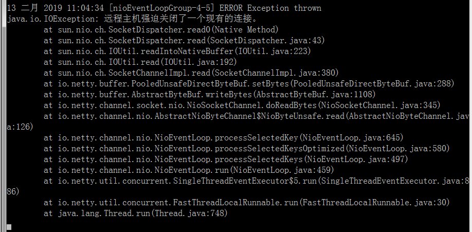
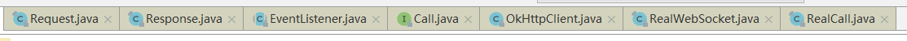
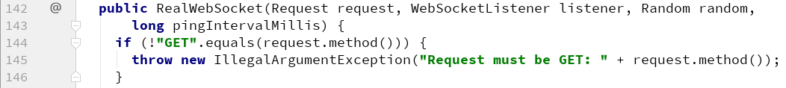

# OkHttp

## 资源

http://square.github.io/okhttp/ ， 官网

https://github.com/square/okhttp ， github位置


### MockWebServer

```xml
<dependency>
	<groupId>com.squareup.okhttp3</groupId>
	<artifactId>mockwebserver</artifactId>
	<version>3.13.1</version>
	<scope>test</scope>
</dependency>
```

https://www.cnblogs.com/ceshi2016/p/7884309.html ，使用指南


### moco

可搭建测试服务器，参考 ： https://github.com/juedui0769/StudyNotes2018/blob/master/129_Server_Moco.md


## 远程主机强迫关闭

根据官网的example编写的post请求，会导致server端出现： 远程主机强迫关闭一个现有连接

以下图片，是本地搭建的 moco 抛出的异常



网上搜索一番，没有直接找到答案，但是这些文章给我启发：

- http://www.myexception.cn/program/1059786.html
- https://juejin.im/post/5a524eef518825732c536025
- https://my.oschina.net/LucasZhu/blog/1608753
  - 这篇文章是讲解如何调整 服务器端 的代码的
- https://www.jianshu.com/p/a71a42f4634b ， 这篇文章比较全面
  - 也是提供给我解决办法的文章！

而且，我查阅的这些类的源码：



但，并没有找到办法，不过发现了一些新的知识点：

- RealCall 的构造方法是可以接收一个 `boolean forWebSocket` 参数的，但是 OkHttpClient 的 `newCall()` 方法内部确实直接写死为 `false` 的。
- OkHttpClient 专门提供了 `newWebSocket()` 方法 ，对应的是 `RealWebSocket`
- `RealWebSocket` 必须是 `GET` 请求，为什么呢？
  - 

---

解决：

```java
    @After
    public void destroy() throws IOException {
//        EventListener.Factory factory = client.eventListenerFactory();
//        factory.create()
        System.out.println(client);

//        client.cache().close();                             //清除cache
        client.dispatcher().executorService().shutdown();   //清除并关闭线程池
        client.connectionPool().evictAll();                 //清除并关闭连接池
    }
```

在代码中添加下面的代码

```java
client.dispatcher().executorService().shutdown();   //清除并关闭线程池
client.connectionPool().evictAll();                 //清除并关闭连接池
```

就是主动关闭 创建的client，上面两行代码是从 https://www.jianshu.com/p/a71a42f4634b  上抄袭过来的，清除 cache 那个必须注释掉，报空指针（即使移到最上面）。


# End