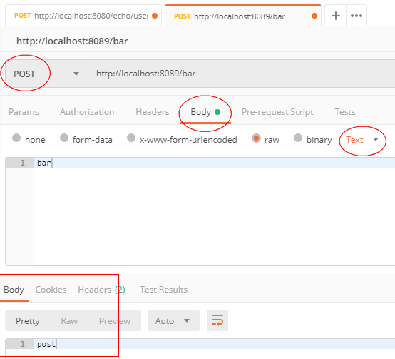
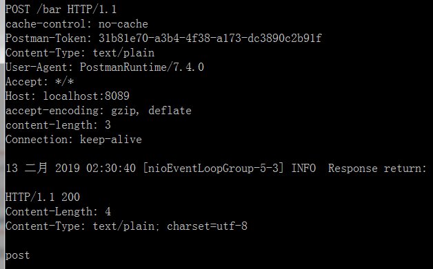
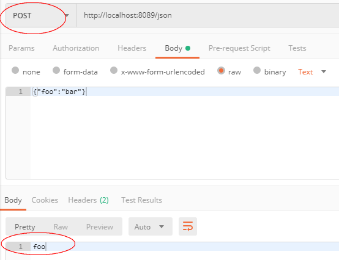
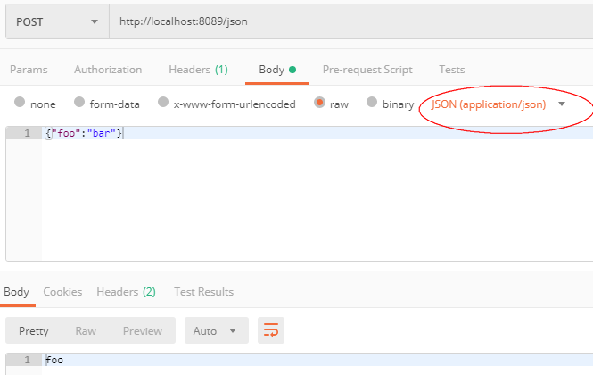

# Moco


## 探索01

https://www.oschina.net/search?scope=project&q=moco

https://github.com/dreamhead/moco ， github


### standalone.jar

使用 moco-runner-0.12.0-standalone.jar 启动，

- D:\wxg_server\server_moco

```
java -jar moco-runner-0.12.0-standalone.jar http -p 8088 -c foo.json
```

foo.json ，文件必须指定， 不能为空

```json
[
  {
    "response" :
      {
        "text" : "foo"
      }
  }
]
```

我在本地，第一次测试时，只创建了 `foo.json` 文件，忘记输入内容，

- 结果，报错，错误信息，不明显，害我调试很久


### 编译

git clone 后，本地编译，出错，不知什么缘故，

- GlobsTest

```
GlobsTest. should_glob_absolute_files_with_glob
GlobsTest. should_glob_files
GlobsTest. should_glob_relative_files
GlobsTest. should_throw_exception_for_unknown_root
```

花费了一些时间差错，但是，后放弃。

- 本地安装了 gradle ，就不要使用 `gradlew` 命令了，我是在上面吃亏了，这个命令要从服务器上下载 gradle ，很费时间
- 另外，使用 `gradle` 时，依然，要从网络上更新**依赖**，这个源文件中使用的是**中央仓库**，下载很慢，我没再研究，也就没有去找配置仓库的办法。（这个留意一下！）

### example01


两个Maven依赖，

```xml
<dependency>
  <groupId>com.github.dreamhead</groupId>
  <artifactId>moco-core</artifactId>
  <version>0.12.0</version>
</dependency>

<dependency>
	<groupId>org.apache.httpcomponents</groupId>
	<artifactId>fluent-hc</artifactId>
	<version>4.5.5</version>
</dependency>
```

java

```java
import org.junit.Test;
import java.io.IOException;
import com.github.dreamhead.moco.HttpServer;
import org.apache.http.client.fluent.Content;
import org.apache.http.client.fluent.Request;
import com.github.dreamhead.moco.Runnable;

import static com.github.dreamhead.moco.Moco.*;
import static com.github.dreamhead.moco.Runner.*;
import static org.hamcrest.core.Is.is;
import static org.junit.Assert.assertThat;

public class MocoExample {

    @Test
    public void should_response_as_expected() throws Exception {
        HttpServer server = httpServer(12306);
        server.response("foo");

        running(server, new Runnable() {
            @Override
            public void run() throws IOException {
                Content content = Request.Get("http://localhost:12306").execute().returnContent();
                assertThat(content.asString(), is("foo"));
            }
        });
    }
}
```


### http-method

https://github.com/dreamhead/moco/blob/master/moco-doc/apis.md#http-method ，参考这个github上的文档

- 这个链接上有所有的API 的配置说明，可以做参考书，或者字典使用。


### 发现

D:\wxg_server\server_moco ， 这个是放 standalone 文件的目录。

（1）要启动多个，需要配置多个 json 文件

```
java -jar moco-runner-0.12.0-standalone.jar http -p 8088 -c foo.json
```

```
java -jar moco-runner-0.12.0-standalone.jar http -p 8089 -c bar.json
```

（2）json文件必须以 `[]` 包裹

```json
[{
  "request" :
	{
		"method" : "get",
	  "uri" : "/foo",
	  "queries" : 
		{
		  "age" : "123"
		}
	},
  "response" :
	{
	  "text" : "bar"
	}
}]
```

（3）如上，`"age" : "123"` ，这说明，你必须传入 `/foo?age=123` 才能正取匹配

（4）POST请求，必须上一个截图了

```json
[{
  "request" :
	{
	  "method" : "post",
	  "uri" : "/bar",
	  "text" : "bar"
	},
  "response" :
	{
	  "text" : "post"
	}
}]
```



对照上的 json 文件，再看上图， Body 中选择 raw ，再选 Text， 然后输入 `bar` ，才能请求成功，否则出错。



（5）json request

```json
[{
  "request" :
	{
		"method" : "post",
	  "uri" : "/json",
	  "json": {
            "foo": "bar"
        }
	},
  "response" :
	{
	  "text" : "foo"
	}
}]
```

```
java -jar moco-runner-0.12.0-standalone.jar http -p 8089 -c jsonReq.json
```



今天又犯傻了，用 `GET` 测试了好一会儿 POST 请求，

- 一定要按部就班的设置，如果匆忙建立测试环境，出问题后，一定要按部就班的检查

选择 `Text` 还是 `JSON(application/json)` 都可以，对比上下两图：




# End