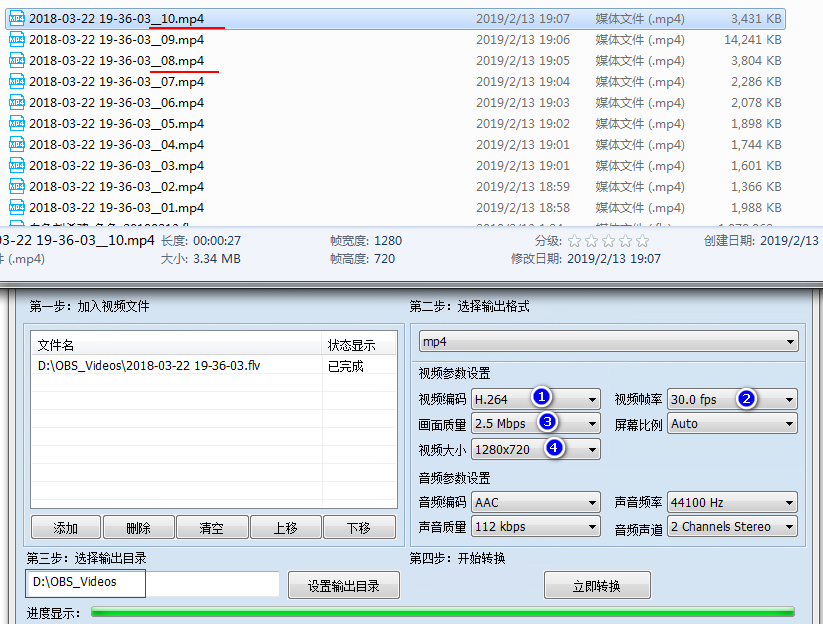
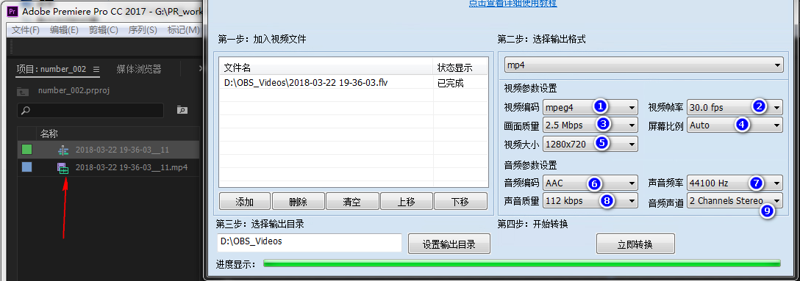

# Adobe Premiere

有些资源收集在QQ邮箱的记事本中的。

## 资源

这个知乎的回答，貌似最专业： <https://www.zhihu.com/question/21552138/answer/100047575>

- 分 入门级、业余级、专业级， 三种

Adobe Premiere Pro ，貌似是大家一致推荐的视频剪辑软件。

-  <https://helpx.adobe.com/cn/support/premiere-pro.html> ， 这个页面是 Adobe Premiere Pro 的在线帮助文档的首页，可以前去学习！

本来是应该看官方视频和文档来学习的，但是，我推荐先看以下这个视频，来入门：

- <https://www.bilibili.com/video/av14166409>

## 软件下载安装

（1）安装参考， https://jingyan.baidu.com/article/e4d08ffd9b9e210fd2f60dc7.html， 

- 下载， 百度网盘 ： tools/视频编辑/ ....
- 关键是注册机： 

（2）还需要一个 adobe id

- 这个注册不了，我看了下 network，发现需要连接到 google， 看来得翻墙才能注册成功。

- 使用，百度浏览器 + 谷歌访问助手， 终于注册成功。
  - ...
- 使用QQ邮箱注册了账号，密码要大写字母，所以和常用密码不同。
- 安装时，绑定了手机号码，……
  - ……
- 

（3）默认安装在 C 盘，最好更改

- 这导致我的 C 盘只剩下，900MB， 我将 Premiere 卸载了
- 单独，启动，Adobe Creative Cloud ， 在其中设置 APP 的安装位置
  - 参考： https://jingyan.baidu.com/article/4e5b3e190efec691901e241a.html
- 所以，
  - 应该先安装 Adobe Creative Cloud ，再安装其他程序

（4）破解

- 链接: https://pan.baidu.com/s/1Q7taMZX64kgKQI3XhhaK2A 提取码: 4nvx 复制这段内容后打开百度网盘手机App，操作更方便哦
- 破解程序已经上传到，百度网盘，上面了。参考上面的链接。
- 选择， Adobe Premiere Pro CC ，点击 install ， 指定安装位置中的，某个dll文件，（有提示的）

## 使用

### （1）无法导入 flv

无法导入 flv 格式的文件，这个要注意一下。

- 以后使用 obs 时，录制的视频，还需要转码以下，才能使用。
- 链接: https://pan.baidu.com/s/1PZvQ9gmBDe-IGfWhWA52vg 提取码: wt7s 复制这段内容后打开百度网盘手机App，操作更方便哦 
- 以上链接是，一个免费的，mp4 转换器，可以把 flv 格式转换为 mp4 格式。

### （2）mp4 转换器

（2）mp4 转换器，参数设置

1.  视频编码：  两个选项， H.264 和 mpeg4， 选择 `mpeg4` 时，文件大好多倍，但是观看起来没什么区别。
   1. 以上只是我的测试
2. 视频帧率： 30 ，好像是这个软件的最大了
3. 画面质量： 最大是 4.0 ， 我选的是 2.5
4. 视频大小 ： 这个必须设置为 1280x720 ， 我上图中的测试，第08才选择了这个选项，之前的都是比这个小，然后，视频中的文字都看不清楚；当我调到 1280x720 时，立刻感觉文字能看清楚了。（不知是否和我录制视频时的分辨率有关？）

其他就没什么了。

### （3）没声音

按上面的设置，转换的 mp4 ，导入到 PR 中，没有声音，PR 识别不出来。

按照下面的设置，转换出的 mp4 ，可以被识别：

就 （1） 和上面不同，这里设置的是 mpeg4，（注意，图片左边的箭头）

- 之前一直以为是 PR  设置问题，现在，才知道原来是素材的问题。

# End