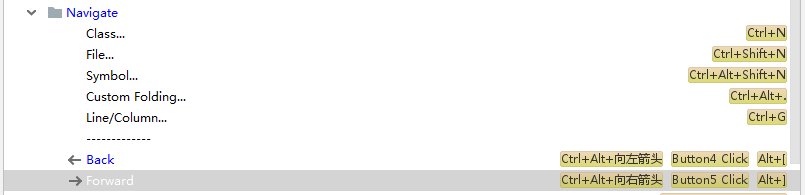
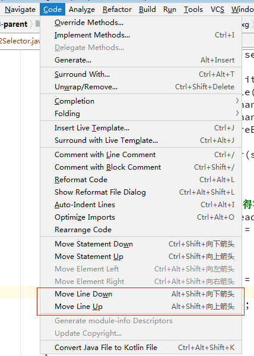

# Start

## 重新设置

重装操作系统（2019年3月12日）了，所有的软件重新安装，IDEA也不例外；但是，之前的配置就都没有了。

- 首先要配置的是字体，`settings`中非常好定位“Font”
  - Editor -> Font -> Lucida Console
  - Editor -> Font -> Source Code Pro
  - 以上两个字体不错，我选择的是`Source Code Pro`
- `Alt + /`，这个是 Eclipse 时代遗留的习惯了。IDEA中需要重新配置一下
  - 这个快捷键被 `Code -> Completion -> Cyclic Expand Word` 占用了，所以……
- `File structure`，这个是类结构，就是 Eclipse 中的 `Ctrl + O` 。
  - 在 IDEA 中快捷键是 `Ctrl + F12`，我将其改为了 `Ctrl + O`  ；
  - 原本  `Ctrl + O` 是对应 重写方法（`Override Methods...`）的， 我将其移除了， 因为在 `Alt + Insert` 中也有 ；
- `Reopen last project on startup`， 我不太喜欢这样，所以取消勾选了
  - `Appearance & Behavior -> System Settings -> Reopen last project on startup`
  - 可以直接在`settings`中搜索
- 另外，在gitee中搜索之前的笔记，“Other”下有IDEA相关的笔记记录！

## 常用快捷键

### Navigate

- 直接在菜单 `Navigate` 中查看对应的快捷键即可！这个菜单下的快捷键是最常用的。
- 
- 上图框选的就是经常要用的快捷操作了，同样因为重新安装的缘故，我还没来得及更新快捷键，`Implementation(s)`是我经常要用的，用来查看一个类的子类的。但是默认是 `Ctrl + Alt + B` ，这个太长了，我记得在 Eclipse 中，对应的快捷键是`Ctrl + T` 。
- ~~这里，我把 `Declaration` 和 `Implementation(s)` 的快捷键互换一下。~~
  - `Declaration`   可以使用 `Ctrl + 左键` 来调用，如下图：
  - 
  - 因为以上几个操作非常，常用，所以，也都绑定了鼠标左键的快捷操作。
- `Ctrl + U` , `Ctrl + H` , `Ctrl + F12 (Ctrl + O)` （我增加了Ctrl+O），这个几个都是常用的快捷键。
- 跳转不是`Alt + 左右箭头`， 而是 `Ctrl + Alt + 左右箭头` ，如下图（比较坑）：
  - 
- 给跳转加上了新的快捷键，如下
  - 
  - `Alt + [` 和 `Alt + ]` ，这是仿照Mac上的IDEA快捷键，而设计的。
- 


### Find Usages

- Alt + F7


### Code

- 移动代码行，如下图：
- 
- 

### 删除一整行

- Eclipse 中删除一行的快捷键是 `Ctrl + D`，在 IDEA 中，`Ctrl + D` 是复制一行；
- `Ctrl + Y` 是删除行的快捷键，在 Keymap 中搜索 "delete" 可以找到和 delete 相关的所有快捷键；
- `Ctrl + Y` 在 Eclipse 中是 撤回， 在 IDEA 中，`Ctrl + Shift + Z`是撤回，`Ctrl + Z`是撤销；


## 多次运行main方法

- 参考： <https://blog.csdn.net/zjcjava/article/details/78292449> ， 这篇文章中的是 取消勾选`Single instance only`
- 在我的IDEA中是，勾选 `Allow running in parallel`
- 总结
  - （1） 老IDEA 取消勾选 `Single instance only`
  - （2） 新IDEA 勾选 `Allow running in parallel`

## IDEA can not download source

- "can not download source" ，今天（2019年3月18日），使用IDEA时，无法下载源码

- 在百度搜索答案，<https://blog.csdn.net/upshi/article/details/78623723> 给出了答案

- 在项目所在的根目录下执行下面的命令， 

- ```
  mvn dependency:resolve -Dclassifier=sources
  ```

- 然后刷新项目，刷新Maven（右侧Maven工具栏）

- 再点击代码，就可以看到源码了。

- 另：

- `Appearance & Behavior -> System Settings -> Updates`

  - 取消勾选 `Use secure connection`

- `Build,Execution,Deployment -> Build Tools -> Maven -> Importing`

  - 勾选 `Automatically download: Sources`

> 开始怀疑错方向，以为和Maven仓库有关呢，我把阿里云切换为华为云，发现还是一样的不能下载source源码。

- 以上方法，治标不治本
- 我最终更换了Maven版本，解决了此问题
  - 将 3.6.0 更换为 3.3.9
  - 更改环境变量之后，要到 IDEA 中重新指定一下： `Build,Execution,Deployment -> Build Tools -> Maven`  ， `Maven home directory : C:/software/apache-maven-3.3.9`

- 

## IDEA与Maven版本冲突

- IDEA can not download source
- 如上
- 我使用IDEA是社区版（`IntelliJ IDEA 2018.3 (Community Edition) Build #IC-183.4284.148`,`build on November 21, 2018`）
- 我使用Maven 3.6.0 会出现问题，切换到 3.3.9 就没问题。
  - can not download source
  - 使用3.6.0不能下载java源码


> 2019年3月19日01:52:48，
>
> 又发现一个新的问题，如果使用 Maven `3.6.0` ，IDEA中的子module无法继承parent的properties；
>
> - 比如，我在parent中声明了`JDK`为`1.8`，在子module中仍然是`1.6`，更改为`3.3.9`就可以修正！


# End