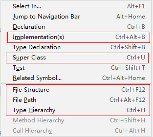

# Start

## 重新设置

重装操作系统（2019年3月12日）了，所有的软件重新安装，IDEA也不例外；但是，之前的配置就都没有了。

- 首先要配置的是字体，`settings`中非常好定位“Font”
  - Editor -> Font -> Lucida Console
  - Editor -> Font -> Source Code Pro
  - 以上两个字体不错，我选择的是`Source Code Pro`
- `Alt + /`，这个是 Eclipse 时代遗留的习惯了。IDEA中需要重新配置一下
  - 这个快捷键被 `Code -> Completion -> Cyclic Expand Word` 占用了，所以……
- `File structure`，这个是类结构，就是 Eclipse 中的 `Ctrl + O` 。
  - 在 IDEA 中快捷键是 `Ctrl + F12`，我将其改为了 `Ctrl + O`  ；
  - 原本  `Ctrl + O` 是对应 重写方法（`Override Methods...`）的， 我将其移除了， 因为在 `Alt + Insert` 中也有 ；
- `Reopen last project on startup`， 我不太喜欢这样，所以取消勾选了
  - `Appearance & Behavior -> System Settings -> Reopen last project on startup`
  - 可以直接在`settings`中搜索
- 另外，在gitee中搜索之前的笔记，“Other”下有IDEA相关的笔记记录！

## 常用快捷键

### Navigate

- 直接在菜单 `Navigate` 中查看对应的快捷键即可！这个菜单下的快捷键是最常用的。
- 
- 上图框选的就是经常要用的快捷操作了，同样因为重新安装的缘故，我还没来得及更新快捷键，`Implementation(s)`是我经常要用的，用来查看一个类的子类的。但是默认是 `Ctrl + Alt + B` ，这个太长了，我记得在 Eclipse 中，对应的快捷键是`Ctrl + T` 。
- ~~这里，我把 `Declaration` 和 `Implementation(s)` 的快捷键互换一下。~~
  - `Declaration`   可以使用 `Ctrl + 左键` 来调用，如下图：
  - 
  - 因为以上几个操作非常，常用，所以，也都绑定了鼠标左键的快捷操作。
- `Ctrl + U` , `Ctrl + H` , `Ctrl + F12 (Ctrl + O)` （我增加了Ctrl+O），这个几个都是常用的快捷键。
- 跳转不是`Alt + 左右箭头`， 而是 `Ctrl + Alt + 左右箭头` ，如下图（比较坑）：
- 
- 

## Find Usages

- Alt + F7

# End