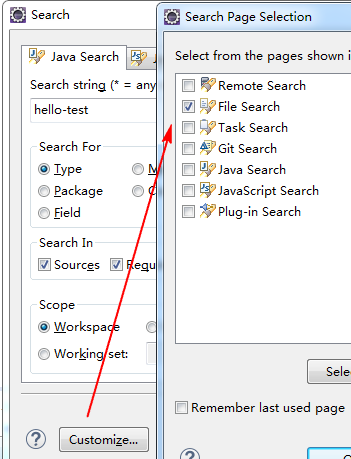

> 116_20190601_周记.md

### 本周回顾

这周过得很快，现在都有点不记得了。

上周五就开始澄清需求了，上周四（0523）是版本日，周五（0524）澄清下月版本需求。

当时分了两个任务，一个是不记工作量的IT优化（A），一个是职业地址的查询和上送（B）。

周一（0527）上午又澄清需求，因为0524荣达俊明都不在。

周二继续深入了解B需求，问了子喻锦章，还和前端聊了下，前端林x桂关静雅太忙转为陈伏华。方案为之前星熠提供的单独接口查询和上送，子喻也说前端ajax发起接口调用不影响之前的业务逻辑，职业地址都存在时前端仍然返显可供用户修改，becif失败重试由后端JOB处理。

周二下午领导将需求转给余龙处理，我只做需求A。周二晚上回去时有点沮丧。

周三按照自己的理解，熟悉和梳理需求A。原以为`0`工作量的IT优化很好做的，按照自己的理解，全系统扫描`SarBussinessException(e)`，记录下需要修改的地方，并找到esa或http调用。但是设计文档不知如何编写，设计文档模板中有`17`项需要填写，很懵逼。

周四重新梳理需求，记录检索结果，找到调用场景。幸好咨询了孝峰，他给出了正确的检索方式`catch (EsbProxyException`。按照这种方式扫描系统后，得出的结果有`53`处，比我之前用`SarBussinessException(e)`多出很多。而且我才搞清楚需求A的目的是优化`EsbProxyException`完整抛出，我就纳闷为何我搜索的是`SarBussinessException`，待仔细查看代码后才发现，项目要求，所有的esb异常都要抛出SarBussinessException。

突然感觉时间逝去的很快，周四了，需求才搞清楚。周四一天都在马不停蹄的记录梳理结果，到晚间，荣达给我讲解了一下如何正确的捕获异常和编写代码。要先捕获esb异常头部，有头部时，按照规范抛出，没有头部时，抛出网络异常`ResponseUtil.FAILED`。以上两种情形下都要抛出错误码`ErrorCodeEnum`，错误码的编写是有规范的： `DP70010("DP70010", "调用D+xxx系统xxx服务接口返回值异常")` 或 `DP70011("DP70011", "调用D+xxx系统xxx服务接口异常")`。领导讲解了规范、原理并提供一段样例，我趁着记忆犹新，赶紧做笔记，等我做完笔记已经是晚上21点多了。

周五继续梳理。下午我才整理出此次修改涉及的系统，并请示荣达，他帮我补全，并给出建议：找到esa或http调用，以便于测试。星熠给了我fat环境下的测试url。周五18:12分后二组全员（除剑哥）去吃饭唱K。

> 此记录转移到QQ邮箱记事本中。

### 计划学习

SpringMVC

Maven-打包原理: spring boot打包原理

SVN-知识补充

### Eclipse

> 本地Eclipse安装位置
> 
> F:\SoftWare\JavaFX eclipse\eclipse-SDK-4.6.0-win32-distro-2.4.0\eclipse.exe
G:\tools\eclipse-jee-helios-SR2-win32\eclipse\eclipse.exe
G:\tools\eclipse\eclipse-java-kepler-R-win32\eclipse.exe
G:\tools\eclipse\eclipse3.3\eclipse.exe
G:\tools\eclipse\eclipse4.4\eclipse.exe
G:\tools\eclipseSDK4.3.2\eclipse\eclipse.exe
G:\tools\eclispe-cpp\eclipse\eclipse.exe
G:\wxg\koala\eclipse_koala_64\eclipse.exe  <--

使用 "G:\wxg\koala\eclipse_koala_64\eclipse.exe" 这个

#### Content Assist

Preferences -> Java -> Editor -> Content Assist

Enable auto activation
- Auto activation triggers for Java: 
    - .qwertyuiopasdfghjklzxcvbnm

`.qwertyuiopasdfghjklzxcvbnm` 把这个填入

#### SVN Team Provider

Eclipse Marketplace
- Subversive - SVN Team Provider 4.0.5
- 对应的URL : <https://marketplace.eclipse.org/content/subversive-svn-team-provider> 打开非常缓慢

> 可以在 eclipse 中，使用 switch 切换分支。

#### Eclipse Git repositories

Eclipse Git repositories : <https://git.eclipse.org/c/>

#### Eclipse使用技巧

这次学习到一些Eclipse的使用技巧

1） 配置"Auto activation triggers for Java" , 如上！

2） SVN switch

3） File search

如上图，配置文件搜索，其他的都干掉。 快捷键 `ctrl + H`

4） Call Hierarchy

快捷键 `Ctrl + Alt + H`， 查询方法被哪些类调用。

这次梳理需求B时，大量使用`Ctrl + Alt + H`，追踪系统中的esa调用和http调用（就是找到系统中的Controller）。
- 在IDEA中的快捷键就是`Alt + F7`

我可以使用这个快捷键来辅助阅读其他源代码，比如`Spring`, `Netty`等。

5） Font

General -> editor -> 编辑器中显示的字体

Java -> 将javadoc的字体调大

### 黄亿华

<https://my.oschina.net/flashsword>

#### Maven

[Maven源码研究之一——准备工作](https://my.oschina.net/flashsword/blog/267693)

#### 迷你DNS服务器

<https://github.com/code4craft/blackhole>

### firebug

<https://getfirebug.com/>

<https://github.com/firebug/firebug>

### 域名

> 移动到QQ记事本

