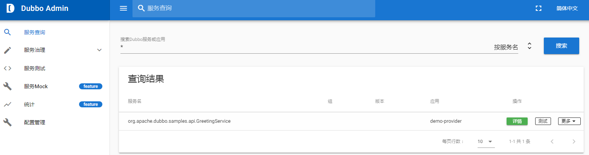

> 119_20190607_周记.md

周五是“端午节”，所以本周只上班四天。

不想在这家公司待了，回忆下工作收获吧！

紧迫感、主动型、重在交流、加班狂魔……

挺欣赏这一点: 紧迫感! 领导写邮件都是加速度的。

我做的需求是"EsbProxyException整个异常抛出的处理"，属于IT优化，不计工作量。
- 使用Eclipse搜索整个工程，搜索关键词`catch ( EsbProxyException`
- 凡是抛出`e`或`e.getMessage()`的都要修改
- 改为抛出`SarBusinessException`,要提供`ErrorCodeEnum`错误码
- 我找到`52`处需要修改的地方，涉及`32`个esb接口。幸好我把查找过程都记入word文档，排查工作做得不错。
- 需要修改`9`个组件: brac_ia_commons, auth, oaps, ... (参考记事簿)
- 管控平台部署都花费了不少时间。
- 测试，需要将esb接口的响应时间调短，故意让其报错，来观察日志。
- 需要添加开关: fix.EsbProxyException.switch.190627=ON/OFF

需求澄清、安全设计（需求设计）、设计评审、开发中、开发完成、冒烟、SIT测试、发版


### F5

负载均衡和F5是什么意思？ : <https://zhidao.baidu.com/question/576773921.html>

<https://www.f5.com/>

### `@ESA`,`@ActionClient`

网上找不到`@ESA`,`@ActionClient`的讲解，它们是平安内部框架pafa定义的注解。我没花时间仔细研究这两个注解，只是在 <http://dubbo.apache.org/zh-cn/docs/user/references/protocol/rest.html> 上看到 `<dubbo:protocol name="rest" server="jetty"/>` 时，突然想起在pafa框架中也看到`server="jetty"`的定义，我想它们应该是有些联系的。我所在的那个项目组就是使用`dubbo`提供ESA服务的，在管控平台可以看到，在dubbo控制台也可以搜索到`brac_ia_account.xXx`服务。

### GITTER

<https://gitter.im/>

<https://gitter.im/alibaba/dubbo>

### Github代码浏览

octotree

<https://github.com/ovity/octotree>

收费的chrome插件，<https://segmentfault.com/a/1190000019418615> 推荐。

看了是收费的后，我就失去了兴趣了。

### 当当-github

<https://github.com/dangdangdotcom>

### dubbo rest

<https://github.com/apache/dubbo>

<http://dubbo.apache.org/zh-cn/docs/user/references/protocol/rest.html>

<https://blog.csdn.net/jianxian89/article/details/84936504>

<https://www.cnblogs.com/yjmyzz/p/dubbox-demo.html>

<https://www.cnblogs.com/loveyou/p/9551468.html>

<https://www.cnblogs.com/bruceChan0018/p/5839195.html> 西行寺-幽幽子

<https://github.com/apache/dubbo-samples>
|- <https://gitee.com/Coding_Freshman/dubbo-samples>


### Dubbo Admin

<http://dubbo.apache.org/zh-cn/blog/download.html> 往下拖动

<https://github.com/apache/dubbo-admin> github

设置npm镜像 : Set npm proxy mirror: you can set npm proxy mirror to speedup npm install: add `registry=https://registry.npm.taobao.org` to ~/.npmrc

修改配置文件，指定dubbo的注册地址 : Specify registry address in `dubbo-admin-server/src/main/resources/application.properties`

**启动**

```
mvn clean package

mvn --projects dubbo-admin-server spring-boot:run
```

或者

```
cd dubbo-admin-distribution/target
java -jar dubbo-admin-0.1.jar
```

访问 <http://localhost:8080>

"F:\wxg117_dubbo\dubbo-admin-0.2.0", "C:\Users\Wxg\Downloads\dubbo-admin-0.2.0.zip"



如上图，"Dubbo Admin"终于是搭建成功了。我参考的是 <https://github.com/apache/dubbo-admin#development-setup> ，另一个方式下载`node`太慢了。我使用“Development Setup”，先使用`mvn clean package`将"F:\wxg117_dubbo\dubbo-admin-0.2.0\dubbo-admin-server"打包成一个单独的jar文件，然后通过 `java -jar dubbo-admin-server-0.2.0.jar`方式启动，再用 `cnpm install` 拉取nodejs的依赖，然后 `npm run dev` 启动，访问`http://localhost:8081`就可以了。
- 当然要先配置好zookeeper，按照github上的说明就可以了。

### SecureCRSecureFXPortable

"F:\101_备份", "D:\software\SecureCRSecureFXPortable"

Options -> Session Options -> Terminal -> Appearance
|- Character encoding: Default -> UTF-8


### FileZilla

"D:\001_E_software\FileZilla_3.23.0.2_win64-setup_bundled2.exe"

"D:\Program Files\FileZilla FTP Client"

### JDK

<https://www.cnblogs.com/chy123/p/6750351.html>

"/home/wxg/jdk-8u191-linux-x64.tar.gz"

```
su wxg

cd ~

tar -zxvf jdk-8u191-linux-x64.tar.gz

cd /usr/local
su -
mkdir java

# 使用root移动JDK
mv jdk1.8.0_191/ /usr/local/java/

# 修改环境变量
su wxg

vi 

```

拷贝完了，才发现，之前应该是拷贝过一次的。在 `/etc/profile` 下看到如下信息：

```
# 20181227, JDK
export JAVA_HOME=/opt/jdk1.8.0_191
export CLASSPATH=.:$JAVA_HOME/lib/dt.jar:$JAVA_HOME/lib/tools.jar
export PATH=$JAVA_HOME/bin:$PATH
```

上面还有日期！ 但不知为何 `wxg` 用户没有执行 `java` 的权限呢？

我参考上面的博文，使用`root`用户修改了`etc/profile`文件，改为如下内容：

```
# 20181227, JDK
export JAVA_HOME=/opt/jdk1.8.0_191
export CLASSPATH=.:$JAVA_HOME/lib/rt.jar:$JAVA_HOME/lib/dt.jar:$JAVA_HOME/lib/tools.jar
export PATH=$JAVA_HOME/bin:$PATH
```

然后切换到`wxg`用户

```
su wxg
source /etc/profile
```

再执行 `java -?` 可以执行了！ 有点奇怪！

### yum 

查看`yum`镜像源

```
 yum repolist all
```

参考 : <https://zhidao.baidu.com/question/556804246534439092.html>


### zip unzip

<https://www.cnblogs.com/zhi-leaf/p/6002303.html>

```
yum install zip unzip
```

```
unzip ~/store/zookeeper-3.4.11.zip -d ~/software/
```

### zookeeper

"E:\software\zookeeper-3.4.11\"

```
su wxg

mkdir software

unzip ~/store/zookeeper-3.4.11.zip -d ~/software/

cd ../software/

mv zookeeper-3.4.11/ zookeeper-3.4.11-01

cd zookeeper-3.4.11-01

## 修改配置文件

cd conf
vim zoo.cfg

## 先创两个目录 dataDir, dataLogDir

cd ..
mkdir dataDir
mkdir dataLogDir

vim ./conf/zoo.cfg

```

zoo.cfg 中的如下内容：

```
dataDir=/home/wxg/software/zookeeper-3.4.11-01/dataDir/
dataLogDir=/home/wxg/software/zookeeper-3.4.11-01/dataLogDir/
```

~~<https://www.cnblogs.com/yangjig/p/6014198.html> vim常用命令~~

<https://gitee.com/juedui0769/MyDocs/blob/master/Linux/Linux998_vim.md> √


```sh
# Usage: zkServer.sh {start|start-foreground|stop|restart|status|upgrade|print-cmd}

sh zkServer.sh start
```

```sh
sh zkCli.sh

?
```

[详解centos6和centos7防火墙的关闭](https://www.cnblogs.com/shizhijie/p/8005727.html)

在windows上查看

```
zkCli.cmd -server 192.168.3.20:2181
```

### dubbo-spring-boot-samples

~~"F:\wxg117_dubbo\dubbo-spring-boot-samples"~~

#### dubbo-samples-api

"F:\wxg117_dubbo\dubbo-samples\dubbo-samples-api"

```java
service.setRegistry(new RegistryConfig("multicast://224.5.6.7:1234"));
reference.setRegistry(new RegistryConfig("multicast://224.5.6.7:1234"));
```

改为

```java
service.setRegistry(new RegistryConfig("zookeeper://192.168.3.20:2181"));
reference.setRegistry(new RegistryConfig("zookeeper://192.168.3.20:2181"));
```

不行，以上方式失败。

#### dubbo-samples-zookeeper

**"F:\wxg117_dubbo\dubbo-samples\dubbo-samples-zookeeper"**

报错:

> [09/06/19 09:25:00:000 CST] main ERROR server.Server:  [DUBBO] qos-server can not bind localhost:22222, dubbo version: 2.7.1, current host: 192.168.56.1
> 
> java.net.BindException: Address already in use: bind

参考 <https://blog.csdn.net/u012988901/article/details/84503672> 的说法，provider和consumer使用了相同的`qos`端口`22222`，按照下面的方式将consumer修改一下：

```
dubbo.application.qosEnable=true
dubbo.application.qosPort=33333
dubbo.application.qosAcceptForeignIp=false
```


